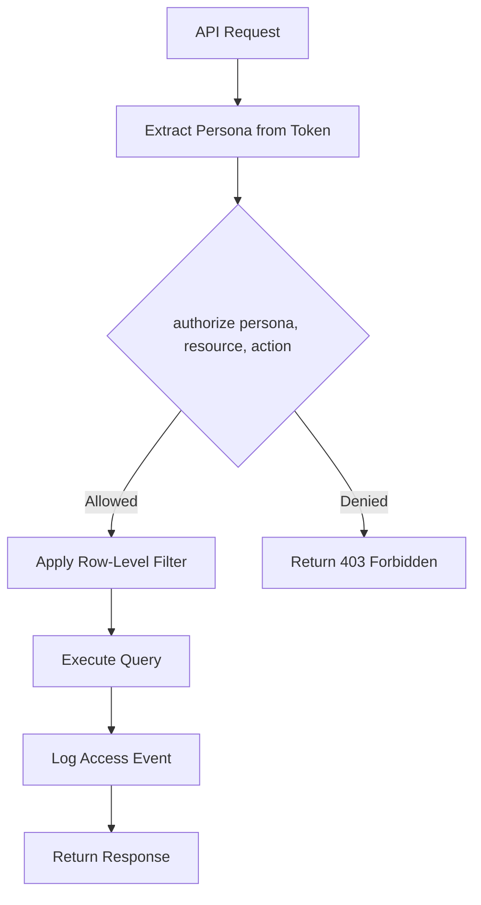

# ADR 0003: Role-Based Access Control with Persona Model

**Status:** Accepted  
**Date:** January 2026  
**Deciders:** Engineering Team, Legal Compliance

## Context

LandRight serves multiple user types with different access needs:
- **Landowners:** View/respond to their own parcel information
- **Land Agents:** Manage parcels, communications, offers
- **In-House Counsel:** Approve documents, manage litigation
- **Outside Counsel:** Read-only access to case files
- **Firm Admins:** View aggregated data for their projects
- **Platform Admins:** Global system administration

Legal compliance requires:
- Audit trail for all data access
- Principle of least privilege
- Row-level data isolation

## Decision

Implement **Role-Based Access Control (RBAC)** using a **Persona model** with a permission matrix.

## Design

### Persona Enum

```python
class Persona(str, Enum):
    LANDOWNER = "landowner"
    LAND_AGENT = "land_agent"
    IN_HOUSE_COUNSEL = "in_house_counsel"
    OUTSIDE_COUNSEL = "outside_counsel"
    FIRM_ADMIN = "firm_admin"
    ADMIN = "admin"
```

### Permission Matrix

```python
PERMISSION_MATRIX = {
    Persona.LANDOWNER: {
        "parcel": {Action.READ},  # Own parcels only
        "offer": {Action.READ},
        "communication": {Action.READ, Action.WRITE},
        "portal": {Action.READ, Action.WRITE},
    },
    Persona.LAND_AGENT: {
        "parcel": {Action.READ, Action.WRITE},
        "communication": {Action.READ, Action.WRITE},
        "offer": {Action.READ, Action.WRITE},
        "roe": {Action.READ, Action.WRITE},
        # ... more resources
    },
    # ... more personas
}
```

### Authorization Flow



### Row-Level Security

For landowners, queries are automatically filtered:

```python
def get_parcels_for_landowner(user_id: UUID, db: Session):
    return db.query(Parcel).join(ParcelParty).filter(
        ParcelParty.party_id == user_id
    ).all()
```

## Rationale

### Why RBAC over ABAC?

| Aspect | RBAC | ABAC |
|--------|------|------|
| Complexity | Simple | Complex |
| Auditability | Clear role assignments | Attribute combinations hard to audit |
| Performance | Fast lookup | Runtime evaluation |
| Legal fit | Matches legal industry roles | Over-engineered |

### Why Persona over Role?

- "Persona" reflects user's job function, not just permissions
- Clearer for legal compliance ("Who accessed this as what?")
- Single persona per session simplifies auditing
- Aligns with legal industry terminology

## Consequences

### Positive

- Clear, auditable access control
- Easy to explain to compliance auditors
- Simple to implement and test
- Performance: O(1) permission lookup

### Negative

- Less flexible than ABAC for complex policies
- New personas require code changes
- Cross-persona access requires session switching

### Mitigations

- Add FIRM_ADMIN persona for rolled-up access
- Document process for adding new personas
- Implement persona switching UI for users with multiple roles

## Implementation

### Middleware Integration

```python
@router.get("/parcels")
def list_parcels(
    persona: Persona = Depends(get_current_persona),
    db: Session = Depends(get_db),
):
    authorize(persona, "parcel", Action.READ)
    # Proceed with query
```

### Audit Logging

```python
def authorize(persona: Persona, resource: str, action: Action):
    if action not in PERMISSION_MATRIX.get(persona, {}).get(resource, set()):
        log_audit_event(
            event_type="ACCESS_DENIED",
            persona=persona,
            resource=resource,
            action=action,
        )
        raise HTTPException(status_code=403)
    
    log_audit_event(
        event_type="ACCESS_GRANTED",
        persona=persona,
        resource=resource,
        action=action,
    )
```

## References

- `backend/app/security/rbac.py` - Implementation
- `docs/rbac.md` - Full permission matrix
- NIST RBAC Standard (INCITS 359-2012)
