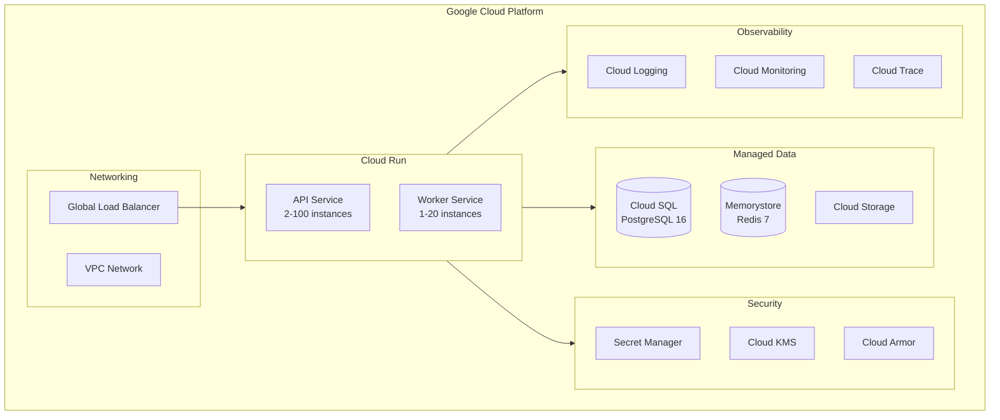

# ADR 0004: Google Cloud Platform with Cloud Run

**Status:** Accepted  
**Date:** January 2026  
**Deciders:** Engineering Team, Infrastructure

## Context

LandRight requires cloud infrastructure that:
1. Supports containerized Python/Node.js applications
2. Auto-scales based on demand
3. Provides managed PostgreSQL and Redis
4. Meets SOC 2 compliance requirements
5. Offers reasonable cost for MVP phase
6. Integrates with CI/CD pipelines

## Decision

Deploy on **Google Cloud Platform** using **Cloud Run** for compute, **Cloud SQL** for PostgreSQL, and **Memorystore** for Redis.

## Architecture



## Rationale

### Why GCP?

| Requirement | GCP Capability |
|-------------|---------------|
| Serverless containers | Cloud Run (excellent) |
| Managed PostgreSQL | Cloud SQL (mature) |
| Managed Redis | Memorystore (native) |
| SOC 2 compliance | Certified |
| Cost | Competitive for MVP |
| CI/CD | Cloud Build, GitHub Actions |

### Why Cloud Run over GKE?

| Aspect | Cloud Run | GKE |
|--------|-----------|-----|
| Operational overhead | Minimal | High |
| Scaling | Automatic 0→N | Manual config |
| Cost at MVP scale | Pay-per-use | Fixed cluster cost |
| Complexity | Simple | Complex |
| Cold start | ~1-2 seconds | None |

Cloud Run selected for MVP simplicity. GKE migration path available if needed.

### Alternatives Considered

| Provider | Pros | Cons | Decision |
|----------|------|------|----------|
| **GCP Cloud Run** | Simple, auto-scale, managed | Cold starts | **Selected** |
| AWS ECS/Fargate | Mature, broad services | Complex, costly | Rejected |
| Azure Container Apps | Similar to Cloud Run | Less mature | Rejected |
| Heroku | Very simple | Limited scale, cost | Rejected |
| Self-hosted K8s | Full control | High ops overhead | Rejected |

## Configuration

### Cloud Run Service

```yaml
# api-service.yaml
apiVersion: serving.knative.dev/v1
kind: Service
metadata:
  name: landright-api
spec:
  template:
    metadata:
      annotations:
        autoscaling.knative.dev/minScale: "2"
        autoscaling.knative.dev/maxScale: "100"
        run.googleapis.com/cpu-throttling: "false"
    spec:
      containerConcurrency: 80
      containers:
        - image: gcr.io/landright/api:latest
          resources:
            limits:
              cpu: "2"
              memory: "4Gi"
          env:
            - name: DATABASE_URL
              valueFrom:
                secretKeyRef:
                  name: database-url
```

### Cloud SQL

```hcl
# terraform/cloudsql.tf
resource "google_sql_database_instance" "main" {
  name             = "landright-prod"
  database_version = "POSTGRES_16"
  region           = "us-central1"
  
  settings {
    tier              = "db-custom-4-16384"
    availability_type = "REGIONAL"  # HA
    
    backup_configuration {
      enabled                        = true
      point_in_time_recovery_enabled = true
      backup_retention_settings {
        retained_backups = 30
      }
    }
    
    ip_configuration {
      private_network = google_compute_network.vpc.id
    }
  }
}
```

## Consequences

### Positive

- Zero infrastructure management
- Automatic scaling (0 to 100+ instances)
- Pay only for actual usage
- Built-in observability
- Simple deployment via containers
- SOC 2 compliant by default

### Negative

- Cold start latency (~1-2 seconds)
- 60-minute request timeout limit
- Less control than Kubernetes
- Vendor lock-in to GCP

### Mitigations

- Keep minimum instances at 2 to reduce cold starts
- Use Cloud Tasks for long-running jobs
- Abstract infrastructure via Terraform for portability
- Document migration path to GKE if needed

## Cost Estimate (MVP Phase)

| Service | Configuration | Monthly Cost |
|---------|--------------|--------------|
| Cloud Run (API) | 2 min instances, avg 4 | ~$150 |
| Cloud Run (Worker) | 1 min instance, avg 2 | ~$75 |
| Cloud SQL | db-custom-4-16384, HA | ~$300 |
| Memorystore | 5GB Standard | ~$150 |
| Cloud Storage | 100GB | ~$3 |
| Load Balancer | Global | ~$20 |
| **Total** | | **~$700/month** |

## References

- [Cloud Run Documentation](https://cloud.google.com/run/docs)
- [Cloud SQL for PostgreSQL](https://cloud.google.com/sql/docs/postgres)
- `infra/gcp/` - Terraform configurations
- `docs/production-deployment.md` - Deployment guide
