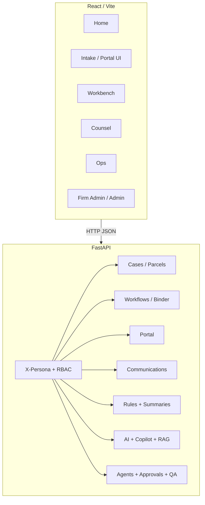

# LandGrant application functionality map

This document maps **personas**, **frontend surfaces**, and **backend API domains** as implemented in the repository. Use it with [`manual-regression-script.md`](./manual-regression-script.md) for release testing.

## Personas and RBAC

Authorization is driven by the `X-Persona` header (dev) and `PERMISSION_MATRIX` in `backend/app/security/rbac.py`. Valid values:

| Persona | Typical role |
|--------|----------------|
| `landowner` | Property owner using the portal |
| `land_agent` | Acquisition / ROW agent |
| `in_house_counsel` | Agency / utility counsel |
| `outside_counsel` | External firm counsel |
| `firm_admin` | Firm-level oversight |
| `admin` | Platform operator (broad access in nav; API still enforces resources) |

## Frontend routes and navigation

Route guards are defined in `frontend/src/constants/personaNav.ts` and `PersonaRoute`.

| Path | Purpose | Allowed personas (summary) |
|------|---------|----------------------------|
| `/` | Home: workspace links by persona | All |
| `/intake` | Landowner portal: invites, decisions, uploads | `landowner`, `admin` |
| `/workbench` | Agent: parcels, map, comms, packet, title, appraisal, ROE, offers, tasks, copilot | `land_agent`, `in_house_counsel`, `admin` |
| `/counsel` | Counsel: approvals, templates, binder, budgets, deadlines, litigation, settlement tools | `in_house_counsel`, `outside_counsel`, `admin` |
| `/ops` | Operations: route planning, notifications | `land_agent`, `in_house_counsel`, `admin` |
| `/firm-admin` | Firm dashboard (admin UI) | `firm_admin`, `admin` |
| `/admin` | Platform admin | `admin` |

### Major UI components by page (non-exhaustive)

- **Workbench** (`WorkbenchPage`): `ParcelMap`, `ParcelList`, `CommsLog`, `PacketChecklist`, `RuleResults`, `TitlePanel`, `AppraisalPanel`, `ROEPanel`, `NegotiationPanel`, `TaskManager`, `CopilotPanel`.
- **Counsel** (`CounselPage`): `CounselQueue`, `BudgetPanel`, `BinderStatus`, `DeadlineManager`, `TemplateViewer`, `OutsideCounselPanel`, `LitigationPanel`, `TaskManager`, `AIDecisionReview`, `SettlementPredictor`, `CopilotPanel`.
- **Intake** (`IntakePage`): portal flows (document extraction, decisions, uploads—see components under `frontend/src/components/`).
- **Ops** (`OpsPage`): operational tooling wired to `/ops` and related APIs.

## Backend API surface (by router prefix)

Routers are registered in `backend/app/main.py`. Prefixes below are appended to the API base URL (e.g. `http://localhost:8050`).

| Prefix | Domain |
|--------|--------|
| `/` | Root metadata (`GET /`) |
| `/health/*` | Liveness, invite probe, e-sign probe |
| `/cases` | Create case; parcel details |
| `/templates` | Template catalog; render |
| `/ai` | AI drafts (uses rules pipeline internally) |
| `/workflows` | Tasks, approvals, binder export, parcel transitions, events, history, escalations |
| `/integrations` | External hooks (e.g. dockets webhook) |
| `/portal` | Invites, verify, session, decisions, uploads, audit |
| `/communications` | Comms log, send, batch, stats |
| `/packet` | Packet checklist |
| `/budgets` | Budget summary |
| `/binder` | Binder status |
| `/notifications` | Notification preview |
| `/parcels` | Parcel listing |
| `/deadlines` | Deadlines, iCal, derive |
| `/title` | Title instruments and curative workflow |
| `/appraisals` | Appraisal CRUD |
| `/ops` | Ops (e.g. route planning) |
| `/outside` | Outside counsel repository / case initiation |
| `/agents` | Agent run, AI decisions, escalations |
| `/roe` | Right-of-entry lifecycle |
| `/offers` | Offers, counters; includes nested `/payment-ledger/*` |
| `/alignments` | Alignments and `/alignments/segments/*` |
| `/litigation` | Litigation matters and analytics |
| `/esign` | E-sign initiate, status, webhooks, dev simulate |
| `/chat` | Messaging threads (incl. portal variants) |
| `/admin` | Firm and platform admin dashboards, search, health |
| `/rules/*` | Rule results, pack import/validate/publish, state diff, requirements, summaries (`/rules/summary/*`) |
| `/audit/*` | AI audit events, citations, sources |
| `/approvals/*` | Structured approval workflow |
| `/qa/*` | QA checks, reports, risk score, validate-for-send |
| `/rag/*` | RAG search, ingest, health, stats |
| `/copilot/*` | Copilot ask, conversations, case helpers |
| `/analytics/*` | Settlement analytics, risk profiles, counter-offer suggestions, stats |
| `/ws/*` | WebSocket status and test broadcast |
| `/predictions/*` | ML predictions, risk profile, batch, health |
| `/tasks/*` | Task CRUD, assignment, bulk ops, stats |

## Rules evaluation (important distinction)

- **HTTP**: There is no stable public `POST /rules/evaluate` in the current API. Parcel-scoped history is available at `GET /rules/results?parcel_id=...`.
- **Library**: Jurisdiction rule evaluation is implemented in `apps.services.rules_engine.evaluate_rules` and used by AI drafts, agents, and unit tests (`backend/tests/test_rules_engine.py`, `backend/tests/rules/`).

## High-level architecture (Mermaid)

## Related documentation

- [`docs/uat_regression.md`](./uat_regression.md) — older UAT checklist (some curl paths may drift; prefer the manual regression script for current API paths).
- [`docs/api.md`](./api.md) / [`docs/api-reference.md`](./api-reference.md) — API reference if maintained in your branch.
- `backend/tests/test_endpoints_rbac.py` — RBAC expectations for automated alignment.
