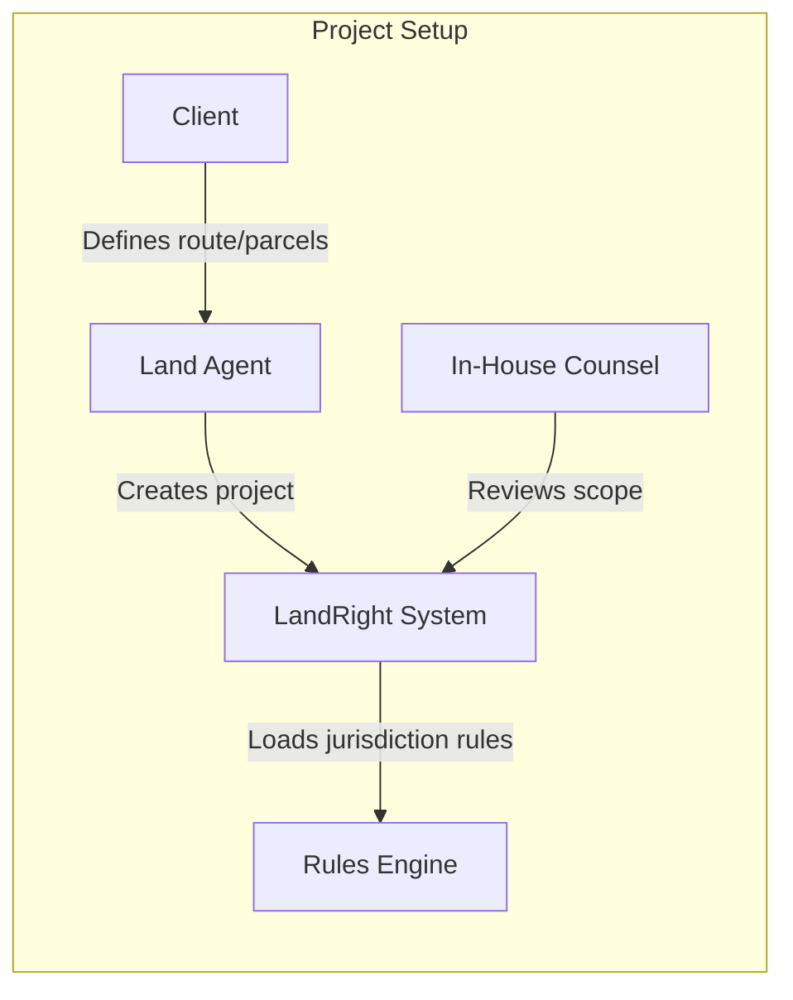
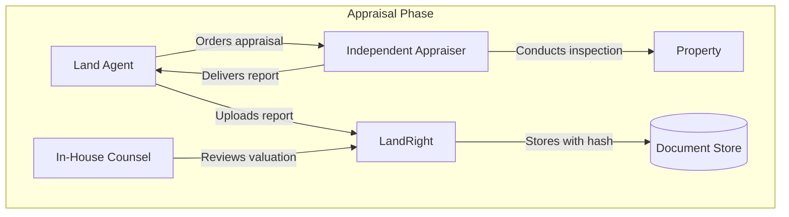
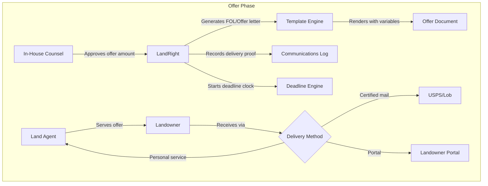
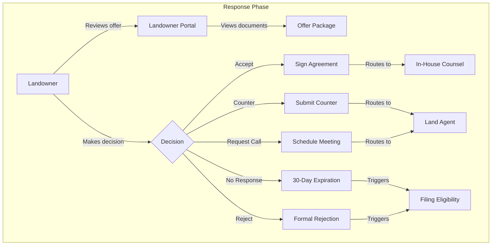
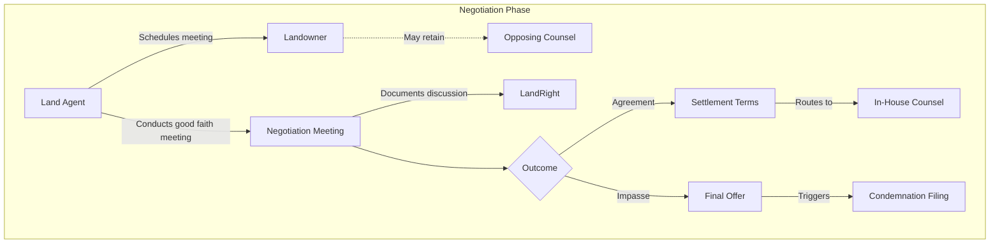
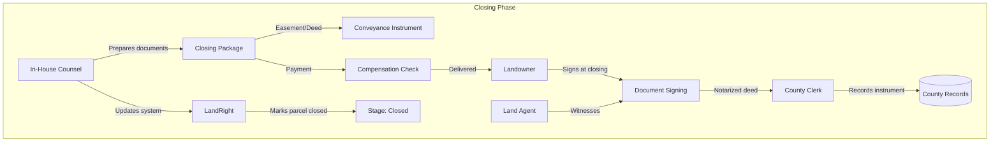
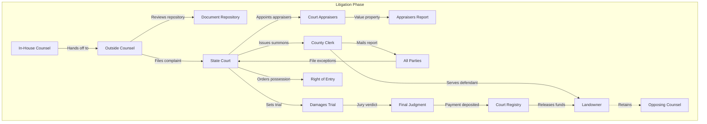
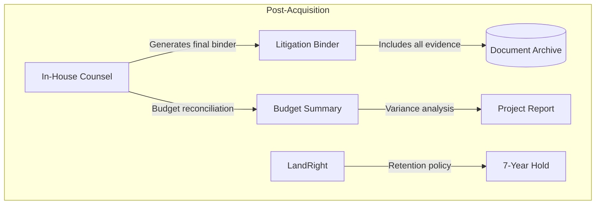
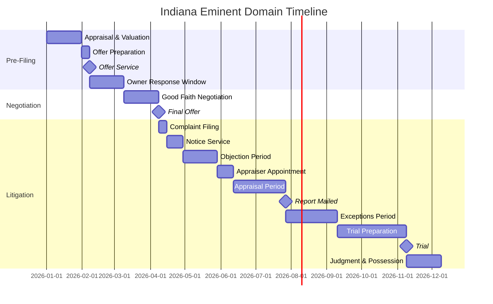

# End-to-End Eminent Domain Workflow

This document maps the complete eminent domain acquisition process from project initiation through closing or litigation, showing all responsible parties and their interactions.

## Parties Involved

| Party | Role | LandRight Persona |
|-------|------|-------------------|
| **Client** | Condemning authority (utility, government agency, pipeline company) | - |
| **In-House Counsel** | Client's internal legal team managing acquisitions | `in_house_counsel` |
| **Land Agent** | Field representatives acquiring right-of-way | `land_agent` |
| **Landowner** | Property owner whose land is being acquired | `landowner` |
| **Opposing Counsel** | Landowner's attorney (if retained) | - |
| **Outside Counsel** | External law firm handling litigation | `outside_counsel` |
| **County Clerk** | Records deeds, easements, and court filings | - |
| **State Court** | Adjudicates condemnation proceedings | - |
| **Appraisers** | Court-appointed (IN) or independent valuators | - |

---

## Phase 1: Project Initiation

### Activities

| Step | Responsible Party | LandRight Action | Output |
|------|-------------------|------------------|--------|
| 1.1 | Client | Define project scope, route, timeline | Project brief |
| 1.2 | Land Agent | Identify affected parcels via GIS | `POST /cases` creates parcels |
| 1.3 | Land Agent | Research title chain, ownership | `POST /title/instruments` |
| 1.4 | In-House Counsel | Select jurisdiction rules pack | Rules loaded (TX, IN, etc.) |
| 1.5 | Land Agent | Order appraisals from vendors | Appraisal assignments |

### Key Deliverables
- Parcel inventory with ownership data
- Title search results
- Project budget established

---

## Phase 2: Appraisal & Valuation

### Activities

| Step | Responsible Party | LandRight Action | Statutory Basis |
|------|-------------------|------------------|-----------------|
| 2.1 | Land Agent | Commission MAI-certified appraiser | - |
| 2.2 | Appraiser | Inspect property, research comps | - |
| 2.3 | Appraiser | Deliver appraisal report | - |
| 2.4 | Land Agent | Upload appraisal to system | `POST /appraisals` |
| 2.5 | In-House Counsel | Review and approve valuation | Workflow approval |

### Key Deliverables
- Certified appraisal report
- Comparable sales analysis
- Damage calculations (severance, remainder)

---

## Phase 3: Initial Offer (Good Faith Negotiation)

### Activities

| Step | Responsible Party | LandRight Action | Statutory Basis |
|------|-------------------|------------------|-----------------|
| 3.1 | In-House Counsel | Approve offer amount (≥100% appraisal) | TX §21.0113 / IN IC 32-24-1-3 |
| 3.2 | In-House Counsel | Render offer letter template | `POST /templates/render` |
| 3.3 | Land Agent | Serve offer via certified mail + portal | `POST /portal/invites` |
| 3.4 | System | Record delivery proof (tracking, signature) | `POST /communications` |
| 3.5 | System | Calculate response deadline (30 days IN) | `POST /deadlines/derive` |

### Statutory Requirements (Indiana IC 32-24-1-5)
- Written offer must include amount and basis
- Served at least 30 days before complaint filing
- Owner has 30 days to accept or reject

### Statutory Requirements (Texas §21.0113-0114)
- Offer at 100% of appraised value
- Good faith meeting required within 45 days
- Final offer before condemnation filing

### Key Deliverables
- Signed offer letter with proof of service
- Deadline tracking initiated
- Communication log entry

---

## Phase 4: Landowner Response

### Activities

| Step | Responsible Party | LandRight Action | Output |
|------|-------------------|------------------|--------|
| 4.1 | Landowner | Access portal via invite link | `POST /portal/verify` |
| 4.2 | Landowner | Review offer, appraisal, maps | `GET /portal/uploads` |
| 4.3 | Landowner | Upload counter-documents (optional) | `POST /portal/uploads` |
| 4.4 | Landowner | Submit decision | `POST /portal/decision` |
| 4.5 | System | Route to appropriate queue | Task creation |

### Decision Outcomes

| Decision | Next Phase | Responsible Party |
|----------|------------|-------------------|
| **Accept** | Phase 6 (Closing) | In-House Counsel |
| **Counter** | Phase 5 (Negotiation) | Land Agent |
| **Request Call** | Phase 5 (Negotiation) | Land Agent |
| **Reject/Silence** | Phase 7 (Litigation) | Outside Counsel |

---

## Phase 5: Negotiation

### Activities

| Step | Responsible Party | LandRight Action | Statutory Basis |
|------|-------------------|------------------|-----------------|
| 5.1 | Land Agent | Schedule good faith meeting | Calendar integration |
| 5.2 | Land Agent | Conduct face-to-face negotiation | TX §21.0114 requires |
| 5.3 | Land Agent | Document meeting outcome | `POST /communications` |
| 5.4 | In-House Counsel | Approve revised offer (if any) | Workflow approval |
| 5.5 | Land Agent | Serve final offer if impasse | Deadline trigger |

### Key Deliverables
- Meeting notes with attendance
- Revised offer (if applicable)
- Final offer letter (if impasse)

---

## Phase 6: Voluntary Closing (If Accepted)

### Activities

| Step | Responsible Party | LandRight Action | Output |
|------|-------------------|------------------|--------|
| 6.1 | In-House Counsel | Prepare easement/deed | Template render |
| 6.2 | In-House Counsel | Prepare closing statement | Payment calculation |
| 6.3 | Land Agent | Schedule closing | Calendar |
| 6.4 | Landowner | Execute documents | E-sign or wet ink |
| 6.5 | County Clerk | Record conveyance | Recording number |
| 6.6 | Client | Issue payment | Wire/check |
| 6.7 | System | Update parcel stage | Stage → "closed" |

### Key Deliverables
- Recorded easement/deed
- Proof of payment
- Closing binder

---

## Phase 7: Condemnation Litigation (If No Agreement)

### Pre-Filing Activities

| Step | Responsible Party | LandRight Action | Statutory Basis |
|------|-------------------|------------------|-----------------|
| 7.1 | In-House Counsel | Verify repository completeness | `GET /outside/repository/completeness` |
| 7.2 | In-House Counsel | Export litigation binder | `POST /workflows/binder/export` |
| 7.3 | In-House Counsel | Hand off to outside counsel | Task assignment |
| 7.4 | Outside Counsel | Review all documentation | Repository access |

### Filing & Service (Indiana IC 32-24-1-5 to 1-7)

| Step | Responsible Party | LandRight Action | Deadline |
|------|-------------------|------------------|----------|
| 7.5 | Outside Counsel | File condemnation complaint | `POST /outside/case/initiate` | ≥30 days after offer |
| 7.6 | County Clerk | Issue summons | - | - |
| 7.7 | Outside Counsel | Serve notice to appear | Record service | 10 days before hearing |
| 7.8 | Landowner/Opposing Counsel | File objections | - | 30 days from service |

### Appraisal & Exceptions (Indiana IC 32-24-1-9 to 1-11)

| Step | Responsible Party | LandRight Action | Deadline |
|------|-------------------|------------------|----------|
| 7.9 | Court | Appoint 3 disinterested appraisers | - | - |
| 7.10 | Court Appraisers | Inspect and value property | - | - |
| 7.11 | Court Appraisers | File report with clerk | - | - |
| 7.12 | County Clerk | Mail report to all parties | Record mailing | - |
| 7.13 | All Parties | File exceptions to report | Track deadline | 45 days from mailing |

### Trial & Judgment (Indiana IC 32-24-1-12 to 1-14)

| Step | Responsible Party | LandRight Action | Deadline |
|------|-------------------|------------------|----------|
| 7.14 | Court | Set trial date | Calendar sync | - |
| 7.15 | Outside Counsel | Serve settlement offer | `POST /outside/status` | 45 days before trial |
| 7.16 | Opposing Counsel | Accept/counter settlement | - | 5 days from offer |
| 7.17 | Court/Jury | Determine just compensation | - | - |
| 7.18 | Outside Counsel | Deposit award with court | Payment record | - |
| 7.19 | Court | Enter judgment + order possession | - | - |

### Post-Judgment

| Step | Responsible Party | LandRight Action | Output |
|------|-------------------|------------------|--------|
| 7.20 | County Clerk | Record judgment | Recording number |
| 7.21 | Court | Release funds to landowner | - |
| 7.22 | Client | Take possession | Project proceeds |
| 7.23 | System | Update parcel stage | Stage → "closed" |

---

## Phase 8: Post-Acquisition

### Activities

| Step | Responsible Party | LandRight Action | Retention |
|------|-------------------|------------------|-----------|
| 8.1 | In-House Counsel | Generate final binder | `POST /workflows/binder/export` |
| 8.2 | In-House Counsel | Reconcile project budget | `GET /budgets/summary` |
| 8.3 | System | Apply litigation hold if needed | Retention flag |
| 8.4 | System | Archive per retention policy | 7-year minimum |

---

## Timeline Summary (Indiana)

---

## RBAC by Phase

| Phase | Land Agent | In-House Counsel | Outside Counsel | Landowner |
|-------|------------|------------------|-----------------|-----------|
| 1. Initiation | Create parcels, upload title | Approve scope | - | - |
| 2. Appraisal | Upload appraisals | Review/approve | - | - |
| 3. Offer | Serve offers, record delivery | Approve amounts, templates | - | - |
| 4. Response | Monitor responses | Review decisions | - | Submit decision |
| 5. Negotiation | Conduct meetings | Approve revised offers | - | Negotiate |
| 6. Closing | Coordinate signing | Prepare documents | - | Sign documents |
| 7. Litigation | Support discovery | Hand off, budget | File, litigate | Defend |
| 8. Post-Acquisition | - | Archive, reconcile | Final reporting | - |

---

## Key Statutory Citations

### Texas Property Code Chapter 21
- §21.0113 - Initial offer requirements (100% of appraisal)
- §21.0114 - Good faith negotiation requirements
- §21.012 - Filing deadline after rejection

### Indiana Code IC 32-24
- IC 32-24-1-3 - Appraisal requirements
- IC 32-24-1-5 - Written offer, 30-day waiting period
- IC 32-24-1-6 - Notice to appear requirements
- IC 32-24-1-7 - Service requirements (10 days/3 publications)
- IC 32-24-1-8 - Objection deadline (30 days, extendable)
- IC 32-24-1-9 - Appraiser appointment
- IC 32-24-1-11 - Exceptions deadline (45 days from mailing)
- IC 32-24-1-12 - Settlement offer timing (45 days before trial)

---

## System Touchpoints Summary

| Workflow Step | API Endpoint | Persona |
|---------------|--------------|---------|
| Create project/parcels | `POST /cases` | land_agent |
| Upload title documents | `POST /title/instruments` | land_agent |
| Upload appraisal | `POST /appraisals` | land_agent |
| Render offer letter | `POST /templates/render` | in_house_counsel |
| Send portal invite | `POST /portal/invites` | land_agent |
| Derive deadlines | `POST /deadlines/derive` | in_house_counsel |
| Landowner decision | `POST /portal/decision` | landowner |
| Record communication | `POST /communications` | land_agent |
| Check repository | `GET /outside/repository/completeness` | outside_counsel |
| Export binder | `POST /workflows/binder/export` | in_house_counsel |
| Initiate litigation | `POST /outside/case/initiate` | outside_counsel |
| Update case status | `POST /outside/status` | outside_counsel |
| Budget reconciliation | `GET /budgets/summary` | in_house_counsel |
