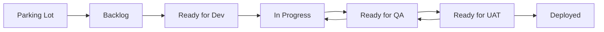

# Jira Board Setup Guide

## Status Creation Complete

The following statuses have been created via API:

| ID | Status Name | Category |
|----|-------------|----------|
| 10037 | Parking Lot | TODO |
| 10038 | Backlog | TODO |
| 10039 | Ready for Dev | TODO |
| 10040 | Ready for QA | IN_PROGRESS |
| 10041 | Ready for UAT | IN_PROGRESS |
| 10042 | Deployed | DONE |

## Adding Columns to Board

The statuses exist but need to be added to the board via the Jira UI.

### Steps to Add New Columns

1. **Open Board Settings**
   - Go to: https://landrightiq.atlassian.net/jira/software/projects/KAN/boards/1
   - Click the **three dots (...)** menu in the top right
   - Select **Board settings**

2. **Add Columns**
   
   Click **+ Add column** and create the following (in order):

   | Column Name | Category | Position |
   |-------------|----------|----------|
   | Parking Lot | To Do | Before "Idea" |
   | Backlog | To Do | After "Idea" |
   | Ready for Dev | To Do | After "Backlog" |
   | Ready for QA | In Progress | After "In Progress" |
   | Ready for UAT | In Progress | After "Ready for QA" |
   | Deployed | Done | After "Done" |

3. **Rename Existing Columns** (Optional)
   - Rename "Idea" to "Parking Lot" (or delete if redundant)
   - Rename "Testing" to "Ready for QA"

4. **Reorder Columns**
   
   Drag columns to achieve this order:
   ```
   Parking Lot → Backlog → Ready for Dev → In Progress → Ready for QA → Ready for UAT → Deployed
   ```

5. **Set Column Limits** (Optional)
   - Click on column header → Set WIP limit
   - Suggested limits:
     - In Progress: 3
     - Ready for QA: 5
     - Ready for UAT: 3

### Final Board Layout

```
┌─────────────┬─────────┬──────────────┬─────────────┬──────────────┬──────────────┬──────────┐
│ Parking Lot │ Backlog │ Ready for Dev│ In Progress │ Ready for QA │ Ready for UAT│ Deployed │
├─────────────┼─────────┼──────────────┼─────────────┼──────────────┼──────────────┼──────────┤
│   (To Do)   │ (To Do) │   (To Do)    │(In Progress)│(In Progress) │(In Progress) │  (Done)  │
└─────────────┴─────────┴──────────────┴─────────────┴──────────────┴──────────────┴──────────┘
```

### Workflow Transitions

Issues can move through statuses in this flow:



## Automation Rules (Optional)

Consider adding these automation rules in Project Settings → Automation:

1. **Auto-move to Ready for QA** 
   - Trigger: Pull request merged
   - Action: Transition issue to "Ready for QA"

2. **Auto-move to Deployed**
   - Trigger: Release published
   - Action: Transition linked issues to "Deployed"

---

*After completing the UI setup, the board columns will be available for all issue types.*
