# Milestone 1: Technical Design & Product Refinement

**Duration:** February 4, 2026 - March 3, 2026  
**Sprints:** 1-2  
**Status:** Complete

This document provides visual diagrams and comprehensive documentation for the LandRight MVP technical design.

---

## Table of Contents

1. [System Architecture](#1-system-architecture)
2. [Database Schema (ERD)](#2-database-schema-erd)
3. [API Structure](#3-api-structure)
4. [Deployment Architecture](#4-deployment-architecture)
5. [Key Data Flows](#5-key-data-flows)
6. [Technology Stack](#6-technology-stack)
7. [Security Architecture](#7-security-architecture)

---

## 1. System Architecture

### High-Level Component Diagram

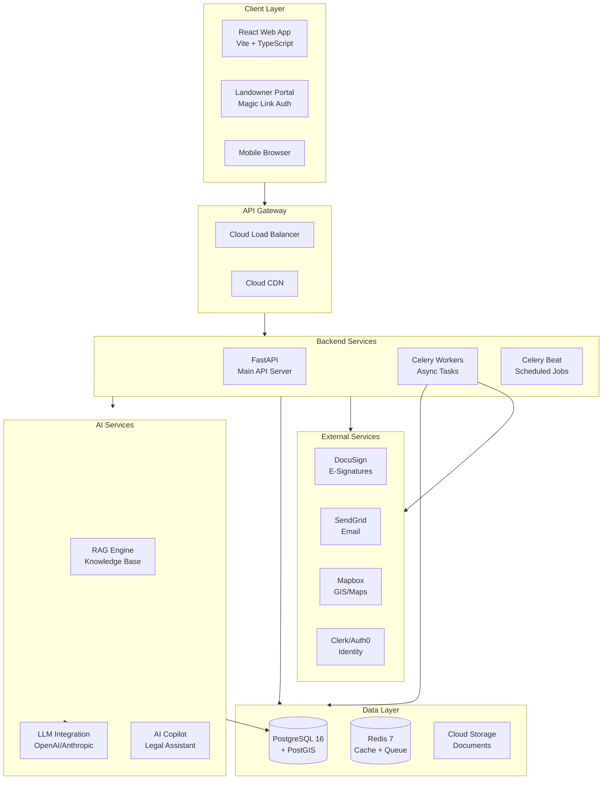

### Component Responsibilities

| Component | Technology | Responsibility |
|-----------|------------|----------------|
| Web App | React + Vite | Internal user interface (agents, counsel, ops) |
| Portal | React | Landowner-facing portal with magic link auth |
| API Server | FastAPI | REST API, business logic, RBAC |
| Workers | Celery | Async document generation, batch comms |
| RAG Engine | LangChain | Legal knowledge retrieval |
| PostgreSQL | v16 + PostGIS | Primary data store with spatial support |
| Redis | v7 | Caching, task queue, session store |
| Cloud Storage | GCS | Document and evidence storage |

---

## 2. Database Schema (ERD)

### Core Domain Model

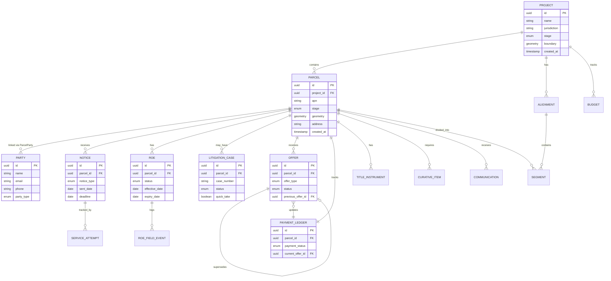

### Document & Template Model

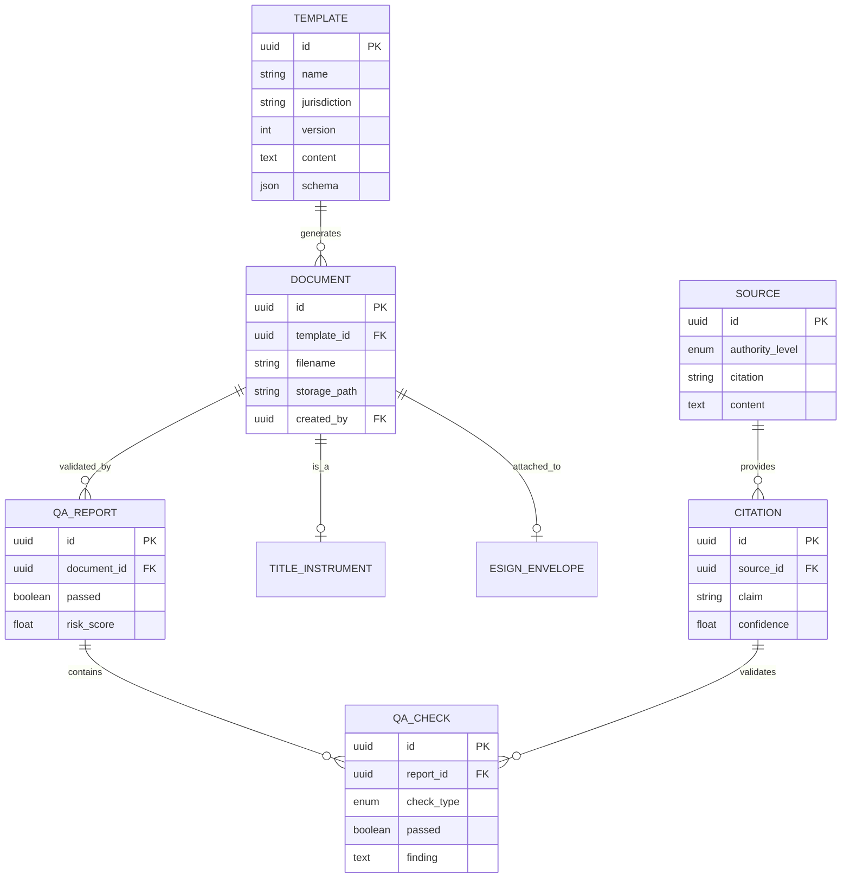

### AI & Workflow Model

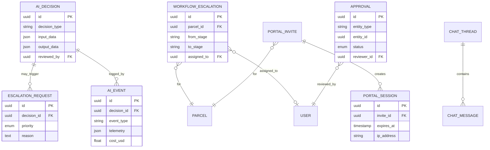

### Key Enums Reference

| Enum | Values | Usage |
|------|--------|-------|
| `ProjectStage` | INTAKE, NEGOTIATION, LITIGATION, CLOSED | Project lifecycle |
| `ParcelStage` | INTAKE, APPRAISAL, OFFER_PENDING, OFFER_SENT, NEGOTIATION, CLOSING, LITIGATION, CLOSED | Parcel workflow |
| `Persona` | LANDOWNER, LAND_AGENT, IN_HOUSE_COUNSEL, OUTSIDE_COUNSEL, FIRM_ADMIN, ADMIN | RBAC roles |
| `NoticeType` | INITIAL_OUTREACH, OFFER, STATUTORY, FINAL_OFFER, POSSESSION | Notice categories |
| `ROEStatus` | DRAFT, SENT, SIGNED, ACTIVE, EXPIRED, REVOKED | ROE lifecycle |
| `LitigationStatus` | NOT_FILED, FILED, SERVED, COMMISSIONERS_HEARING, ORDER_OF_POSSESSION, TRIAL, APPEAL, SETTLED, CLOSED | Case progression |
| `OfferStatus` | DRAFT, SENT, RECEIVED, ACCEPTED, REJECTED, EXPIRED, SUPERSEDED | Offer workflow |
| `PaymentStatus` | NOT_STARTED, INITIAL_OFFER_SENT, COUNTEROFFER_RECEIVED, AGREEMENT_IN_PRINCIPLE, PAYMENT_INSTRUCTION_SENT, PAYMENT_CLEARED | Payment tracking |

---

## 3. API Structure

### API Domain Organization

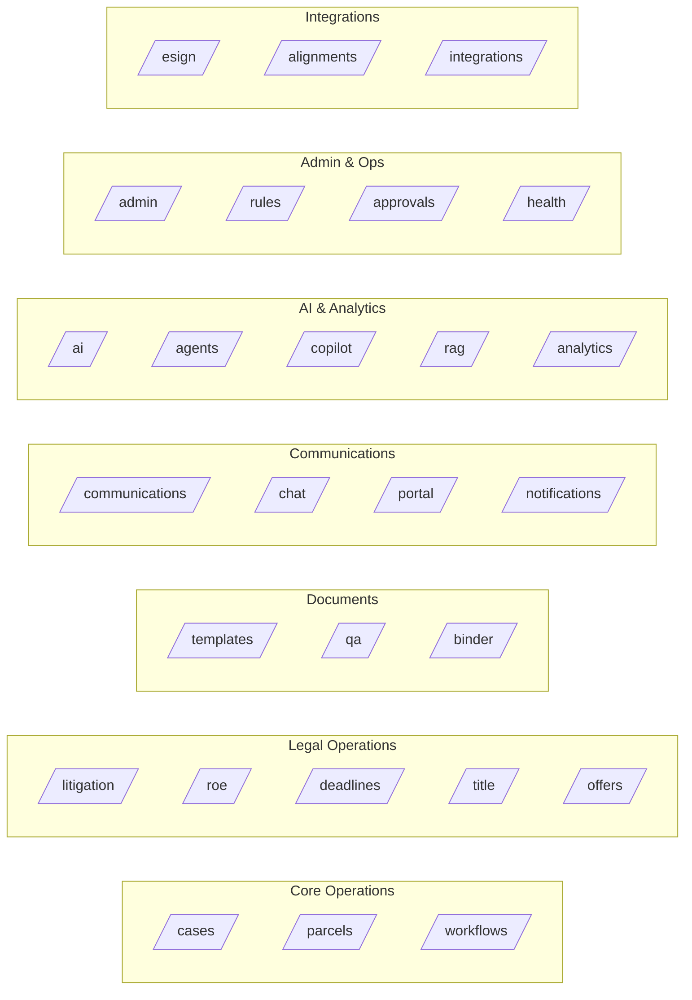

### Endpoint Count by Domain

| Domain | Route File | Endpoints | Description |
|--------|------------|-----------|-------------|
| **Core** | cases, parcels, workflows | 15 | Case/parcel CRUD, state transitions |
| **Legal** | litigation, roe, deadlines, title, offers | 35 | Legal document management |
| **Documents** | templates, qa, binder | 12 | Document generation & QA |
| **Communications** | communications, chat, portal, notifications | 28 | Multi-channel messaging |
| **AI** | ai, agents, copilot, rag, analytics | 25 | AI-powered features |
| **Admin** | admin, rules, approvals, health | 30 | Administration & compliance |
| **Integrations** | esign, alignments, integrations | 18 | External service connectors |
| **Total** | 35 files | **163+** | Full MVP API |

### Authentication & Authorization

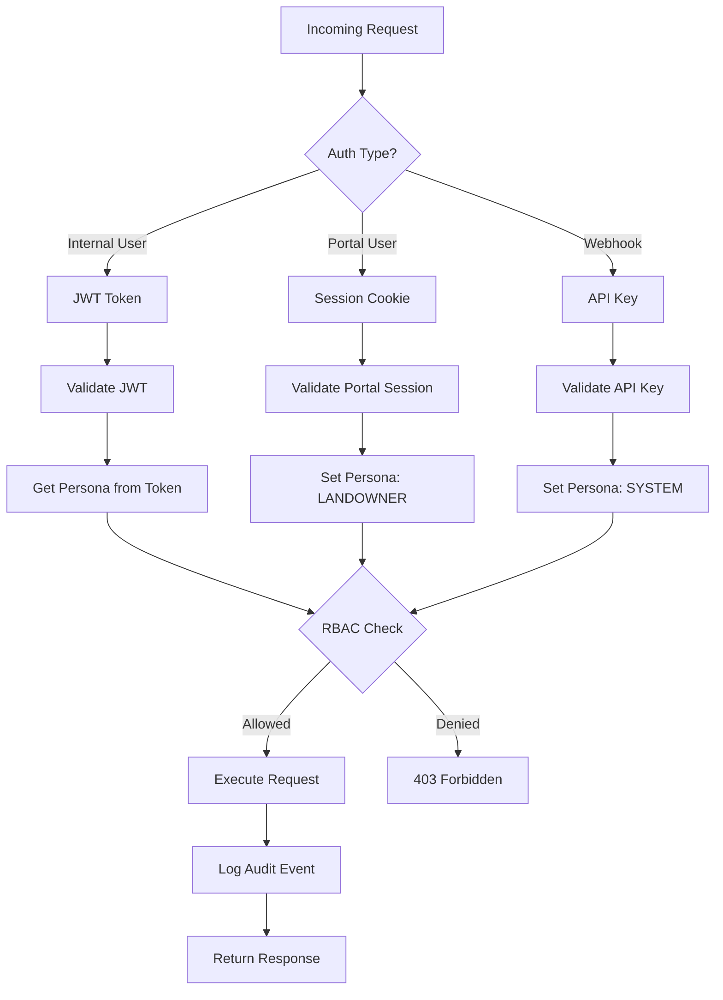

### RBAC Permission Matrix (Summary)

| Resource | Landowner | Land Agent | In-House Counsel | Outside Counsel | Firm Admin | Admin |
|----------|-----------|------------|------------------|-----------------|------------|-------|
| Parcel | R (own) | RW | RW | R | R | R |
| Offer | R (own) | RW | RW | R | R | R |
| Communication | RW (own) | RW | RW | R | R | R |
| Litigation | - | R | RW | RW | R | R |
| ROE | R (own) | RW | RW | R | R | R |
| Template | - | R | RW | R | - | RW |
| Admin Dashboard | - | - | - | - | R | RW |

---

## 4. Deployment Architecture

### GCP Infrastructure

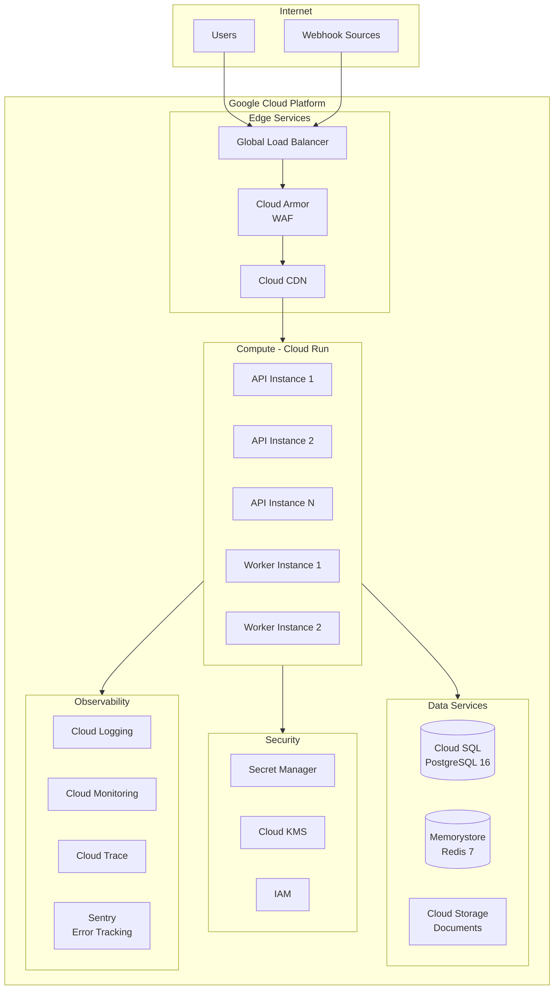

### Environment Configuration

| Environment | API URL | Database | Redis | Purpose |
|-------------|---------|----------|-------|---------|
| **Local** | localhost:8050 | localhost:55432 | localhost:56379 | Development |
| **Staging** | api-staging.landright.ai | staging-db | staging-redis | QA/Testing |
| **Production** | api.landright.ai | prod-db (HA) | prod-redis (HA) | Live system |

### Scaling Configuration

```yaml
# Cloud Run Scaling
min_instances: 2
max_instances: 100
cpu: 2
memory: 4Gi

# Autoscaling Triggers
cpu_utilization: 70%
request_count: 100/instance
concurrent_requests: 80

# Database
machine_type: db-custom-4-16384
high_availability: true
backup_retention: 30 days

# Redis
tier: standard
memory_size_gb: 5
replica_count: 1
```

---

## 5. Key Data Flows

### Landowner Portal Flow

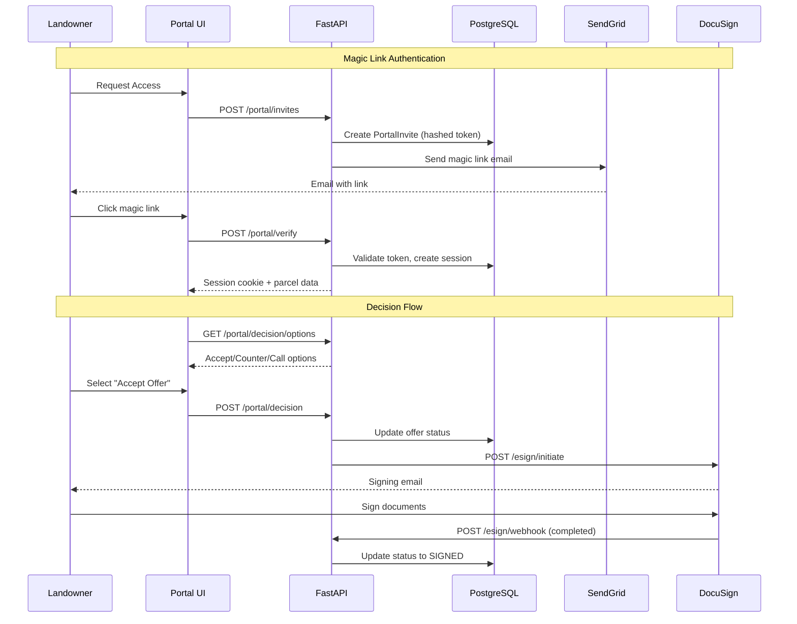

### Document Generation & QA Flow

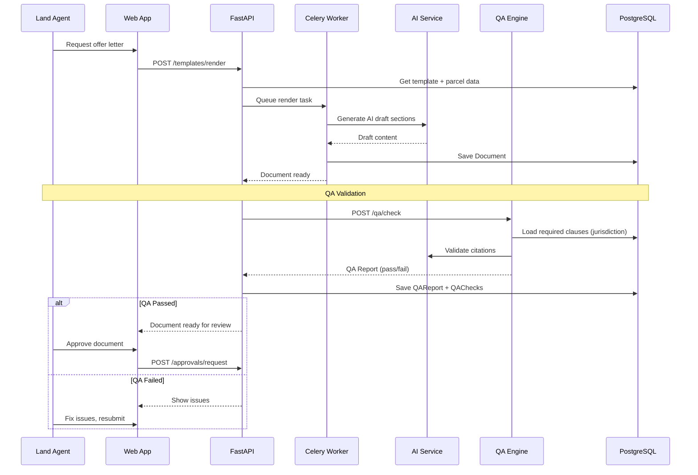

### Litigation Workflow

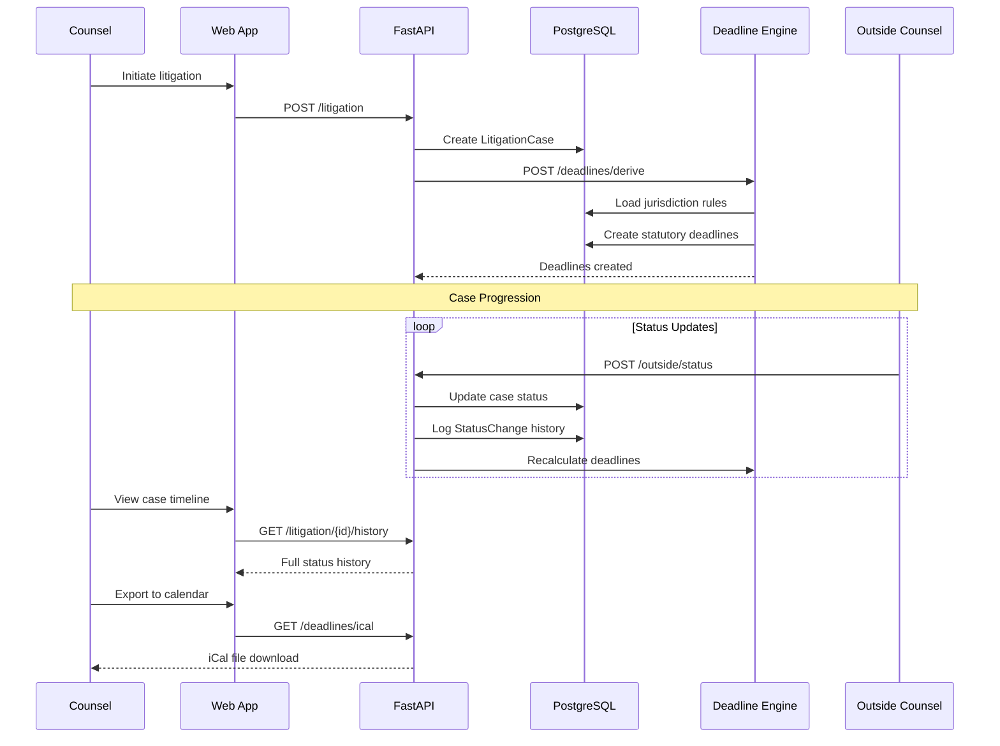

### ROE Field Operations Flow

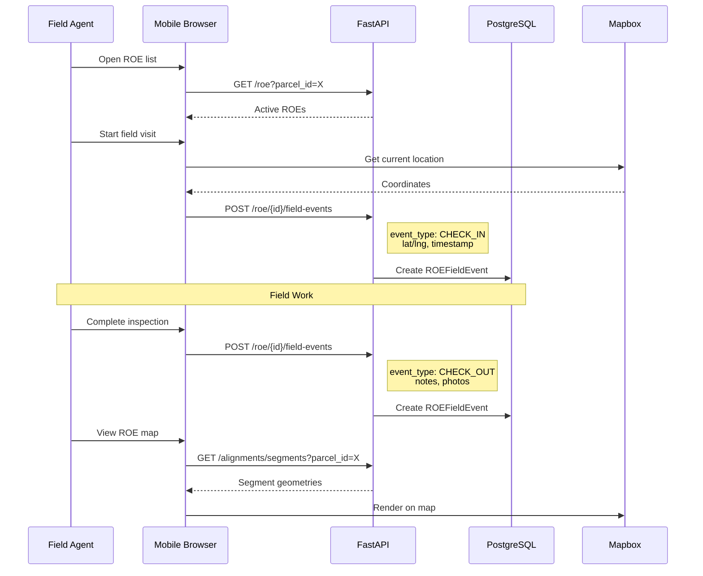

---

## 6. Technology Stack

### Backend Stack

| Layer | Technology | Version | Purpose |
|-------|------------|---------|---------|
| **Framework** | FastAPI | 0.109+ | Async REST API |
| **ORM** | SQLAlchemy | 2.0+ | Database abstraction |
| **Validation** | Pydantic | 2.0+ | Request/response models |
| **Task Queue** | Celery | 5.3+ | Async job processing |
| **Cache** | Redis | 7.0+ | Caching, sessions, queue broker |
| **Database** | PostgreSQL | 16 | Primary data store |
| **Spatial** | PostGIS | 3.4+ | GIS operations |

### Frontend Stack

| Layer | Technology | Version | Purpose |
|-------|------------|---------|---------|
| **Framework** | React | 18+ | UI components |
| **Build Tool** | Vite | 5+ | Fast dev server, bundling |
| **Language** | TypeScript | 5+ | Type safety |
| **Styling** | Tailwind CSS | 3+ | Utility-first CSS |
| **Maps** | Mapbox GL | 3+ | Interactive maps |
| **State** | React hooks | - | Local state management |

### AI Stack

| Component | Technology | Purpose |
|-----------|------------|---------|
| **LLM** | OpenAI GPT-4 / Anthropic Claude | Document generation, analysis |
| **RAG** | LangChain + pgvector | Legal knowledge retrieval |
| **Embeddings** | OpenAI Ada | Document vectorization |

### Infrastructure

| Service | GCP Product | Purpose |
|---------|-------------|---------|
| **Compute** | Cloud Run | Containerized API + workers |
| **Database** | Cloud SQL | Managed PostgreSQL |
| **Cache** | Memorystore | Managed Redis |
| **Storage** | Cloud Storage | Document storage |
| **CDN** | Cloud CDN | Static asset delivery |
| **Security** | Cloud Armor | WAF, DDoS protection |
| **Secrets** | Secret Manager | Credential management |
| **Monitoring** | Cloud Monitoring | Metrics, alerts |
| **Logging** | Cloud Logging | Centralized logs |

---

## 7. Security Architecture

### Security Layers

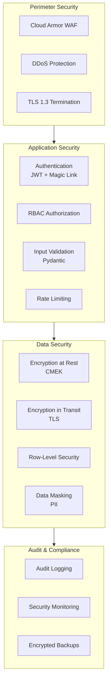

### Security Controls Summary

| Control | Implementation | Status |
|---------|---------------|--------|
| **Authentication** | JWT (internal), Magic Link (portal) | Implemented |
| **Authorization** | RBAC with persona matrix | Implemented |
| **Encryption (Transit)** | TLS 1.3 everywhere | Implemented |
| **Encryption (Rest)** | CMEK via Cloud KMS | Implemented |
| **Input Validation** | Pydantic models | Implemented |
| **Rate Limiting** | Per-endpoint limits | Implemented |
| **Audit Logging** | All state changes logged | Implemented |
| **Secrets Management** | GCP Secret Manager | Implemented |
| **Vulnerability Scanning** | Dependabot + Snyk | Configured |
| **Penetration Testing** | Scheduled quarterly | Planned |

---

## Appendix: File References

| Document | Path | Description |
|----------|------|-------------|
| Architecture | `docs/architecture.md` | Detailed architecture narrative |
| Data Model | `docs/data-model.md` | Entity descriptions |
| API Reference | `docs/api-reference.md` | Endpoint documentation |
| RBAC | `docs/rbac.md` | Permission matrix |
| Security | `docs/security.md` | Security controls |
| Deployment | `docs/production-deployment.md` | Deployment guide |
| Database Models | `backend/app/db/models.py` | SQLAlchemy models |
| API Routes | `backend/app/api/routes/` | Route implementations |

---

*Generated: February 2026*  
*Version: 1.0*
