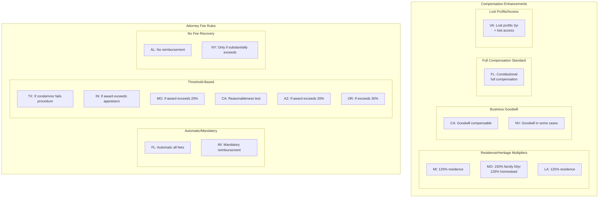
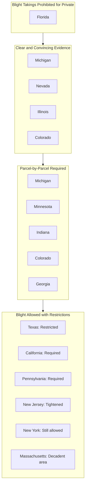
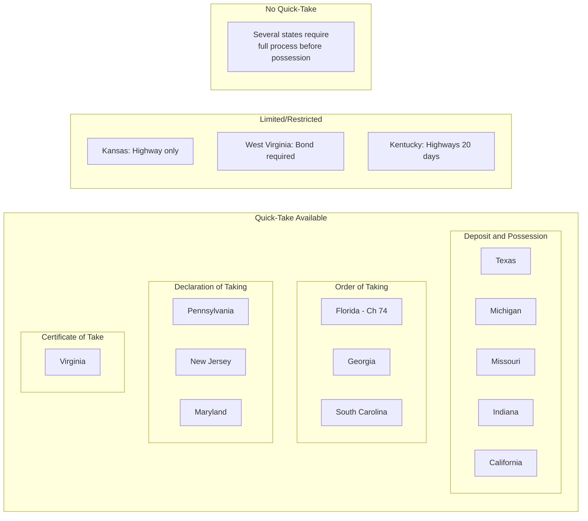
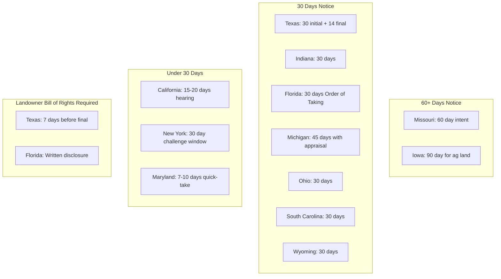
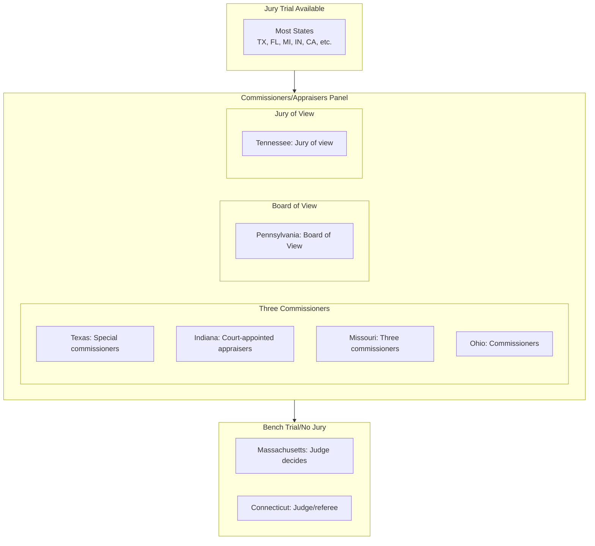
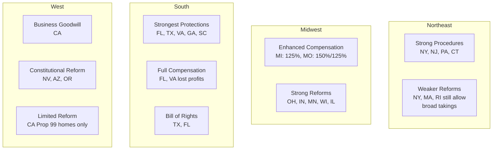

# State Requirements Map

This document visualizes how the 50 states group by key eminent domain requirements.

## Overview Diagram

## Post-Kelo Reform Classification

```mermaid
flowchart LR
    subgraph StrongReform [Strong Protections - Constitutional]
        MI3["Michigan 2006"]
        FL3["Florida 2006"]
        VA3["Virginia 2012"]
        TX3["Texas 2009"]
        NV3["Nevada 2006/2008"]
        ND["North Dakota 2006"]
        SC["South Carolina 2006"]
        NH["New Hampshire 2006"]
        GA["Georgia 2006"]
    end
    
    subgraph ModerateReform [Moderate - Statutory Only]
        IN3["Indiana 2006"]
        MO3["Missouri 2006"]
        OH["Ohio 2006"]
        IL["Illinois 2006"]
        MN["Minnesota 2006"]
        WI["Wisconsin 2006"]
        KS["Kansas 2006"]
        TN["Tennessee 2006"]
        KY["Kentucky 2006"]
        WV["West Virginia 2006"]
        ID["Idaho 2006"]
        MT["Montana 2007"]
        WY["Wyoming 2007"]
        UT["Utah 2007"]
        NM["New Mexico 2007"]
        SD["South Dakota 2006"]
        NE["Nebraska 2006"]
        IA["Iowa 2006"]
        CO["Colorado 2006"]
        WA["Washington 2007"]
        OR3["Oregon 2006"]
        AZ3["Arizona 2006"]
        DE["Delaware 2005"]
        AR["Arkansas 2007"]
        OK["Oklahoma 2006"]
    end
    
    subgraph LimitedReform [Limited/No Reform]
        CA3["California 2008<br/>Prop 99 homes only"]
        NY3["New York<br/>No new limits"]
        MA["Massachusetts<br/>No new limits"]
        MD["Maryland<br/>Cosmetic only"]
        NJ["New Jersey<br/>Blight tightened"]
        CT["Connecticut 2007<br/>Primary purpose test"]
        RI["Rhode Island<br/>No statutory change"]
        HI["Hawaii<br/>No change"]
        AK["Alaska<br/>No change"]
        VT["Vermont<br/>No statutory change"]
    end
    
    StrongReform --> ModerateReform --> LimitedReform
```

## Blight Standards

## Quick-Take Availability

## Notice Period Requirements

## Trial/Compensation Determination Method

## State Groupings Summary Table

| Category | States | Key Characteristic |
|----------|--------|-------------------|
| **Enhanced Compensation** | MI, MO, LA, VA | Multipliers or additional damages |
| **Business Goodwill** | CA, (NV partial) | Compensate lost goodwill |
| **Full Compensation** | FL | Constitutional "full" not "just" |
| **Automatic Atty Fees** | FL, MI | Condemnor always pays fees |
| **Strongest Post-Kelo** | FL, MI, VA, TX, NV, ND | Constitutional ban on econ dev |
| **No Reform** | NY, MA, MD, RI, HI, AK, VT | Still allow broad takings |
| **Blight Prohibited** | FL | Cannot use blight for private |
| **Clear/Convincing Blight** | MI, NV, IL, CO | Higher proof standard |
| **Bill of Rights Required** | TX, FL | Written disclosure to owner |
| **Long Notice (60+ days)** | MO, IA | Extended negotiation period |
| **Quick-Take Available** | Most states | Varies by type |
| **Bench Trial Only** | MA, CT | No jury on compensation |

## Regional Patterns

## Implementation Priority Matrix

Based on unique requirements complexity:

| Priority | State | Unique Features to Implement |
|----------|-------|------------------------------|
| 1 | TX | Bill of Rights, detailed timeline, special commissioners |
| 1 | IN | 5 deadline chains, payment elections, extension rules |
| 1 | FL | Full compensation, auto fees, blight prohibition |
| 1 | CA | Resolution of Necessity, business goodwill, Prop 99 |
| 1 | MI | 125% multiplier, mandatory fees, going concern |
| 1 | MO | Heritage bonuses, 60-day notice, citizens appeal |
| 2 | VA | Lost profits/access compensation |
| 2 | NV | PISTOL amendment, strict public use |
| 2 | OH | Norwood decision implications |
| 3 | Others | Standard framework with state-specific citations |
