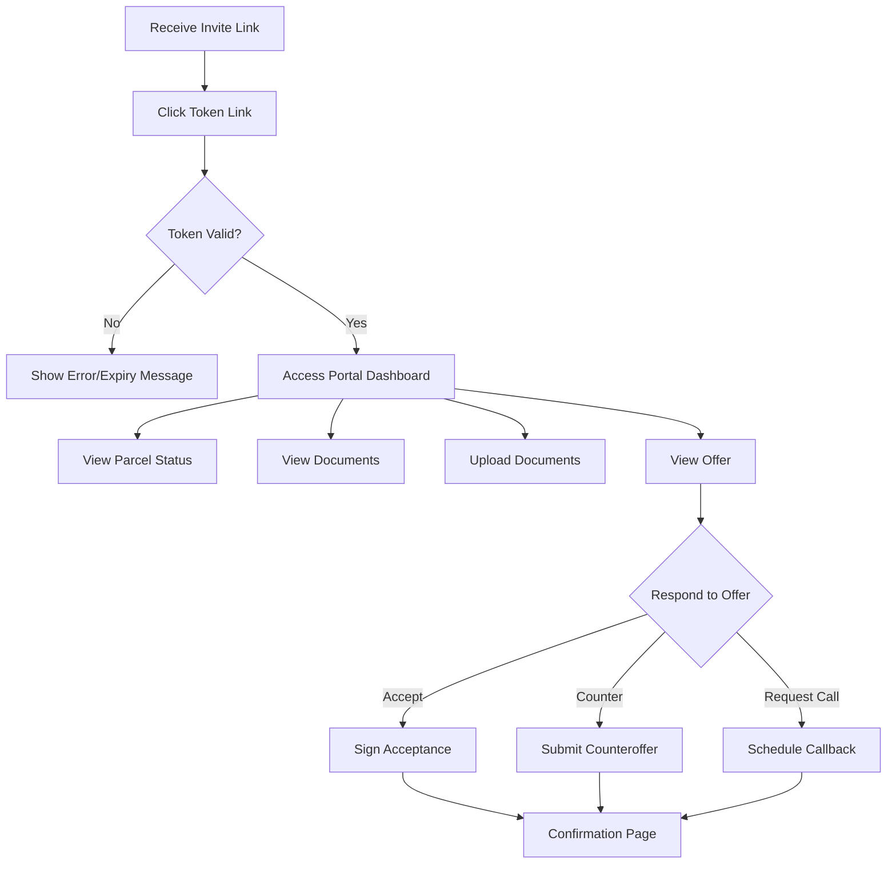
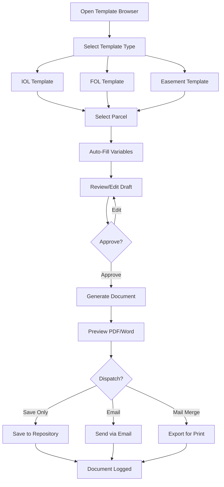
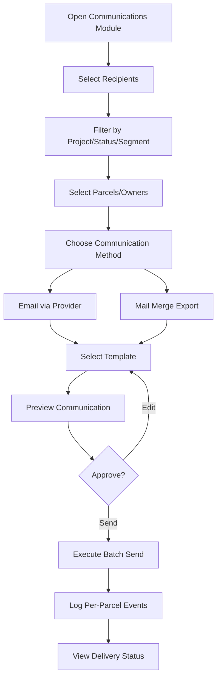
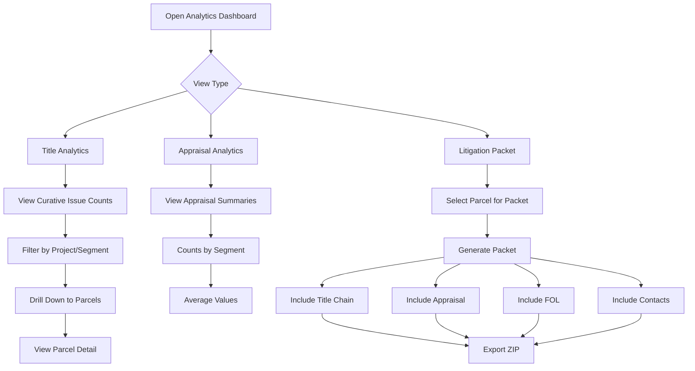

# User Journeys

> **Source**: Software Development Agreement - Exhibit B, Milestone 1 Deliverables  
> **Created**: January 24, 2026  
> **Status**: Milestone 1 Confirmation Required

---

## Overview

This document defines the key user journeys required for MVP acceptance per Agreement Exhibit B. Each journey includes:
- Persona and goal
- Step-by-step flow
- Acceptance criteria
- Related epics and stories

---

## Journey 1: Landowner Uploads and Negotiation Portal

**Persona**: Landowner  
**Goal**: Access portal, review offer, upload documents, respond to negotiation  
**Agreement Reference**: Exhibit A - "Landowner Portal: Status and Uploads"

### Flow

### Steps

| Step | Action | System Response | Data Captured |
|------|--------|-----------------|---------------|
| 1 | Landowner receives email/SMS with portal link | Link contains time-limited token | PortalInvite created |
| 2 | Clicks link and lands on portal | System validates token | Token verified, session started |
| 3 | Views parcel status dashboard | Plain-language status displayed | Portal session logged |
| 4 | Reviews documents (notices, ROE, offer) | Document list with downloads | Document access logged |
| 5 | Uploads required documents (POA, W-9, photos) | Files validated and stored | Document created, AuditEvent |
| 6 | Views current offer | Offer summary displayed | Offer view logged |
| 7 | Responds: Accept/Counter/Request Call | Response form submitted | Offer response, Task created |
| 8 | Receives confirmation | Confirmation page/email | Communication logged |

### Acceptance Criteria

- [ ] Tokenized links work without self-registration (no account creation)
- [ ] Tokens expire after configured duration (default: 7 days)
- [ ] Failed attempts are rate-limited (max 5 per hour)
- [ ] Status displays in plain language, not internal codes
- [ ] Only approved/released documents visible to landowner
- [ ] File uploads validated: type whitelist, size limit (≤50MB)
- [ ] All portal interactions logged with timestamps
- [ ] Counteroffer creates new Offer record with source="landowner"
- [ ] Request callback creates Task assigned to land_agent persona

### Related Stories

- LP-001: Tokenized Secure Access
- LP-002: Status Display
- LP-003: Document List and Download
- LP-004: Landowner Uploads
- LP-005: Negotiation Portal (Landowner View)
- LP-006: Portal Audit Logging

---

## Journey 2: Template Generator

**Persona**: In-House Counsel / Legal Director  
**Goal**: Generate IOL/FOL/Easement documents from templates  
**Agreement Reference**: Exhibit A - "Document Management & Template Generator"

### Flow

### Steps

| Step | Action | System Response | Data Captured |
|------|--------|-----------------|---------------|
| 1 | Navigate to Template Generator | Template browser loads | Session logged |
| 2 | Select template type (IOL/FOL/Easement) | Template list filtered | - |
| 3 | Choose specific template version | Template details shown | Template ID noted |
| 4 | Select target parcel(s) | Parcel data loaded | Parcel context set |
| 5 | Review auto-filled variables | Variables populated from parcel/project | - |
| 6 | Edit variables if needed | Form validation | Changes tracked |
| 7 | Preview generated document | PDF/Word preview rendered | - |
| 8 | Approve or request changes | Status updated | Approval logged |
| 9 | Generate final document | Document created | Document record, hash |
| 10 | Dispatch (email, print, save) | Action executed | Communication logged |

### Acceptance Criteria

- [ ] Template browser shows only approved templates
- [ ] Templates have version numbers and approval status
- [ ] Variables auto-fill from parcel/project data:
  - Owner name(s)
  - Parcel ID / legal description
  - Project name
  - Offer amount (if applicable)
  - Relevant dates
- [ ] Generated documents support PDF and Word formats
- [ ] Documents are version-stamped and hashed
- [ ] Batch generation supported (multiple parcels)
- [ ] All template actions require Legal persona or higher
- [ ] Generated documents linked to parcel record

### Related Stories

- DOC-002: Template Storage
- DOC-003: Template Versioning and Approval
- DOC-004: Document Generation
- DOC-005: Template Generator (IOL/FOL/Easements)
- DOC-006: Documents & Templates UI
- DOC-007: End-to-End Template Generation Flow

---

## Journey 3: Landowner Communications (One-to-Many)

**Persona**: ROW Manager / Land Agent  
**Goal**: Send batch communications to multiple landowners  
**Agreement Reference**: Exhibit A - "Landowner Communications – One-to-Many Sends"

### Flow

### Steps

| Step | Action | System Response | Data Captured |
|------|--------|-----------------|---------------|
| 1 | Open Communications module | Interface loads | Session logged |
| 2 | Apply filters (project, status, segment) | Parcel list filtered | Filter criteria |
| 3 | Select parcels/owners for batch | Selection confirmed | Recipient list |
| 4 | Choose method (email/mail merge) | Method-specific options shown | Method selected |
| 5 | Select communication template | Template loaded | Template ID |
| 6 | Preview merged communications | Sample previews shown | - |
| 7 | Confirm and send | Batch job initiated | Batch ID created |
| 8 | System sends/generates | Emails sent or PDFs generated | Per-recipient status |
| 9 | View delivery status | Status dashboard updated | Delivery proofs |

### Acceptance Criteria

- [ ] Filter parcels by: project, status, segment, curative status, negotiation status
- [ ] Select individual or all matching parcels
- [ ] Email sends through integrated provider (SendGrid/SES)
- [ ] Mail merge exports to PDF/letter format
- [ ] Each send event logged at parcel level:
  - Date/time
  - Communication type
  - Template used
  - Delivery result (if known)
- [ ] Delivery status tracking (for email via webhooks)
- [ ] Batch communications respect landowner preferences
- [ ] Failed sends flagged for retry/review

### Related Stories

- COM-002: Batch Communications (One-to-Many)
- COM-003: Communication Event Logging
- COM-005: Batch Communications UI
- EMAIL-001: Email Provider Integration
- EMAIL-002: Email Send Logging

---

## Journey 4: Title & Appraisal Analytics, Litigation Packet Views

**Persona**: General Counsel / Legal Director  
**Goal**: Review title issues, appraisal summaries, and prepare litigation packets  
**Agreement Reference**: Exhibit A - "Analytics & Reporting", "Title & Curative Tracker"

### Flow

### Title Analytics Steps

| Step | Action | System Response | Data Captured |
|------|--------|-----------------|---------------|
| 1 | Navigate to Title Analytics | Dashboard loads | Session logged |
| 2 | View curative issue summary | Counts by type displayed | - |
| 3 | Filter by project/segment | Data filtered | Filter criteria |
| 4 | Identify high-severity parcels | Parcels highlighted | - |
| 5 | Drill down to specific parcel | Curative item list shown | - |
| 6 | Review item details | Item detail modal | - |
| 7 | Export analytics report | CSV/PDF generated | Export logged |

### Appraisal Analytics Steps

| Step | Action | System Response | Data Captured |
|------|--------|-----------------|---------------|
| 1 | Navigate to Appraisal Analytics | Dashboard loads | Session logged |
| 2 | View parcels with appraisals | Count displayed | - |
| 3 | View appraisal ranges by segment | Range summary shown | - |
| 4 | View average values by segment | Averages computed | - |
| 5 | Export summary report | CSV generated | Export logged |

**NOTE**: Per Agreement Section 3.3(a), appraisal analytics display client-provided data only. No independent valuation modeling.

### Litigation Packet Steps

| Step | Action | System Response | Data Captured |
|------|--------|-----------------|---------------|
| 1 | Select parcel for litigation | Parcel context set | - |
| 2 | Open litigation packet generator | Checklist displayed | - |
| 3 | Select components to include | Options toggled | - |
| 4 | Generate packet | ZIP file created | Packet logged |
| 5 | Download ZIP | File downloaded | Download logged |

### Acceptance Criteria

#### Title Analytics
- [ ] Display counts and types of curative issues by project/segment
- [ ] Identify parcels with multiple or severe curative issues
- [ ] Show lienholder counts and unreleased encumbrances
- [ ] Curative resolution rates and cycle times
- [ ] Filter by status (open, in_progress, resolved)
- [ ] Export to CSV/PDF

#### Appraisal Analytics
- [ ] Count of parcels with appraisals completed
- [ ] Appraisal ranges by segment
- [ ] Average appraised values by segment
- [ ] Data sourced from client-provided appraisals only
- [ ] No independent valuation computation

#### Litigation Packet
- [ ] Paginated output including:
  - Contact information
  - Title chain documents
  - Appraisal summary
  - Final Offer Letter
- [ ] Download as ZIP archive
- [ ] All included documents version-stamped
- [ ] Packet generation logged in audit trail

### Related Stories

- TIT-003: Title Report Analytics (MVP)
- TIT-005: Title Analytics Dashboard
- ANA-002: Title & Curative Analytics
- ANA-004: Appraisal Analytics (MVP)
- ANA-005: Analytics Dashboard UI
- LIT-004: Calendar and List Views

---

## Acceptance Criteria Summary

| Journey | Key Criteria Count | Status |
|---------|-------------------|--------|
| Landowner Portal & Negotiation | 9 | Pending Review |
| Template Generator | 10 | Pending Review |
| One-to-Many Communications | 8 | Pending Review |
| Title/Appraisal/Litigation | 16 | Pending Review |

---

## Sign-Off

**Milestone 1 Requirement**: Confirm user journeys and acceptance criteria for all four flows above.

| Journey | Client Confirmed | Developer Confirmed | Date |
|---------|-----------------|--------------------|----|
| Landowner Portal & Negotiation | [ ] | [ ] | |
| Template Generator | [ ] | [ ] | |
| One-to-Many Communications | [ ] | [ ] | |
| Title/Appraisal/Litigation Views | [ ] | [ ] | |

---

## Related Documents

- [Data Model](data-model.md)
- [Backlog](backlog/landright_backlog.md)
- [RBAC Matrix](rbac.md)
- [Workflows](workflows.md)
