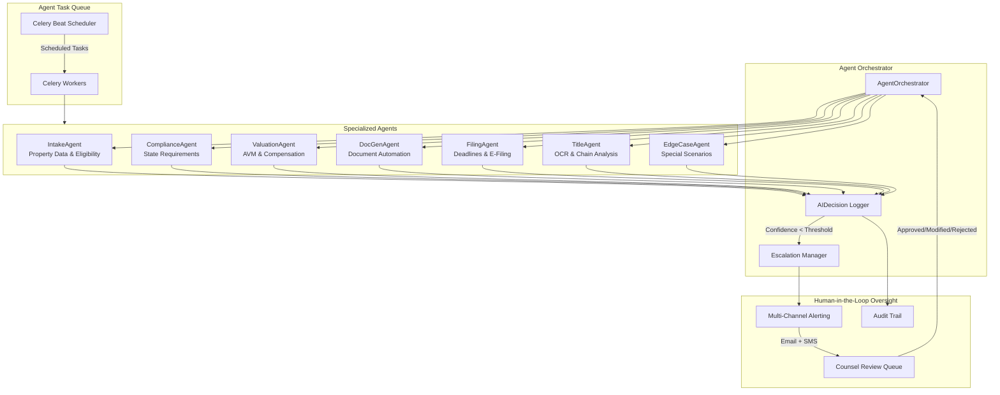
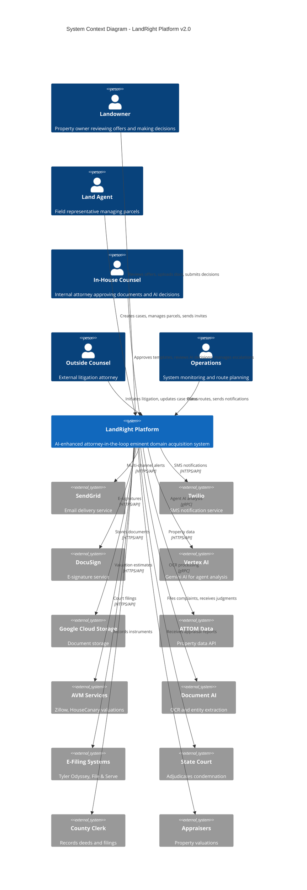
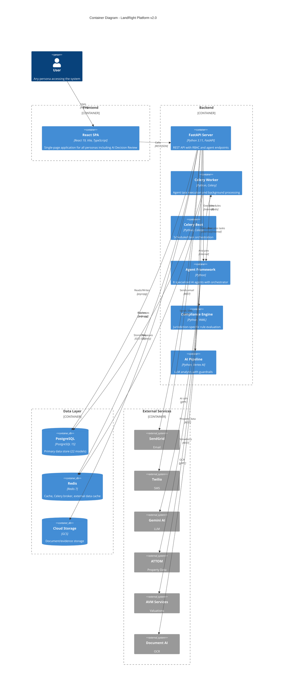
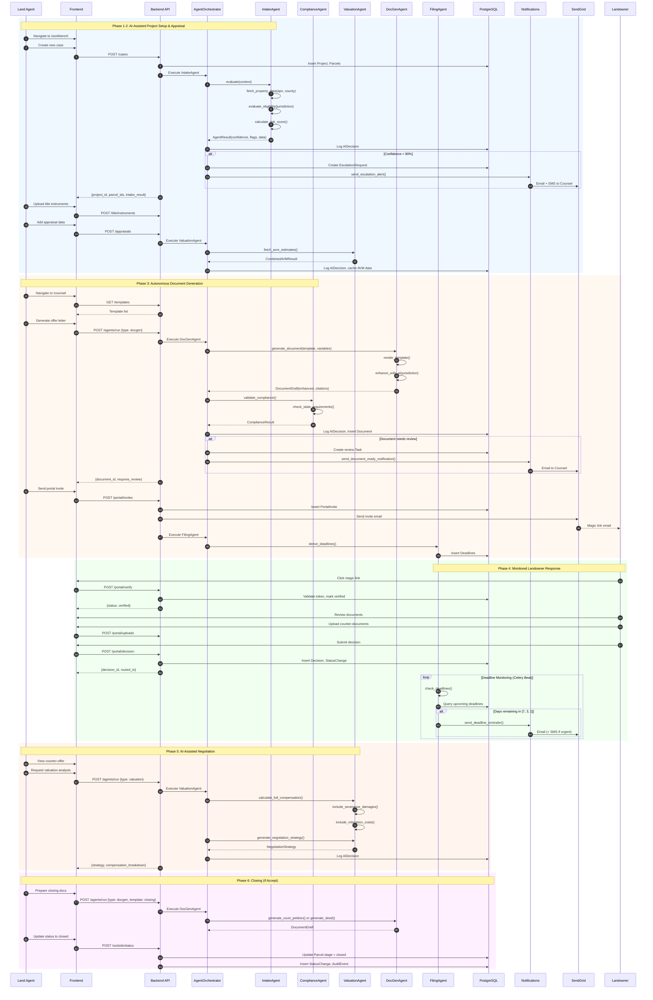
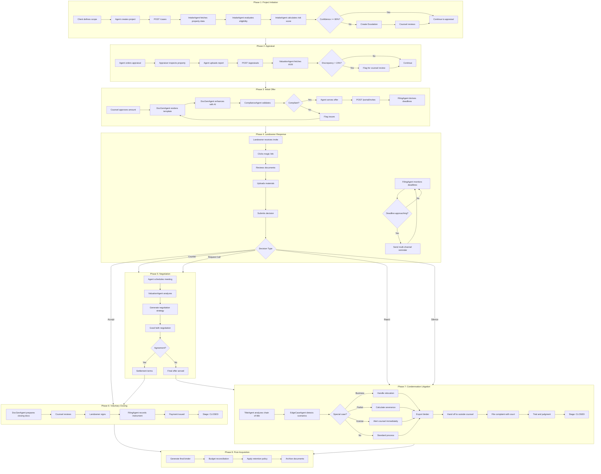
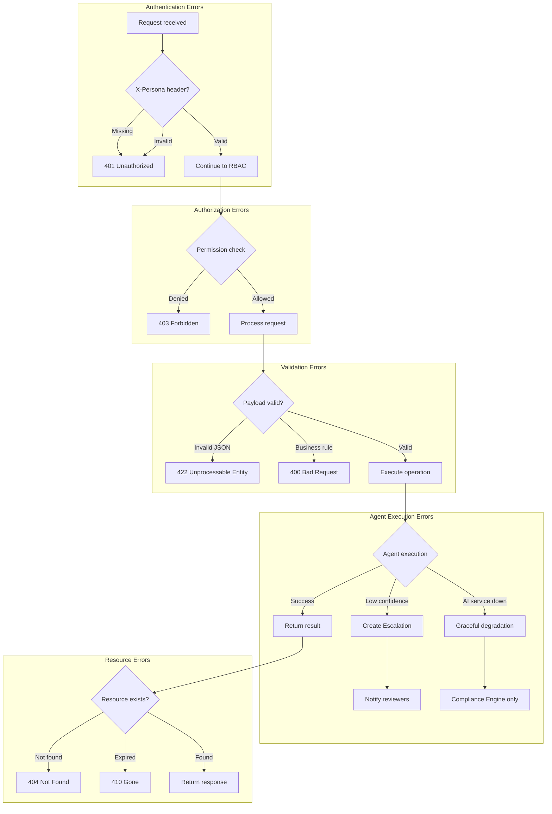
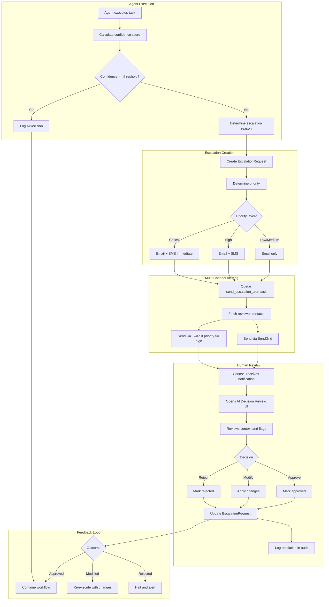
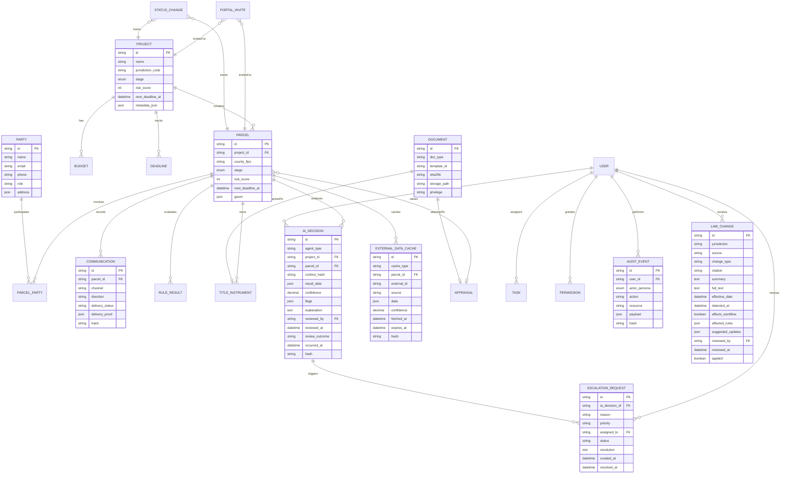
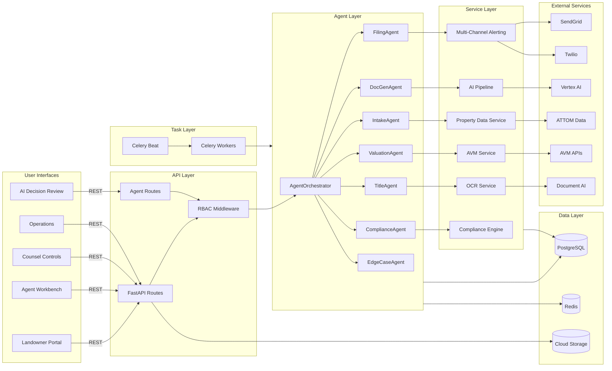

# LandRight End-to-End Workflow Documentation

> **Purpose**: This document maps the complete application workflow for the LandRight eminent domain platform, enabling new engineers, product leaders, and auditors to understand the system quickly.
>
> **Last Updated**: 2026-01-29

---

## Version Information

| Version | Status | Description |
|---------|--------|-------------|
| **v2.0** | **Current** | AI-Enhanced Autonomous Workflow with Agent Orchestration |
| v1.0 | Legacy | Manual Attorney-Supervised Workflow ([Appendix B](#appendix-b-legacy-workflow-v10)) |

> **Note**: Version 2.0 introduces AI agents for automated case intake, compliance checking, valuation cross-verification, document generation, deadline monitoring, title analysis, and edge case handling. All AI operations include human-in-the-loop oversight via the escalation system.

---

## Table of Contents

1. [Overview](#1-overview)
2. [System Context](#2-system-context)
3. [Architecture (Containers)](#3-architecture-containers)
4. [Core E2E Workflow (Happy Path)](#4-core-e2e-workflow-happy-path)
5. [Unhappy Paths + Resiliency](#5-unhappy-paths--resiliency)
6. [Data Model + Data Flows](#6-data-model--data-flows)
7. [RACI Matrix](#7-raci-matrix)
8. [Traceability (Code Map)](#8-traceability-code-map)

---

## 1. Overview

### 1.1 System Purpose

LandRight is an **attorney-in-the-loop eminent domain platform** that streamlines the property acquisition process for condemning authorities (utilities, government agencies, pipeline companies). The system provides:

- **Compliance Engine** for jurisdiction-specific statutory compliance with AI-augmented validation
- **Multi-persona workflows** separating concerns between agents, counsel, and landowners
- **Audit-grade documentation** with SHA-256 hashing and retention policies
- **Autonomous Document Generation** with human-in-the-loop oversight
- **AI Agent Orchestration** for intelligent automation across the acquisition lifecycle

### 1.2 Personas

| Persona | Header Value | Description | Primary Interface |
|---------|--------------|-------------|-------------------|
| **Landowner** | `landowner` | Property owners reviewing offers and making decisions | `/intake` (Portal) |
| **Land Agent** | `land_agent` | Field representatives managing parcels and communications | `/workbench` |
| **In-House Counsel** | `in_house_counsel` | Internal attorneys approving templates, reviewing AI decisions | `/counsel` |
| **Outside Counsel** | `outside_counsel` | External law firm handling litigation | `/counsel` (Panel) |
| **Admin/Ops** | `admin` | Operations staff and system monitoring | `/ops` |

### 1.3 Workflow Summary

The platform supports an **8-phase eminent domain workflow** with AI-orchestrated stage progression:

```
Phase 1: Project Initiation
    ↓ [IntakeAgent: property data, eligibility, risk score]
Phase 2: Appraisal & Valuation
    ↓ [ValuationAgent: AVM cross-check, compensation calc]
Phase 3: Initial Offer (Good Faith)
    ↓ [DocGenAgent: template render, AI enhancement]
    ↓ [ComplianceAgent: jurisdiction validation]
Phase 4: Landowner Response
    ↓ [FilingAgent: deadline monitoring, reminders]
    ├─[Accept]────────→ Phase 6: Voluntary Closing → CLOSED
    ├─[Counter/Call]──→ Phase 5: Negotiation ─┬→ Settlement → CLOSED
    │                   [ValuationAgent: strategy]└→ Impasse ───┐
    └─[Reject/Silence]────────────────────────────────────────────┘
                                                              ↓
                                              Phase 7: Condemnation Litigation
                                              [TitleAgent: chain analysis]
                                              [EdgeCaseAgent: special scenarios]
                                                              ↓
                                              Phase 8: Post-Acquisition → CLOSED
```

### 1.4 AI Agent Architecture

LandRight employs a multi-agent architecture with centralized orchestration and human oversight:



#### Agent Responsibilities

| Agent | Purpose | Key Capabilities |
|-------|---------|------------------|
| **IntakeAgent** | Case onboarding automation | Property data fetch, eligibility evaluation, risk scoring |
| **ComplianceAgent** | Statutory compliance | State rule validation, deadline checking, law change monitoring |
| **ValuationAgent** | Compensation analysis | AVM integration, severance calculation, negotiation strategy |
| **DocGenAgent** | Document automation | Template rendering, AI enhancement, jurisdiction-specific clauses |
| **FilingAgent** | Deadline management | Reminder scheduling, e-filing, error interpretation |
| **TitleAgent** | Title analysis | OCR processing, chain of title, issue identification |
| **EdgeCaseAgent** | Special scenarios | Business relocation, partial takings, inverse condemnation |

#### Confidence Thresholds

All agents operate with configurable confidence thresholds. When confidence falls below the threshold, the system automatically creates an escalation for human review:

| Agent | Default Threshold | Critical Flags |
|-------|-------------------|----------------|
| IntakeAgent | 80% | `missing_apn`, `title_defect`, `disputed_ownership` |
| ComplianceAgent | 85% | `compliance_violation`, `deadline_missed`, `law_change_detected` |
| ValuationAgent | 85% | `significant_discrepancy`, `missing_comparables` |
| DocGenAgent | 90% | `template_mismatch`, `missing_required_clause` |
| FilingAgent | 90% | `filing_rejected`, `deadline_imminent` |
| TitleAgent | 85% | `chain_break`, `unresolved_lien`, `missing_instrument` |
| EdgeCaseAgent | 80% | `business_relocation`, `partial_taking`, `inverse_condemnation` |

### 1.5 Parcel Stage Progression

Parcels move through defined stages with orchestrated transitions:

| Stage | Description | AI Agent Involvement | Next Valid Stages |
|-------|-------------|---------------------|-------------------|
| `intake` | Initial parcel creation | IntakeAgent evaluates eligibility | `appraisal` |
| `appraisal` | Valuation in progress | ValuationAgent cross-checks AVM | `offer_pending` |
| `offer_pending` | Offer being prepared | DocGenAgent renders, ComplianceAgent validates | `offer_sent` |
| `offer_sent` | Offer served to landowner | FilingAgent monitors deadlines | `negotiation` |
| `negotiation` | Active negotiations | ValuationAgent suggests strategy | `closing`, `litigation` |
| `closing` | Voluntary closing in progress | DocGenAgent prepares closing docs | `closed` |
| `litigation` | Condemnation proceedings | TitleAgent analyzes, EdgeCaseAgent detects | `closed` |
| `closed` | Acquisition complete | (terminal) | (terminal) |

---

## 2. System Context

### 2.1 System Context Diagram



### 2.2 External Actors

| Actor | Type | Interaction | Protocol |
|-------|------|-------------|----------|
| Landowner | Human | Portal access via magic link | HTTPS |
| Land Agent | Human | Workbench UI | HTTPS |
| In-House Counsel | Human | Counsel UI + AI Decision Review | HTTPS |
| Outside Counsel | Human | Counsel Panel | HTTPS |
| Operations | Human | Ops UI | HTTPS |
| SendGrid | Service | Email delivery | REST API |
| Twilio | Service | SMS delivery | REST API |
| DocuSign | Service | E-signatures | REST API (planned) |
| Vertex AI | Service | Agent AI analysis | gRPC |
| ATTOM Data | Service | Property data fetch | REST API |
| AVM Services | Service | Automated valuations | REST API |
| Document AI | Service | OCR/entity extraction | gRPC |
| E-Filing Systems | Service | Court document filing | REST API |
| GCS | Service | Document storage | REST API |
| Docket System | Service | Court filing webhooks | Webhook (POST) |

### 2.3 Entry Points

| Entry Point | Type | Path | Purpose |
|-------------|------|------|---------|
| Web UI | Frontend | `http://localhost:3050/*` | All persona interfaces |
| REST API | Backend | `http://localhost:8050/*` | All API operations |
| Agent API | Backend | `http://localhost:8050/agents/*` | AI agent execution and review |
| Health Probes | Backend | `/health/*` | Kubernetes liveness/readiness |
| Webhook | Backend | `/integrations/dockets` | External docket updates |

---

## 3. Architecture (Containers)

### 3.1 Container Diagram



### 3.2 Component Details

#### Frontend (React SPA)

| Component | Path | Purpose |
|-----------|------|---------|
| App Shell | `frontend/src/App.tsx` | Routing and context providers |
| AppLayout | `frontend/src/components/AppLayout.tsx` | Navigation and project/parcel selector |
| HomePage | `frontend/src/pages/HomePage.tsx` | Landing page with workspace cards |
| IntakePage | `frontend/src/pages/IntakePage.tsx` | Landowner portal |
| WorkbenchPage | `frontend/src/pages/WorkbenchPage.tsx` | Agent workbench |
| CounselPage | `frontend/src/pages/CounselPage.tsx` | Counsel controls + AI Decision Review |
| OpsPage | `frontend/src/pages/OpsPage.tsx` | Operations dashboard |
| AIDecisionReview | `frontend/src/components/AIDecisionReview.tsx` | Escalation management UI |
| API Client | `frontend/src/lib/api.ts` | Typed API wrapper (50+ functions) |

#### Backend (FastAPI)

| Component | Path | Purpose |
|-----------|------|---------|
| Main App | `backend/app/main.py` | FastAPI initialization, route registration |
| Dependencies | `backend/app/api/deps.py` | Request dependencies (persona, user, DB) |
| RBAC | `backend/app/security/rbac.py` | Permission matrix and authorization |
| Routes | `backend/app/api/routes/*.py` | 20 route modules, 50+ endpoints |
| Agent Routes | `backend/app/api/routes/agents.py` | Agent execution and escalation management |
| Models | `backend/app/db/models.py` | 22 SQLAlchemy models |
| Services | `backend/app/services/*.py` | Business logic (compliance, AI, notifications, AVM, OCR) |
| Agents | `backend/app/agents/*.py` | 8 specialized agents + orchestrator |
| Tasks | `backend/app/tasks/*.py` | Celery task definitions |

#### Agent Framework

| Component | Path | Purpose |
|-----------|------|---------|
| BaseAgent | `backend/app/agents/base.py` | Abstract agent with confidence/escalation logic |
| AgentOrchestrator | `backend/app/agents/orchestrator.py` | Centralized execution with oversight |
| IntakeAgent | `backend/app/agents/intake_agent.py` | Property data and eligibility |
| ComplianceAgent | `backend/app/agents/compliance_agent.py` | State requirement validation |
| ValuationAgent | `backend/app/agents/valuation_agent.py` | AVM and compensation calculation |
| DocGenAgent | `backend/app/agents/docgen_agent.py` | Document generation and enhancement |
| FilingAgent | `backend/app/agents/filing_agent.py` | Deadline monitoring and e-filing |
| TitleAgent | `backend/app/agents/title_agent.py` | OCR and chain of title analysis |
| EdgeCaseAgent | `backend/app/agents/edge_case_agent.py` | Special scenario handling |

#### Agent Task Queue (Celery)

| Component | Path | Purpose |
|-----------|------|---------|
| Worker App | `backend/app/worker.py` | Celery application initialization |
| Config | `backend/app/celeryconfig.py` | Beat schedule and task configuration |
| Intake Tasks | `backend/app/tasks/intake.py` | Property data and eligibility tasks |
| Compliance Tasks | `backend/app/tasks/compliance.py` | Compliance check and audit tasks |
| Valuation Tasks | `backend/app/tasks/valuation.py` | AVM and compensation tasks |
| DocGen Tasks | `backend/app/tasks/docgen.py` | Document generation tasks |
| Filing Tasks | `backend/app/tasks/filing.py` | Deadline and filing tasks |
| Title Tasks | `backend/app/tasks/title.py` | OCR and title analysis tasks |
| Edge Case Tasks | `backend/app/tasks/edge_cases.py` | Special scenario tasks |
| Notification Tasks | `backend/app/tasks/notifications.py` | Multi-channel alerting tasks |

#### Data Stores

| Store | Technology | Purpose | Location |
|-------|------------|---------|----------|
| PostgreSQL | PostgreSQL 15 | Primary relational data | Cloud SQL / localhost:55432 |
| Redis | Redis 7 | Cache + Celery broker + external data cache | Memorystore / localhost:56379 |
| GCS | Google Cloud Storage | Document storage | GCS bucket (planned) |
| Local FS | Filesystem | Development file storage | `/tmp/landright/` |

### 3.3 Technology Stack

| Layer | Technology | Version |
|-------|------------|---------|
| Frontend | React | 19.2.3 |
| Build Tool | Vite | 6.0.7 |
| Styling | Tailwind CSS | 3.4.3 |
| Backend | FastAPI | 0.109.0 |
| ORM | SQLAlchemy | 2.0.25 |
| Task Queue | Celery | 5.3+ |
| Database | PostgreSQL | 16 |
| Cache | Redis | 7 |
| AI | Vertex AI (Gemini) | 1.47.0 |
| OCR | Google Document AI | - |
| Infrastructure | GCP (Cloud Run, Cloud SQL) | - |
| IaC | Terraform | - |

---

## 4. Core E2E Workflow (Happy Path)

### 4.1 AI-Enhanced Acquisition Sequence



### 4.2 Workflow Activity Diagram



### 4.3 API Endpoint Flow Summary

| Phase | Action | Endpoint | Persona | AI Agent | Data Written |
|-------|--------|----------|---------|----------|--------------|
| 1 | Create case | `POST /cases` | land_agent | IntakeAgent | Project, Parcel, AIDecision |
| 1 | Run intake | `POST /agents/run` | land_agent | IntakeAgent | AIDecision, EscalationRequest |
| 1 | Upload title | `POST /title/instruments` | land_agent | TitleAgent | TitleInstrument, Document |
| 2 | Add appraisal | `POST /appraisals` | land_agent | ValuationAgent | Appraisal, ExternalDataCache |
| 3 | Generate doc | `POST /agents/run` | in_house_counsel | DocGenAgent | Document, AIDecision |
| 3 | Send invite | `POST /portal/invites` | land_agent | FilingAgent | PortalInvite, Deadline |
| 4 | Verify invite | `POST /portal/verify` | landowner | - | PortalInvite (updated) |
| 4 | Upload docs | `POST /portal/uploads` | landowner | - | Document |
| 4 | Submit decision | `POST /portal/decision` | landowner | - | Decision, StatusChange |
| 5 | Get strategy | `POST /agents/run` | in_house_counsel | ValuationAgent | AIDecision |
| 6/7 | Update status | `POST /outside/status` | outside_counsel | - | StatusChange, AuditEvent |
| 7 | Analyze title | `POST /agents/run` | in_house_counsel | TitleAgent | AIDecision |
| 7 | Detect edge cases | `POST /agents/run` | in_house_counsel | EdgeCaseAgent | AIDecision, EscalationRequest |
| 7 | Export binder | `POST /workflows/binder/export` | in_house_counsel | - | Document (binder) |

---

## 5. Unhappy Paths + Resiliency

### 5.1 Error Handling Matrix



### 5.2 Error Response Catalog

| Status | Condition | Example Endpoint | Response Body |
|--------|-----------|------------------|---------------|
| 401 | Missing/invalid persona | Any | `{"detail": "Not authenticated"}` |
| 403 | Insufficient permissions | `POST /agents/run` as landowner | `{"detail": "Forbidden"}` |
| 400 | Invalid stage transition | `POST /outside/status` | `{"detail": "Invalid transition from 'intake' to 'closed'"}` |
| 404 | Resource not found | `GET /agents/decisions/{id}` | `{"error": "not_found"}` |
| 410 | Invite expired | `POST /portal/verify` | `{"detail": "Invite expired"}` |
| 413 | File too large | `POST /portal/uploads` | `{"detail": "File exceeds 50MB limit"}` |
| 422 | Invalid payload | `POST /agents/run` | `{"detail": [{"loc": ["body", "agent_type"], "msg": "invalid agent"}]}` |
| 429 | Rate limited | `POST /portal/verify` | `{"detail": "Too many attempts"}` |
| 503 | AI service unavailable | `POST /agents/run` | `{"detail": "AI service temporarily unavailable", "fallback": "compliance_only"}` |

### 5.3 Graceful Degradation

| Failure Mode | Fallback Behavior | Code Location |
|--------------|-------------------|---------------|
| Database unavailable | In-memory stubs for dev | `backend/app/api/routes/cases.py` |
| AI service unavailable | Compliance Engine only (no AI analysis) | `backend/app/agents/base.py:call_ai()` |
| ATTOM API unavailable | Return cached data or manual entry | `backend/app/services/property_data_service.py` |
| AVM services unavailable | Use appraisal value only | `backend/app/services/avm_service.py` |
| Document AI unavailable | Manual title entry | `backend/app/services/ocr_service.py` |
| SendGrid unavailable | Preview mode (no actual send) | `backend/app/services/notifications.py` |
| Twilio unavailable | Email-only notifications | `backend/app/tasks/notifications.py` |
| E-Filing unavailable | Queue for manual filing | `backend/app/agents/filing_agent.py` |
| GCS unavailable | Local filesystem storage | `backend/app/api/routes/portal.py` |

### 5.4 Retry and Idempotency

| Operation | Idempotent | Retry Safe | Notes |
|-----------|------------|------------|-------|
| `GET /*` | Yes | Yes | Read operations |
| `POST /cases` | No | No | Creates new records |
| `POST /agents/run` | Yes | Yes | Same context = same decision logged |
| `POST /portal/verify` | Yes | Yes | Token validation |
| `POST /portal/decision` | No | No | One decision per parcel |
| `POST /agents/escalations/{id}/resolve` | Yes | Yes | Resolution is idempotent |
| `POST /workflows/binder/export` | Yes | Yes | Same bundle regenerated |
| Celery tasks | Yes | Yes | Task ID prevents duplicate execution |

### 5.5 Timeout Configuration

| Component | Timeout | Configuration |
|-----------|---------|---------------|
| API requests | 120s | Gunicorn `--timeout 120` |
| AI pipeline | 30s | Vertex AI client timeout |
| Agent execution | 300s (soft), 600s (hard) | Celery task limits |
| Database connections | 30s | SQLAlchemy pool timeout |
| External API calls | 30s | httpx client timeout |
| Background jobs | 900s | Cloud Run worker timeout |

### 5.6 Escalation and Notification Flow



### 5.7 Scheduled Task Overview

| Task | Schedule | Queue | Purpose |
|------|----------|-------|---------|
| `check_all_deadlines` | Hourly | filing | Monitor approaching deadlines |
| `send_deadline_digest` | Daily 8 AM | notifications | Daily summary to counsel |
| `check_law_updates` | Weekly Monday 6 AM | compliance | Monitor legal changes |
| `audit_active_cases` | Daily 2 AM | compliance | Compliance audit |
| `check_pending_escalations` | Every 4 hours | compliance | Escalation follow-up |
| `cleanup_stale_cache` | Daily 3:30 AM | default | Remove expired cache |
| `refresh_avm_cache` | Weekly Sunday 1 AM | default | Update AVM data |

---

## 6. Data Model + Data Flows

### 6.1 Entity Relationship Diagram



### 6.2 Data Flow Diagram



### 6.3 Key Data Objects

| Object | Created By | Read By | AI Agent | Persisted In |
|--------|------------|---------|----------|--------------|
| Project | Land Agent | All personas | IntakeAgent | PostgreSQL |
| Parcel | Land Agent | All personas | Multiple | PostgreSQL |
| Document | Multiple | Counsel, Agent | DocGenAgent | PostgreSQL + GCS |
| Communication | System | Agent, Counsel | - | PostgreSQL |
| PortalInvite | Agent | Landowner | - | PostgreSQL |
| Decision | Landowner | Agent, Counsel | - | PostgreSQL |
| RuleResult | System | Agent, Counsel | ComplianceAgent | PostgreSQL |
| Deadline | System/Counsel | Counsel, Outside | FilingAgent | PostgreSQL |
| AIDecision | System | Counsel | All agents | PostgreSQL |
| EscalationRequest | System | Counsel | Orchestrator | PostgreSQL |
| ExternalDataCache | System | Agents | Multiple | PostgreSQL + Redis |
| LawChange | System | Counsel | ComplianceAgent | PostgreSQL |
| AuditEvent | System | Admin | - | PostgreSQL |
| StatusChange | System | All | - | PostgreSQL |

### 6.4 Data Integrity

| Mechanism | Purpose | Implementation |
|-----------|---------|----------------|
| SHA-256 hashing | Document integrity | `backend/app/services/hashing.py` |
| Audit events | Action traceability | `backend/app/db/models.py:AuditEvent` |
| AI decision logging | Agent output traceability | `backend/app/db/models.py:AIDecision` |
| Context hashing | Decision reproducibility | `backend/app/agents/orchestrator.py` |
| Status change log | Stage transition history | `backend/app/db/models.py:StatusChange` |
| Stage validation | Prevent invalid transitions | `backend/app/db/models.py:PARCEL_STAGE_TRANSITIONS` |
| Token hashing | Secure invite links | `PortalInvite.token_sha256` |
| External data caching | API response integrity | `backend/app/db/models.py:ExternalDataCache` |

---

## 7. RACI Matrix

### 7.1 Workflow Stage Responsibilities

| Stage | Product | Engineering | Security | Legal/Compliance | IT/Ops | Support | AI Agents |
|-------|---------|-------------|----------|------------------|--------|---------|-----------|
| **Project Setup** | A | R | C | C | I | I | IntakeAgent |
| **Appraisal** | A | I | I | C | I | I | ValuationAgent |
| **Offer Preparation** | C | R | I | A | I | I | DocGenAgent, ComplianceAgent |
| **Portal Invite** | I | R | C | A | C | I | FilingAgent |
| **Landowner Response** | I | R | I | C | I | R | FilingAgent |
| **Negotiation** | C | I | I | A | I | R | ValuationAgent |
| **Closing** | I | R | I | A | C | I | DocGenAgent |
| **Litigation Handoff** | I | R | C | A | I | I | TitleAgent, EdgeCaseAgent |
| **Binder Export** | I | R | C | A | I | I | - |
| **AI Decision Review** | I | C | C | A | I | I | Orchestrator |
| **Post-Acquisition** | A | R | C | C | R | I | - |

**Legend**: R = Responsible, A = Accountable, C = Consulted, I = Informed

### 7.2 Operational Responsibilities

| Activity | Product | Engineering | Security | Legal/Compliance | IT/Ops | Support |
|----------|---------|-------------|----------|------------------|--------|---------|
| **Feature Development** | A | R | C | C | I | I |
| **Bug Fixes** | C | R | I | I | I | C |
| **Security Patches** | I | R | A | C | C | I |
| **Rule Pack Updates** | C | R | I | A | I | I |
| **Template Changes** | C | R | I | A | I | I |
| **Agent Tuning** | C | R | C | A | I | I |
| **Escalation Review** | I | C | C | A | I | I |
| **Infrastructure** | I | C | C | I | R | I |
| **Monitoring/Alerts** | I | C | C | I | R | I |
| **User Support** | I | C | I | C | I | R |
| **Compliance Audits** | C | C | R | A | C | I |
| **Data Retention** | I | R | C | A | R | I |

### 7.3 Role Definitions

| Role | Responsibility |
|------|----------------|
| **Product** | Feature prioritization, user requirements, roadmap |
| **Engineering** | Implementation, testing, deployment, agent development |
| **Security** | Vulnerability assessment, access controls, encryption |
| **Legal/Compliance** | Statutory compliance, rule accuracy, AI oversight, escalation review |
| **IT/Ops** | Infrastructure, monitoring, incident response |
| **Support** | User assistance, issue triage, feedback collection |

---

## 8. Traceability (Code Map)

### 8.1 Frontend Traceability

| Diagram Node | File Path | Description |
|--------------|-----------|-------------|
| React SPA | `frontend/src/main.tsx` | Application entry point |
| App Shell | `frontend/src/App.tsx` | Routes and context providers |
| AppLayout | `frontend/src/components/AppLayout.tsx` | Navigation and selectors |
| HomePage | `frontend/src/pages/HomePage.tsx` | Landing page |
| IntakePage | `frontend/src/pages/IntakePage.tsx` | Landowner portal |
| WorkbenchPage | `frontend/src/pages/WorkbenchPage.tsx` | Agent workbench |
| CounselPage | `frontend/src/pages/CounselPage.tsx` | Counsel controls + AI review |
| OpsPage | `frontend/src/pages/OpsPage.tsx` | Operations dashboard |
| AIDecisionReview | `frontend/src/components/AIDecisionReview.tsx` | Escalation management UI |
| API Client | `frontend/src/lib/api.ts` | Typed API wrapper |
| AppContext | `frontend/src/context/AppContext.tsx` | Global state management |

### 8.2 Backend Route Traceability

| Endpoint | File Path | Handler Function | Purpose |
|----------|-----------|------------------|---------|
| `POST /cases` | `backend/app/api/routes/cases.py` | `create_case()` | Create project and parcels |
| `GET /cases/{id}` | `backend/app/api/routes/cases.py` | `get_case()` | Retrieve case details |
| `GET /parcels` | `backend/app/api/routes/parcels.py` | `list_parcels()` | List parcels |
| `POST /portal/invites` | `backend/app/api/routes/portal.py` | `send_invite()` | Send portal invite |
| `POST /portal/verify` | `backend/app/api/routes/portal.py` | `verify_invite()` | Verify magic link |
| `POST /portal/decision` | `backend/app/api/routes/portal.py` | `submit_decision()` | Submit landowner decision |
| `POST /portal/uploads` | `backend/app/api/routes/portal.py` | `upload_file()` | Upload documents |
| `GET /templates` | `backend/app/api/routes/templates.py` | `list_templates()` | List templates |
| `POST /templates/render` | `backend/app/api/routes/templates.py` | `render_template()` | Render template |
| `POST /ai/drafts` | `backend/app/api/routes/ai.py` | `generate_draft()` | Generate AI draft |
| `GET /workflows/approvals` | `backend/app/api/routes/workflows.py` | `list_approvals()` | List pending approvals |
| `POST /workflows/binder/export` | `backend/app/api/routes/workflows.py` | `export_binder()` | Export binder |
| `GET /deadlines` | `backend/app/api/routes/deadlines.py` | `list_deadlines()` | List deadlines |
| `POST /deadlines/derive` | `backend/app/api/routes/deadlines.py` | `derive_deadlines()` | Derive deadlines |
| `GET /outside/repository/completeness` | `backend/app/api/routes/outside.py` | `repository_completeness()` | Check completeness |
| `POST /outside/case/initiate` | `backend/app/api/routes/outside.py` | `initiate_case()` | Initiate litigation |
| `POST /outside/status` | `backend/app/api/routes/outside.py` | `update_status()` | Update case status |
| `POST /agents/run` | `backend/app/api/routes/agents.py` | `run_agent()` | Execute agent analysis |
| `GET /agents/decisions` | `backend/app/api/routes/agents.py` | `list_ai_decisions()` | List AI decisions |
| `GET /agents/decisions/{id}` | `backend/app/api/routes/agents.py` | `get_ai_decision()` | Get decision details |
| `GET /agents/escalations` | `backend/app/api/routes/agents.py` | `list_escalations()` | List escalations |
| `GET /agents/escalations/{id}` | `backend/app/api/routes/agents.py` | `get_escalation()` | Get escalation details |
| `POST /agents/escalations/{id}/resolve` | `backend/app/api/routes/agents.py` | `resolve_escalation()` | Resolve escalation |
| `POST /agents/escalations/{id}/assign` | `backend/app/api/routes/agents.py` | `assign_escalation()` | Assign to reviewer |
| `GET /communications` | `backend/app/api/routes/communications.py` | `list_communications()` | List communications |
| `GET /rules/results` | `backend/app/api/routes/rules.py` | `list_rule_results()` | List rule results |
| `GET /budgets/summary` | `backend/app/api/routes/budgets.py` | `get_budget_summary()` | Get budget summary |
| `GET /binder/status` | `backend/app/api/routes/binder.py` | `get_binder_status()` | Get binder status |
| `GET /appraisals` | `backend/app/api/routes/appraisals.py` | `get_appraisal()` | Get appraisal |
| `POST /appraisals` | `backend/app/api/routes/appraisals.py` | `upsert_appraisal()` | Create/update appraisal |
| `GET /title/instruments` | `backend/app/api/routes/title.py` | `list_title_instruments()` | List title instruments |
| `POST /title/instruments` | `backend/app/api/routes/title.py` | `upload_title_instrument()` | Upload title instrument |
| `GET /ops/routes/plan` | `backend/app/api/routes/ops.py` | `get_route_plan()` | Get route plan |
| `POST /notifications/preview` | `backend/app/api/routes/notifications.py` | `preview_notification()` | Preview notification |
| `GET /health/live` | `backend/app/api/routes/health.py` | `liveness()` | Liveness probe |
| `POST /integrations/dockets` | `backend/app/api/routes/integrations.py` | `docket_webhook()` | Docket webhook |

### 8.3 Service Traceability

| Service | File Path | Key Functions |
|---------|-----------|---------------|
| Compliance Engine | `backend/app/services/rules_engine.py` | `evaluate_rules()`, `load_rule()`, `get_jurisdiction_config()` |
| AI Pipeline | `backend/app/services/ai_pipeline.py` | `run_ai_pipeline()`, `run_ai_pipeline_async()`, `call_gemini()` |
| Notifications | `backend/app/services/notifications.py` | `preview_or_send()`, `_render_template()` |
| Deadline Rules | `backend/app/services/deadline_rules.py` | `derive_deadlines()`, `get_upcoming_warnings()` |
| Property Data | `backend/app/services/property_data_service.py` | `fetch_property_data()`, `fetch_tax_records()` |
| AVM Service | `backend/app/services/avm_service.py` | `get_combined_estimates()`, `get_single_estimate()` |
| OCR Service | `backend/app/services/ocr_service.py` | `process()`, `extract_entities()`, `classify_document()` |
| Hashing | `backend/app/services/hashing.py` | `sha256_hex()` |

### 8.4 Database Model Traceability

| Model | Table Name | File Path | Key Fields |
|-------|------------|-----------|------------|
| Project | `projects` | `backend/app/db/models.py` | id, name, jurisdiction_code, stage |
| Parcel | `parcels` | `backend/app/db/models.py` | id, project_id, county_fips, stage |
| Party | `parties` | `backend/app/db/models.py` | id, name, email, role |
| ParcelParty | `parcel_parties` | `backend/app/db/models.py` | parcel_id, party_id, relationship_type |
| TitleInstrument | `title_instruments` | `backend/app/db/models.py` | id, parcel_id, document_id, ocr_payload |
| Appraisal | `appraisals` | `backend/app/db/models.py` | id, parcel_id, value, comps, summary |
| Document | `documents` | `backend/app/db/models.py` | id, doc_type, sha256, storage_path |
| Template | `templates` | `backend/app/db/models.py` | id, version, jurisdiction, variables_schema |
| Communication | `communications` | `backend/app/db/models.py` | id, parcel_id, channel, delivery_status |
| RuleResult | `rule_results` | `backend/app/db/models.py` | id, parcel_id, rule_id, citation, fired |
| Task | `tasks` | `backend/app/db/models.py` | id, project_id, title, persona, status |
| Budget | `budgets` | `backend/app/db/models.py` | id, project_id, cap_amount, actual_amount |
| User | `users` | `backend/app/db/models.py` | id, email, persona, full_name |
| Permission | `permissions` | `backend/app/db/models.py` | id, user_id, resource, action |
| AuditEvent | `audit_events` | `backend/app/db/models.py` | id, user_id, action, resource, hash |
| PortalInvite | `portal_invites` | `backend/app/db/models.py` | id, token_sha256, email, expires_at |
| Deadline | `deadlines` | `backend/app/db/models.py` | id, project_id, title, due_at |
| StatusChange | `status_changes` | `backend/app/db/models.py` | id, parcel_id, old_status, new_status |
| AIDecision | `ai_decisions` | `backend/app/db/models.py` | id, agent_type, confidence, result_data, hash |
| EscalationRequest | `escalation_requests` | `backend/app/db/models.py` | id, ai_decision_id, reason, priority, status |
| LawChange | `law_changes` | `backend/app/db/models.py` | id, jurisdiction, change_type, affects_workflow |
| ExternalDataCache | `external_data_cache` | `backend/app/db/models.py` | id, cache_type, source, data, expires_at |

### 8.5 Rules Engine Traceability

| Rule Pack | File Path | Jurisdiction | Key Features |
|-----------|-----------|--------------|--------------|
| Base | `rules/base.yaml` | Common | Anchor events, defaults, evidence hooks |
| Texas | `rules/tx.yaml` | TX | Bill of Rights, quick-take, special commissioners |
| Indiana | `rules/in.yaml` | IN | Resolution required, 30-day offer wait, appraisers |
| Michigan | `rules/mi.yaml` | MI | 125% multiplier, mandatory attorney fees, blight |
| California | `rules/ca.yaml` | CA | Resolution of necessity, business goodwill |
| Florida | `rules/fl.yaml` | FL | Full compensation, order of taking |
| Missouri | `rules/mo.yaml` | MO | 150%/125% multipliers, commissioners |
| Schema | `rules/schema/state_rules.schema.json` | - | Validation schema |

### 8.6 Infrastructure Traceability

| Resource | File Path | Purpose |
|----------|-----------|---------|
| Cloud Run API | `infra/gcp/cloudrun.tf:5-267` | API service deployment |
| Cloud Run Worker | `infra/gcp/cloudrun.tf:281-432` | Celery worker deployment |
| Cloud SQL | `infra/gcp/main.tf:71-130` | PostgreSQL database |
| Memorystore | `infra/gcp/main.tf:135-148` | Redis cache |
| GCS Bucket | `infra/gcp/main.tf:168-192` | Evidence storage |
| Pub/Sub | `infra/gcp/main.tf:197-221` | Event messaging |
| Secret Manager | `infra/gcp/secrets.tf` | Credentials storage |
| VPC | `infra/gcp/main.tf:25-65` | Network configuration |

### 8.7 Celery Task Traceability

| Task Module | File Path | Key Tasks |
|-------------|-----------|-----------|
| Intake | `backend/app/tasks/intake.py` | `fetch_property_data`, `evaluate_case_eligibility`, `run_intake_pipeline` |
| Compliance | `backend/app/tasks/compliance.py` | `check_case_compliance`, `audit_active_cases`, `check_law_updates` |
| Valuation | `backend/app/tasks/valuation.py` | `fetch_avm_estimates`, `cross_check_appraisal`, `calculate_full_compensation` |
| DocGen | `backend/app/tasks/docgen.py` | `generate_document`, `enhance_document_with_ai`, `render_to_pdf` |
| Filing | `backend/app/tasks/filing.py` | `check_all_deadlines`, `file_document_with_court`, `send_reminder` |
| Title | `backend/app/tasks/title.py` | `ocr_title_document`, `analyze_title_document`, `build_chain_of_title` |
| Edge Cases | `backend/app/tasks/edge_cases.py` | `detect_edge_cases`, `handle_business_relocation`, `handle_partial_taking` |
| Notifications | `backend/app/tasks/notifications.py` | `send_escalation_alert`, `send_deadline_reminder`, `send_document_ready_notification` |

### 8.8 AI Agent Traceability

| Agent | File Path | Key Methods | Confidence Threshold |
|-------|-----------|-------------|---------------------|
| BaseAgent | `backend/app/agents/base.py` | `execute()`, `should_escalate()`, `call_ai()` | Configurable |
| AgentOrchestrator | `backend/app/agents/orchestrator.py` | `execute_with_oversight()`, `_log_decision()`, `_create_escalation()`, `_cross_verify()` | N/A |
| IntakeAgent | `backend/app/agents/intake_agent.py` | `fetch_property_data()`, `evaluate_eligibility()`, `calculate_risk_score()` | 80% |
| ComplianceAgent | `backend/app/agents/compliance_agent.py` | `check_case_compliance()`, `monitor_law_changes()`, `analyze_law_change_impact()` | 85% |
| ValuationAgent | `backend/app/agents/valuation_agent.py` | `fetch_avm_estimates()`, `calculate_full_compensation()`, `generate_negotiation_strategy()` | 85% |
| DocGenAgent | `backend/app/agents/docgen_agent.py` | `generate_document()`, `enhance_with_ai()`, `render_to_pdf()`, `generate_court_petition()` | 90% |
| FilingAgent | `backend/app/agents/filing_agent.py` | `check_deadlines()`, `file_document()`, `record_deed()`, `send_reminder()`, `interpret_filing_error()` | 90% |
| TitleAgent | `backend/app/agents/title_agent.py` | `ocr_document()`, `analyze_title_document()`, `build_chain_of_title()`, `identify_issues_with_ai()` | 85% |
| EdgeCaseAgent | `backend/app/agents/edge_case_agent.py` | `detect_edge_cases()`, `handle_business_relocation()`, `handle_partial_taking()`, `handle_inverse_condemnation()` | 80% |

### 8.9 Supporting Service Traceability

| Service | File Path | Key Methods | External Dependency |
|---------|-----------|-------------|---------------------|
| PropertyDataService | `backend/app/services/property_data_service.py` | `fetch_property_data()`, `fetch_tax_records()`, `fetch_owner_info()` | ATTOM Data API |
| AVMService | `backend/app/services/avm_service.py` | `get_combined_estimates()`, `get_single_estimate()` | Zillow, HouseCanary |
| OCRService | `backend/app/services/ocr_service.py` | `process()`, `extract_entities()`, `classify_document()` | Google Document AI |

---

## Appendix A: Quick Reference

### A.1 Startup Commands

```bash
# Start dependencies
docker compose up -d db redis

# Start backend (port 8050)
cd backend && uvicorn app.main:app --reload --port 8050

# Start Celery worker
cd backend && celery -A app.worker worker --loglevel=info

# Start Celery beat (scheduler)
cd backend && celery -A app.worker beat --loglevel=info

# Start frontend (port 3050)
cd frontend && npm run dev
```

### A.2 Key URLs

| Service | URL | Purpose |
|---------|-----|---------|
| Frontend | http://localhost:3050 | Web application |
| Backend API | http://localhost:8050 | REST API |
| API Docs | http://localhost:8050/docs | Swagger UI |
| Health Check | http://localhost:8050/health/live | Liveness probe |

### A.3 Persona Headers

```bash
# Example API calls with persona
curl -H "X-Persona: land_agent" http://localhost:8050/parcels
curl -H "X-Persona: in_house_counsel" http://localhost:8050/templates
curl -H "X-Persona: in_house_counsel" http://localhost:8050/agents/escalations
curl -H "X-Persona: landowner" http://localhost:8050/portal/decision/options
curl -H "X-Persona: outside_counsel" http://localhost:8050/outside/repository/completeness
```

### A.4 Agent Execution Examples

```bash
# Run intake analysis
curl -X POST -H "X-Persona: land_agent" -H "Content-Type: application/json" \
  -d '{"agent_type": "intake", "project_id": "proj_123", "parcel_id": "parcel_456"}' \
  http://localhost:8050/agents/run

# Run valuation analysis
curl -X POST -H "X-Persona: in_house_counsel" -H "Content-Type: application/json" \
  -d '{"agent_type": "valuation", "parcel_id": "parcel_456", "payload": {"appraisal_value": 500000}}' \
  http://localhost:8050/agents/run

# List pending escalations
curl -H "X-Persona: in_house_counsel" \
  "http://localhost:8050/agents/escalations?status=open"

# Resolve escalation
curl -X POST -H "X-Persona: in_house_counsel" -H "Content-Type: application/json" \
  -d '{"outcome": "approved", "notes": "Reviewed and approved"}' \
  http://localhost:8050/agents/escalations/esc_789/resolve
```

---

## Appendix B: Legacy Workflow (v1.0)

> **Note**: This section documents the original manual workflow prior to AI agent integration. It is preserved for historical reference and audit purposes.

### B.1 Legacy System Purpose (v1.0)

The original LandRight platform provided:

- **Deterministic rules engine** for jurisdiction-specific statutory compliance
- **Multi-persona workflows** separating concerns between agents, counsel, and landowners
- **Audit-grade documentation** with SHA-256 hashing and retention policies
- **AI-assisted drafting** with human review guardrails

### B.2 Legacy Workflow Summary (v1.0)

```
Phase 1: Project Initiation
    ↓ [Manual property data entry]
Phase 2: Appraisal & Valuation
    ↓ [Manual appraisal upload]
Phase 3: Initial Offer (Good Faith)
    ↓ [Manual template rendering]
Phase 4: Landowner Response
    ↓ [Manual deadline tracking]
    ├─[Accept]────────→ Phase 6: Voluntary Closing → CLOSED
    ├─[Counter/Call]──→ Phase 5: Negotiation ─┬→ Settlement → CLOSED
    │                                         └→ Impasse ───┐
    └─[Reject/Silence]────────────────────────────────────────┘
                                                              ↓
                                              Phase 7: Condemnation Litigation
                                                              ↓
                                              Phase 8: Post-Acquisition → CLOSED
```

### B.3 Legacy Components (v1.0)

| Component | Status in v1.0 | Replaced By (v2.0) |
|-----------|----------------|-------------------|
| Rules Engine | Active | Compliance Engine + ComplianceAgent |
| AI Pipeline | Basic drafting | DocGenAgent with enhancement |
| Manual deadline tracking | Active | FilingAgent with automation |
| Manual property lookup | Active | IntakeAgent + PropertyDataService |
| Manual appraisal review | Active | ValuationAgent + AVMService |
| Manual title analysis | Active | TitleAgent + OCRService |
| Basic notifications | Email only | Multi-Channel Alerting |
| No escalation system | N/A | AgentOrchestrator + EscalationRequest |

### B.4 Legacy Missing Components (v1.0)

| Component | Expected Location | Status in v1.0 |
|-----------|-------------------|----------------|
| Celery Worker | `backend/app/worker.py` | Not implemented |
| Celery Tasks | `backend/app/tasks/*.py` | Not implemented |
| AI Agents | `backend/app/agents/*.py` | Not implemented |
| External Data Cache | Database | Not implemented |
| Escalation System | Database + UI | Not implemented |
| AVM Integration | Service | Not implemented |
| OCR/Document AI | Service | Not implemented |
| E-Filing Integration | Service | Not implemented |

---

*Document generated for LandRight Platform v2.0.0*
*Legacy v1.0 workflow archived for reference*
