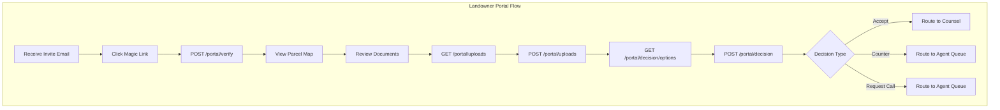
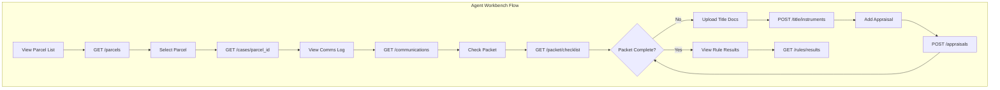
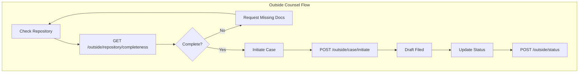
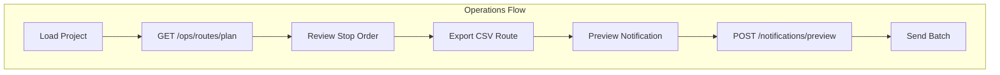
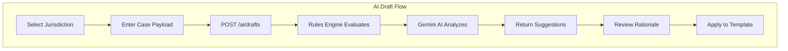

# LandRight Workflows

This document maps the complete application workflow for all personas, linking frontend pages to backend API endpoints.

## Personas

| Persona | Header Value | Description |
|---------|--------------|-------------|
| Landowner | `landowner` | Property owners reviewing offers and making decisions |
| Land Agent | `land_agent` | Field agents managing parcels and communications |
| In-House Counsel | `in_house_counsel` | Internal attorneys approving templates and exports |
| Outside Counsel | `outside_counsel` | External attorneys initiating litigation |
| Admin/Ops | `admin` | Operations and system monitoring |

---

## Workflow 1: Landowner Portal

**Frontend Route:** `/intake`  
**Page:** `IntakePage.tsx`

The landowner receives a secure invite link, verifies their identity, reviews parcel documents, uploads required materials, and submits their decision (Accept, Counter, or Request Call).

### Portal Endpoints

| Method | Path | Purpose | Component |
|--------|------|---------|-----------|
| POST | `/portal/invites` | Send magic-link invite email | `InviteCard` |
| POST | `/portal/verify` | Verify invite token | `InviteCard` |
| GET | `/portal/decision/options` | Get available decision choices | `DecisionActions` |
| POST | `/portal/decision` | Submit landowner decision | `DecisionActions` |
| GET | `/portal/uploads` | List uploaded files | `UploadPanel` |
| POST | `/portal/uploads` | Upload supporting document | `UploadPanel` |

---

## Workflow 2: Agent Workbench

**Frontend Route:** `/workbench`  
**Page:** `WorkbenchPage.tsx`

Land agents filter and manage parcels, review communications history, check packet completeness, upload title instruments, and manage appraisals.

### Workbench Endpoints

| Method | Path | Purpose | Component |
|--------|------|---------|-----------|
| GET | `/parcels` | List/filter parcels with risk + deadline | `ParcelList` |
| GET | `/cases/{parcel_id}` | Get parcel details | `ParcelList` |
| GET | `/communications` | Get parcel comms timeline | `CommsLog` |
| GET | `/packet/checklist` | Get pre-offer packet status | `PacketChecklist` |
| GET | `/rules/results` | Get fired rule citations | `RuleResults` |
| GET | `/title/instruments` | List title chain documents | `TitlePanel` |
| POST | `/title/instruments` | Upload deed/survey | `TitlePanel` |
| GET | `/appraisals` | Get appraisal data | `AppraisalPanel` |
| POST | `/appraisals` | Create/update appraisal | `AppraisalPanel` |

---

## Workflow 3: Counsel Approvals

**Frontend Route:** `/counsel`  
**Page:** `CounselPage.tsx`

In-house counsel reviews approval queue, manages templates, exports binders, monitors budgets, sets deadlines, and hands off to outside counsel when litigation is required.

```mermaid
flowchart TD
    subgraph counsel [Counsel Approval Flow]
        A[View Approval Queue] --> B[GET /workflows/approvals]
        B --> C[Review Templates]
        C --> D[GET /templates]
        D --> E[Render Template]
        E --> F[POST /templates/render]
        F --> G[Check Binder Status]
        G --> H[GET /binder/status]
        H --> I{Binder Ready?}
        I -->|Yes| J[Export Binder]
        J --> K[POST /workflows/binder/export]
        K --> L[Review Budget]
        L --> M[GET /budgets/summary]
        M --> N[Manage Deadlines]
        N --> O[GET /deadlines]
        O --> P[POST /deadlines/derive]
        I -->|No| Q[Request Missing Items]
    end
```

### Counsel Endpoints

| Method | Path | Purpose | Component |
|--------|------|---------|-----------|
| GET | `/workflows/approvals` | List pending approvals | `CounselQueue` |
| POST | `/workflows/tasks` | Create review task | `CounselQueue` |
| POST | `/workflows/binder/export` | Generate audit binder | `BinderStatus` |
| GET | `/binder/status` | Check binder sections | `BinderStatus` |
| GET | `/budgets/summary` | Get project budget utilization | `BudgetPanel` |
| GET | `/templates` | List approved templates | `TemplateViewer` |
| POST | `/templates/render` | Render template with variables | `TemplateViewer` |
| GET | `/deadlines` | List project deadlines | `DeadlineManager` |
| POST | `/deadlines` | Create manual deadline | `DeadlineManager` |
| GET | `/deadlines/ical` | Export iCal feed | `DeadlineManager` |
| POST | `/deadlines/derive` | Derive statutory deadlines | `DeadlineManager` |

---

## Workflow 4: Outside Counsel Handoff

**Frontend Route:** `/counsel` (panel)  
**Component:** `OutsideCounselPanel.tsx`

When litigation is necessary, outside counsel checks repository completeness, initiates the case, and updates status as proceedings advance.

### Outside Counsel Endpoints

| Method | Path | Purpose | Component |
|--------|------|---------|-----------|
| GET | `/outside/repository/completeness` | Check required docs present | `OutsideCounselPanel` |
| POST | `/outside/case/initiate` | Start litigation draft | `OutsideCounselPanel` |
| POST | `/outside/status` | Update case status | `OutsideCounselPanel` |

---

## Workflow 5: Operations

**Frontend Route:** `/ops`  
**Page:** `OpsPage.tsx`

Operations staff plan field visit routes and preview/send batch notifications.

### Operations Endpoints

| Method | Path | Purpose | Component |
|--------|------|---------|-----------|
| GET | `/ops/routes/plan` | Generate optimized visit route | `RoutePlanPanel` |
| POST | `/notifications/preview` | Preview/send notification | `NotificationsPanel` |

---

## Workflow 6: AI-Assisted Drafting

**Component:** `AIDraftPanel.tsx`

Available from intake page for generating AI-assisted draft analyses.

### AI Endpoints

| Method | Path | Purpose | Component |
|--------|------|---------|-----------|
| POST | `/ai/drafts` | Synchronous AI draft | `AIDraftPanel` |
| POST | `/ai/drafts/async` | Async AI draft (preferred) | `AIDraftPanel` |
| GET | `/ai/health` | Check AI service status | - |

---

## Health & Monitoring

| Method | Path | Purpose |
|--------|------|---------|
| GET | `/health/live` | Liveness probe |
| GET | `/health/invite` | Invite flow synthetic check |
| GET | `/health/esign` | E-sign vendor check |

---

## Integration Webhooks

| Method | Path | Purpose |
|--------|------|---------|
| POST | `/integrations/dockets` | Receive docket updates from external systems |

---

## RBAC Summary

All endpoints enforce role-based access via the `X-Persona` header. See [rbac.md](rbac.md) for the full policy matrix.

| Resource | landowner | land_agent | in_house_counsel | outside_counsel |
|----------|-----------|------------|------------------|-----------------|
| portal | read/write | - | - | - |
| decision | execute | - | - | - |
| parcel | - | read/write | read | read |
| communication | - | read/write | read/write | - |
| template | - | - | read/execute/approve | - |
| binder | - | - | read/approve | read |
| budget | - | - | read | - |
| deadline | - | - | read/write | - |
| case | - | write | read | read/write |
| appraisal | - | read/write | read | - |
| title | - | read/write | read | - |
| ops | - | read | - | - |
