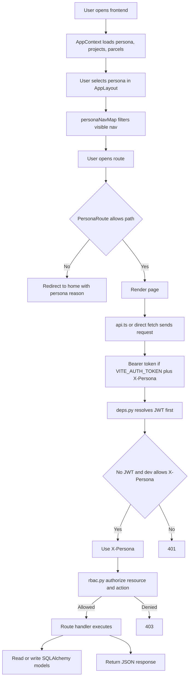
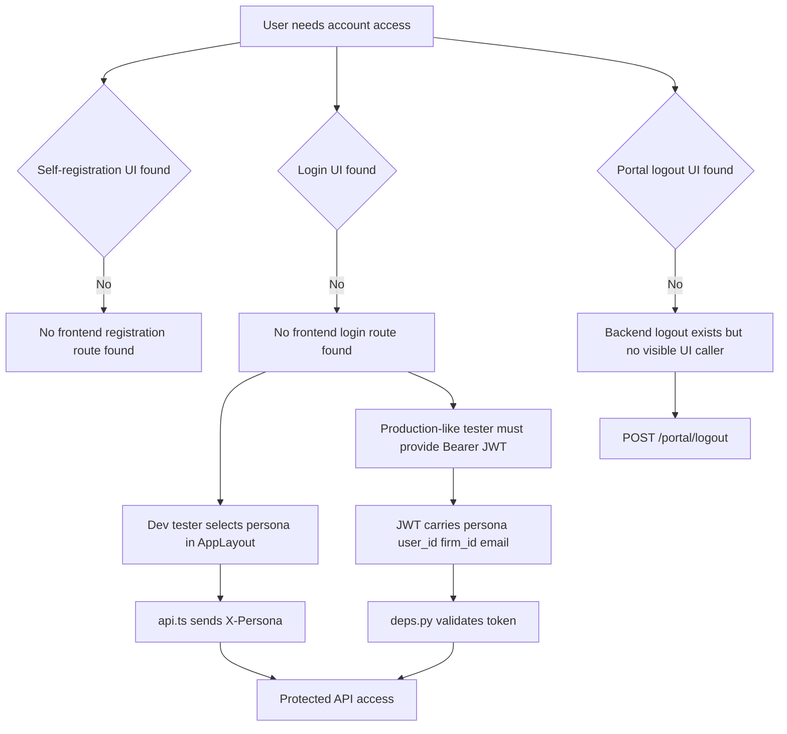
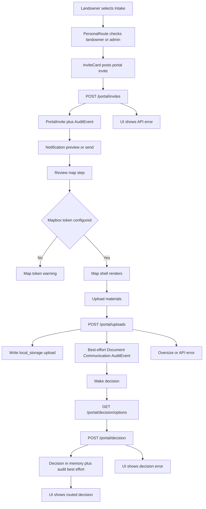
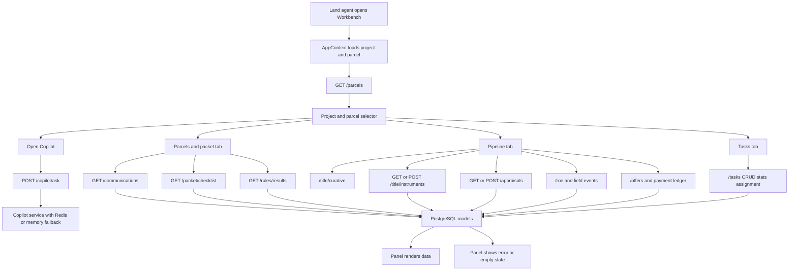
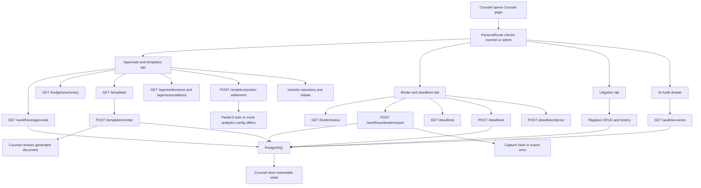
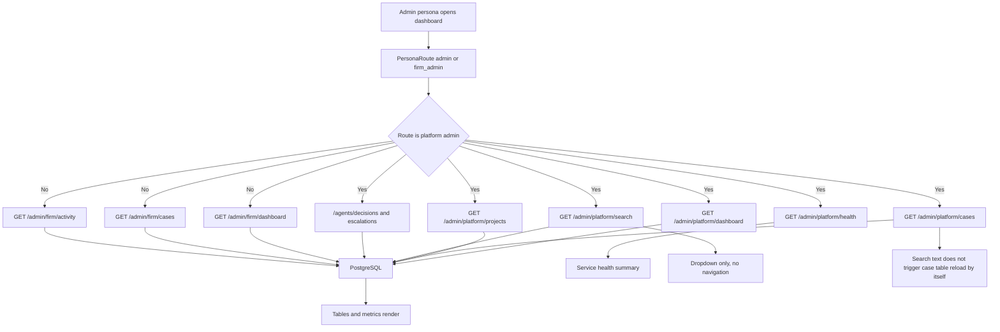
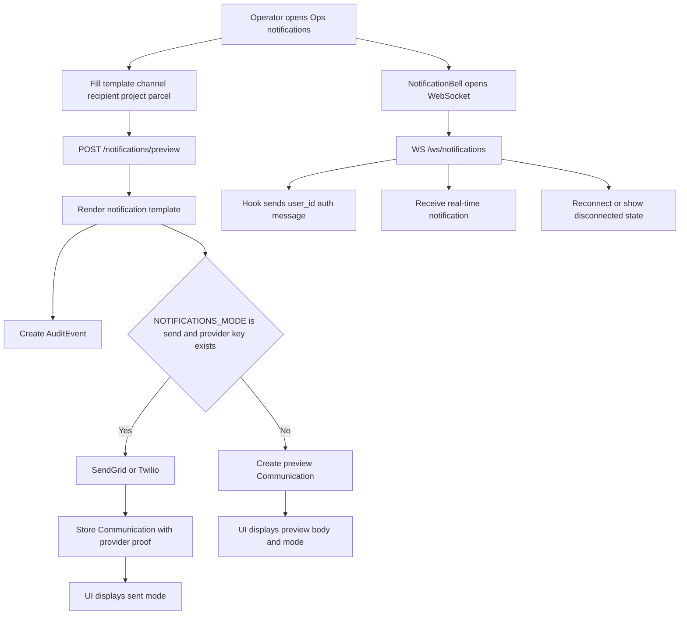
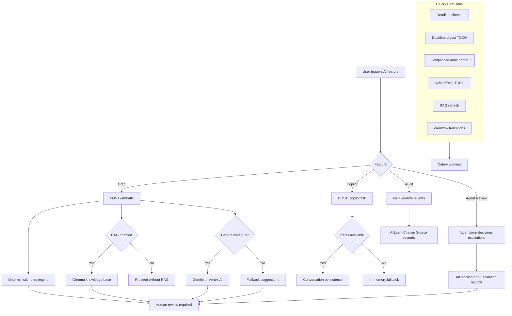
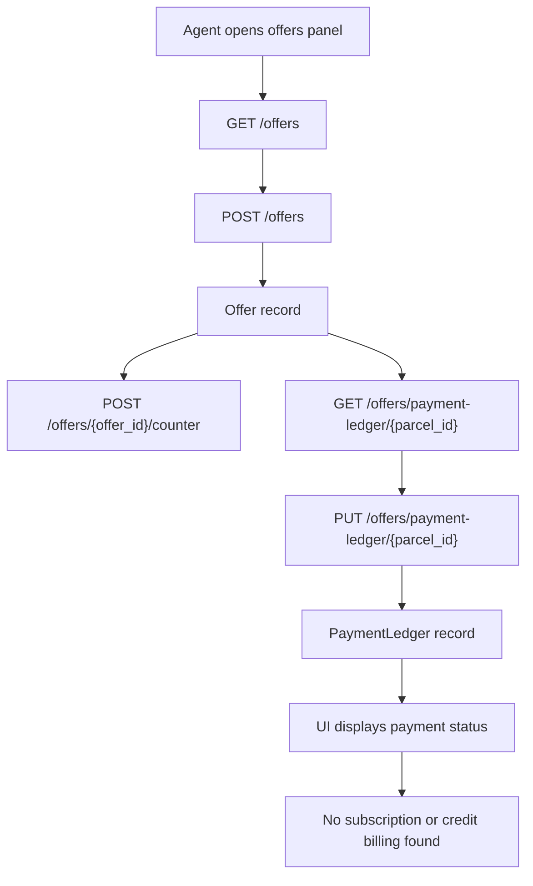

# LandGrant Functionality And Manual Testing Guide

This guide is based on the current repository code, not only existing product docs. It is intended for UAT testers, product stakeholders, and developers validating the application end-to-end.

Status labels used throughout:

| Status | Meaning |
|---|---|
| Working | UI and backend path are wired and have plausible persistence or response behavior. Still requires UAT verification. |
| Partial | A real implementation exists, but it has known limitations, hardcoded data, fallback storage, missing production wiring, or incomplete coverage. |
| UI Only | The UI displays or implies a feature, but no complete backend path is wired from that UI. |
| Broken | Code evidence shows the path is likely non-functional or internally inconsistent. |
| Unused | Backend/API code exists but is not reached by the current React UI. |
| Unknown | Code exists, but runtime behavior depends on external services or unverified configuration. |

## 1. Executive Summary

LandGrant is an attorney-in-the-loop eminent domain and right-of-way workflow application. It helps landowners, land agents, counsel, firm administrators, and platform administrators manage parcel intake, document uploads, communications, title/appraisal/ROE work, offers, litigation, deadlines, binder exports, notifications, AI-assisted drafting, AI decision review, and operational monitoring.

The frontend is a React/Vite portal with persona-based navigation. The backend is a FastAPI service with SQLAlchemy models, PostgreSQL-compatible persistence, Redis/Celery background workers, optional RAG/AI services, notification integrations, and external-service stubs for e-signature and property/valuation providers.

Primary user roles are:

- `landowner`: portal user for invites, uploads, document review, and decision submission.
- `land_agent`: acquisition or ROW agent using the workbench and operations tools.
- `in_house_counsel`: counsel reviewer for approvals, templates, binder/deadline workflows, AI audit, litigation, and operations.
- `outside_counsel`: external counsel using the counsel workspace and handoff tools.
- `firm_admin`: firm-level dashboard user.
- `admin`: platform administrator with broad frontend navigation and platform dashboard access.

The app is usable for manual UAT in a development environment, especially for route navigation, RBAC spot checks, core CRUD workflows, document upload, notification preview, admin dashboards, and AI/counsel surfaces. It is not fully production-ready for UAT sign-off without acknowledging important gaps: there is no full frontend login screen, production JWT auth must be configured separately, route-level firm tenancy helpers are not wired into API queries, several flows rely on in-memory fallback state, some UI paths hardcode project/persona values, some background tasks are stubs, and external services often run in preview, mock, or dev-stub mode.

Key integrations and dependencies include PostgreSQL, Redis, Celery, SendGrid, Twilio, DocuSign demo/stub configuration, Mapbox, Gemini/Vertex AI, Chroma/RAG, and optional GCP infrastructure. Payment subscription or credit billing was not found. The only payment-related application logic identified is offer payment-ledger tracking under `/offers/payment-ledger/{parcel_id}`.

Overall UAT readiness: **Partial**. Manual testers can validate the demo workflow and many backend endpoints now, but UAT should explicitly record which tests are run in dev/demo mode versus production-like JWT, provider, worker, and tenancy settings.

## 2. Zoomed-Out Application Diagram

```mermaid
flowchart TB
  subgraph users [User Roles]
    Landowner[Landowner]
    LandAgent[Land Agent]
    InHouseCounsel[In-House Counsel]
    OutsideCounsel[Outside Counsel]
    FirmAdmin[Firm Admin]
    PlatformAdmin[Platform Admin]
  end

  subgraph frontend [React Vite Frontend]
    AppLayout["AppLayout: persona, project, parcel, notifications"]
    Home["/"]
    Intake["/intake"]
    Workbench["/workbench"]
    Counsel["/counsel"]
    Ops["/ops"]
    FirmAdminPage["/firm-admin"]
    AdminPage["/admin"]
    NotFound["404"]
  end

  subgraph auth [Auth And Permissions]
    PersonaRoute["PersonaRoute and personaNavMap"]
    ApiAuth["api.ts: Authorization Bearer plus X-Persona"]
    BackendAuth["deps.py: JWT first, dev X-Persona fallback"]
    RBAC["rbac.py authorize"]
  end

  subgraph api [FastAPI Routers]
    PortalApi["/portal"]
    CaseParcelApi["/cases /parcels"]
    WorkApi["/communications /packet /rules /title /appraisals /roe /offers /tasks"]
    CounselApi["/templates /workflows /budgets /binder /deadlines /litigation /outside"]
    AdminApi["/admin"]
    AiApi["/ai /agents /audit /copilot /rag /qa /analytics /predictions"]
    OpsApi["/ops /notifications /health /ws"]
    IntegrationApi["/esign /integrations /chat /alignments /approvals"]
  end

  subgraph data [Persistence]
    Postgres["PostgreSQL via SQLAlchemy models"]
    LocalStorage["local_storage uploads"]
    Redis["Redis for Celery and Copilot fallback boundary"]
    InMemory["In-memory fallback stores"]
  end

  subgraph external [External Services]
    SendGrid[SendGrid]
    Twilio[Twilio]
    DocuSign[DocuSign Demo Or Stub]
    Gemini[Gemini Or Vertex AI]
    Chroma[Chroma RAG]
    Mapbox[Mapbox]
    GCP[GCP Storage And Cloud Run]
  end

  Landowner --> Intake
  LandAgent --> Workbench
  LandAgent --> Ops
  InHouseCounsel --> Workbench
  InHouseCounsel --> Counsel
  OutsideCounsel --> Counsel
  FirmAdmin --> FirmAdminPage
  PlatformAdmin --> AdminPage
  PlatformAdmin --> Intake
  PlatformAdmin --> Workbench
  PlatformAdmin --> Counsel
  PlatformAdmin --> Ops

  AppLayout --> Home
  AppLayout --> Intake
  AppLayout --> Workbench
  AppLayout --> Counsel
  AppLayout --> Ops
  AppLayout --> FirmAdminPage
  AppLayout --> AdminPage
  AppLayout --> NotFound

  PersonaRoute --> ApiAuth
  ApiAuth --> BackendAuth
  BackendAuth --> RBAC
  RBAC --> PortalApi
  RBAC --> CaseParcelApi
  RBAC --> WorkApi
  RBAC --> CounselApi
  RBAC --> AdminApi
  RBAC --> AiApi
  RBAC --> OpsApi
  RBAC --> IntegrationApi

  PortalApi --> Postgres
  CaseParcelApi --> Postgres
  WorkApi --> Postgres
  CounselApi --> Postgres
  AdminApi --> Postgres
  AiApi --> Postgres
  OpsApi --> Postgres
  IntegrationApi --> Postgres

  PortalApi --> LocalStorage
  PortalApi --> InMemory
  IntegrationApi --> InMemory
  AiApi --> Redis
  OpsApi --> SendGrid
  OpsApi --> Twilio
  IntegrationApi --> DocuSign
  AiApi --> Gemini
  AiApi --> Chroma
  Intake --> Mapbox
  Workbench --> Mapbox
  Postgres --> GCP
```

## 3. Route and Feature Inventory

| Route/Page | Purpose | User role required | Main component/file path | API endpoints used | Database/models touched | Status | Notes |
|---|---|---|---|---|---|---|---|
| `/` | Home and persona landing links | All | `frontend/src/pages/HomePage.tsx`, `frontend/src/components/AppLayout.tsx` | Context bootstraps `GET /admin/platform/projects`, `GET /parcels` | `Project`, `Parcel` | Working | Static route plus global project/parcel selectors. Unauthorized route redirects land here with state. |
| `/intake` | Landowner portal wizard: invite, review map, upload, decision | `landowner`, `admin` | `frontend/src/pages/IntakePage.tsx` | `POST /portal/invites`, `GET /portal/uploads`, `POST /portal/uploads`, `GET /portal/decision/options`, `POST /portal/decision`, optional agent tools `POST /cases`, `POST /ai/drafts` | `PortalInvite`, `PortalSession`, `Document`, `Communication`, `AuditEvent`, `Parcel`, `Project`, `RuleResult` | Partial | Wizard state is local. `verifyInvite` exists in `api.ts` but no UI calls it. Map shell is present, but no parcel GeoJSON is passed to `ParcelMap`. |
| `/workbench` | Land agent parcel workbench for map, packet, comms, title, appraisal, ROE, offers, tasks, copilot | `land_agent`, `in_house_counsel`, `admin` | `frontend/src/pages/WorkbenchPage.tsx` | `GET /parcels`, `GET /communications`, `GET /packet/checklist`, `GET /rules/results`, `GET/POST /title/instruments`, `/title/curative/*`, `GET/POST /appraisals`, `/roe*`, `/offers*`, `/offers/payment-ledger/*`, `/tasks*`, `POST /copilot/ask` | `Parcel`, `Communication`, `RuleResult`, `TitleInstrument`, `Document`, `Appraisal`, `ROE`, `ROEFieldEvent`, `Offer`, `PaymentLedger`, `Task`, `AIEvent` | Partial | Core panels are wired. Map is not fed real parcel features. Task defaults can fall back to `PRJ-001` in some paths. |
| `/counsel` | Counsel approval, budget, template, binder, deadline, litigation, outside counsel, AI audit, settlement prediction | `in_house_counsel`, `outside_counsel`, `admin` | `frontend/src/pages/CounselPage.tsx` | `GET /workflows/approvals`, `GET /budgets/summary`, `GET /templates`, `POST /templates/render`, `POST /deadlines/derive`, `GET /binder/status`, `POST /workflows/binder/export`, `/deadlines*`, `/litigation*`, `/outside*`, `/agents*`, `GET /audit/ai-events`, `POST /analytics/predict-settlement`, `POST /copilot/ask` | `Budget`, `Template`, `Document`, `Deadline`, `LitigationCase`, `AIDecision`, `EscalationRequest`, `AIEvent`, `AuditEvent`, `Task` | Partial | `SettlementPredictor` hardcodes assessed value in the page. Template deadline derivation hardcodes `PRJ-001`. Outside-counsel panel uses fixed `outside_counsel` API persona wrappers. |
| `/ops` | Route planning, notification preview, integration health probes | `land_agent`, `in_house_counsel`, `admin` | `frontend/src/pages/OpsPage.tsx` | `GET /ops/routes/plan`, `POST /notifications/preview`, `GET /health/live`, `GET /health/invite`, `GET /health/esign` | `Parcel`, `Project`, `Communication`, `AuditEvent` | Partial | Notification UI previews only; actual send depends on `NOTIFICATIONS_MODE=send` plus provider keys. Health probes treat auth failures as degraded. |
| `/firm-admin` | Firm dashboard, firm cases, firm activity | `firm_admin`, `admin` | `frontend/src/pages/FirmAdminPage.tsx` | `GET /admin/firm/dashboard`, `GET /admin/firm/cases`, `GET /admin/firm/activity` | `Firm`, `Project`, `Parcel`, `LitigationCase`, `Offer`, `ROE`, `AuditEvent` | Partial | UI is wired. Backend route-level tenant scoping helpers are not used in route code, so firm isolation needs security validation. |
| `/admin` | Platform dashboard, cases, projects, health, search, AI decision dashboard | `admin` | `frontend/src/pages/AdminPage.tsx`, `frontend/src/components/AIDecisionDashboard.tsx` | `GET /admin/platform/dashboard`, `GET /admin/platform/cases`, `GET /admin/platform/projects`, `GET /admin/platform/search`, `GET /admin/platform/health`, `/agents/decisions`, `/agents/escalations` | `Firm`, `Project`, `Parcel`, `User`, `AuditEvent`, `AIDecision`, `EscalationRequest` | Partial | Search dropdown is wired but search results are not navigable. Case table effect does not refetch on search text alone. `projectFilter` state has no visible UI setter. |
| `*` | Not-found page | All | `frontend/src/pages/NotFoundPage.tsx` | None | None | Working | Static fallback page. |
| Global app shell | Persona/project/parcel selectors and notification bell | All | `frontend/src/components/AppLayout.tsx`, `frontend/src/context/AppContext.tsx`, `frontend/src/components/NotificationBell.tsx` | `GET /admin/platform/projects`, `GET /parcels`, WebSocket `/ws/notifications` | `Project`, `Parcel`; WebSocket in-memory connection manager | Partial | App context falls back to demo projects if admin projects fails. WebSocket auth sends only `user_id` in the hook and does not use JWT. |

## 4. API and Backend Inventory

| Method | Endpoint | Purpose | Called by which frontend route/component | Auth required | Request payload | Response shape | Database/models touched | Error handling | Status | Notes |
|---|---|---|---|---|---|---|---|---|---|---|
| GET | `/health/live` | API liveness | `/ops` integration probes, smoke scripts | Open/probe | None | `{status}` | None | Probe catches failures and marks down/degraded | Working | Registered in `backend/app/api/routes/health.py`. |
| GET | `/health/invite` | Portal invite dependency probe | `/ops` | Open/probe | None | `{status, checks}` | May inspect config/dependencies | Probe catches failures | Working | Useful before testing portal invites. |
| GET | `/health/esign` | E-sign dependency probe | `/ops` | Open/probe | None | `{status, vendor}` | None | Probe catches failures | Partial | Vendor/config may be stubbed or demo. |
| POST | `/cases` | Create case and parcels | `/intake` Agent Tools `IntakeForm` | `land_agent` via wrapper | `project_id`, parcels, jurisdiction | `project_id`, `parcel_ids`, optional deadline | `Project`, `Parcel`, `Party`, `ParcelParty` | 4xx/5xx shown as component error | Working | API has in-memory fallback if DB unavailable. |
| GET | `/cases/{parcel_id}` | Fetch case details by parcel | `SettlementPredictor` helper path | `land_agent` wrapper | Path `parcel_id` | Case details | `Parcel` | Missing parcel can return fallback error | Partial | Used indirectly for settlement context. |
| GET | `/parcels` | List parcels by project and filters | App context, `ParcelList` | `land_agent` wrapper | Query filters | `{total, items}` | `Parcel` | App context stores error and clears parcels | Working | Drives global parcel selector. |
| POST | `/portal/invites` | Create portal invite and email preview/send | `/intake` `InviteCard` | `portal` write via `landowner` wrapper in UI | Email, project, parcel | Invite id, status, invite link | `PortalInvite`, `AuditEvent`, `Communication` | Best-effort DB; validation errors from FastAPI | Partial | UI allows landowner to send invite; actual email depends on notification config. |
| POST | `/portal/verify` | Verify invite token and create portal session | No current UI caller | `landowner` | Token | Session status, cookie | `PortalInvite`, `PortalSession`, `AuditEvent` | Rate limits failed attempts | Unused | `verifyInvite` exists in `frontend/src/lib/api.ts`, but the intake page does not call it. |
| POST | `/portal/verify/refresh` | Refresh portal verification/session | No current UI caller | Portal session/cookie | Session data | Session status | `PortalSession` | 401/403 on missing/expired session | Unused | Backend only in current UI. |
| POST | `/portal/logout` | Portal logout | No current UI caller | Portal session/cookie | None | Logout status | `PortalSession` | Clears cookie | UI Only | There is no visible logout UI. |
| GET | `/portal/session` | Read portal session | No current UI caller | Portal session/cookie | None | Session details | `PortalSession` | 401/403 on invalid session | Unused | Important for real landowner portal UAT but not wired. |
| GET | `/portal/decision/options` | Decision options | `/intake` `DecisionActions` | `portal` read | None | `{options}` | None or config | Component error state | Working | Used by landowner decision step. |
| POST | `/portal/decision` | Submit landowner decision | `/intake` `DecisionActions` | `portal` write | Parcel id, selection, note | Decision id, route target | In-memory decision store, audit/communication best effort | Component error state | Partial | Decision persistence includes in-memory store. |
| GET | `/portal/uploads` | List portal uploads | `/intake` `UploadPanel` | `portal` read | Query `parcel_id` | `{items}` | In-memory upload list | Component error state | Partial | List reads `_uploads_by_parcel`, not DB. Restarts clear list. |
| POST | `/portal/uploads` | Upload landowner file | `/intake` `UploadPanel` | `portal` write | Multipart `parcel_id`, file | Upload item | `Document`, `Communication`, `AuditEvent`, local file storage | 413 for over 50 MB; best-effort DB rollback | Partial | Local storage path and virus scan is `skipped_local`. |
| GET | `/communications` | Read parcel communications | `/workbench` `CommsLog` | `communication` read | Query `parcel_id` | `{items}` | `Communication` | Component error state | Working | Read-only in current workbench UI. |
| POST | `/communications/send` | Send or preview communication | No primary UI caller | `communication` write | Channel, recipient, template/body | Send result | `Communication`, `AuditEvent` | Provider failures captured in proof/status | Unused | Related service is used by notifications. |
| POST | `/communications/batch` | Batch communication | No primary UI caller | `communication` write | Batch payload | Batch id/results | `Communication`, `AuditEvent` | Route handles per-recipient failures | Unused | Not exposed in current Ops UI. |
| GET | `/packet/checklist` | Parcel packet checklist | `/workbench` `PacketChecklist` | `packet` execute/read | Query `parcel_id` | `{items}` | `Document`, `RuleResult`, `Communication` style sources | Component error state | Working | Used as pre-offer packet view. |
| GET | `/rules/results` | Rule result history by parcel | `/workbench` `RuleResults` | `rules` read | Query `parcel_id` | `{items}` | `RuleResult` | Component error state | Working | There is no current public `POST /rules/evaluate`; evaluation is library-driven. |
| GET | `/budgets/summary` | Project budget summary | `/counsel` `BudgetPanel` | `budget` read | Query `project_id` | Summary amounts, utilization, alerts | `Budget` | Component error state | Working | Counsel dashboard surface. |
| GET | `/binder/status` | Binder section readiness | `/counsel` `BinderStatus` | `binder` read | Query `project_id` | `{sections}` | `Document`, `Template`, `RuleResult` style dependencies | Component error state | Working | Pairs with binder export. |
| POST | `/workflows/binder/export` | Export binder package | `/counsel` `BinderStatus` | `workflow/binder` execute | `{}` from UI, backend may use project context/defaults | Bundle id, hash, storage path | `Document`, `AuditEvent` | Existing docs note possible 500 in test harness | Partial | UI does not send `project_id`; verify backend behavior carefully. |
| GET | `/workflows/approvals` | Counsel approval queue | `/counsel` `CounselQueue` | `workflow` read | None | `{items}` | Workflow/approval sources | Component error state | Working | Distinct from `/approvals/*` API. |
| GET/POST | `/deadlines` | List/create project deadlines | `/counsel` `DeadlineManager` | `deadline` read/write | Query or deadline JSON | Deadline list or id | `Deadline` | Component error state | Working | iCal and derive are separate endpoints. |
| GET | `/deadlines/ical` | Export deadlines as iCal | `/counsel` `DeadlineManager` | `deadline` read | Query `project_id` | `{ical}` | `Deadline` | Component error state | Working | Manual QA should inspect downloaded/copied iCal text. |
| POST | `/deadlines/derive` | Derive deadlines from jurisdiction anchors | `/counsel` `DeadlineManager`, `TemplateViewer` | `deadline` write | Jurisdiction, anchors, project/parcel, persist flag | Derived deadlines and errors | `Deadline` if persisted | Component error state | Partial | `TemplateViewer` hardcodes `project_id: PRJ-001`. |
| GET | `/templates` | Template catalog | `/counsel` `TemplateViewer` | `template` read | None | Template metadata array | `Template` plus filesystem/library | Component error state | Working | Outside counsel may be denied by RBAC depending role. |
| POST | `/templates/render` | Render document template | `/counsel` `TemplateViewer` | `template` execute/write | Template id, variables, persist flags | Rendered text, document id, anchors | `Document`, `Template` | Component error state | Working | Counsel human review required before legal use. |
| GET/POST | `/title/instruments` | Title instrument list/upload | `/workbench` `TitlePanel` | `title` read/write | Query `parcel_id` or multipart file | Instruments or document id/hash | `TitleInstrument`, `Document` | Component error state | Partial | OCR/background processing may depend on worker/service availability. |
| GET/POST/PUT | `/title/curative*` | Curative item lifecycle | `/workbench` `TitlePanel` | `title` read/write | Curative item payloads | Curative DTOs/analytics | `CurativeItem` | Component error state | Working | Used by title panel. |
| GET/POST | `/appraisals` | Appraisal read/upsert | `/workbench` `AppraisalPanel` | `appraisal` read/write | Query `parcel_id` or appraisal payload | Appraisal object or id | `Appraisal` | Component error state | Working | One appraisal per parcel pattern. |
| GET/POST/PUT | `/roe*` | Right-of-entry lifecycle and field events | `/workbench` `ROEPanel` | `roe` read/write | ROE and field-event payloads | ROE records | `ROE`, `ROEFieldEvent` | Component error state | Working | Includes expiring/expired endpoints. |
| GET/POST/PUT | `/offers*` | Offers, updates, counteroffers | `/workbench` `NegotiationPanel` | `offer` read/write | Offer/counter payloads | Offer records | `Offer`, `PaymentLedger`, `WorkflowEvent` best effort | Component error state | Working | Workflow event failure is non-blocking. |
| GET/PUT | `/offers/payment-ledger/{parcel_id}` | Payment ledger tracking | `/workbench` `NegotiationPanel` | `offer` read/write | Optional ledger update payload | Ledger status | `PaymentLedger` | Component error state | Partial | This is not subscription/credit billing. |
| GET/POST/PUT/DELETE | `/tasks*` | Task CRUD, stats, assignment, bulk operations | `/workbench`, `/counsel` `TaskManager` | `task` read/write | Task filters/payloads | Task DTOs, stats | `Task`, `User`, `Parcel`, `Project` | Component error state | Working | Persona is passed from context for many TaskManager calls. |
| GET | `/ops/routes/plan` | Route plan CSV | `/ops` `RoutePlanPanel` | `ops` read | Query `project_id` | Parcel ids and CSV | `Parcel` | Component error state | Working | Validate CSV content manually. |
| POST | `/notifications/preview` | Compose notification preview or send | `/ops` `NotificationsPanel` | `communication` write | Template, channel, recipient, project, parcel, variables | Notification body, mode, comm/audit ids | `Communication`, `AuditEvent` | Component error state | Partial | Send path requires `NOTIFICATIONS_MODE=send` and SendGrid/Twilio keys; UI is preview-oriented. |
| GET | `/outside/repository/completeness` | Outside counsel repository readiness | `/counsel` `OutsideCounselPanel` | `outside` read | Query `project_id` | Percent, checks, missing | `Document`, `Project`, `Parcel` | Component error state | Working | Wrapper forces `outside_counsel` persona. |
| POST | `/outside/case/initiate` | Initiate outside counsel case handoff | `/counsel` `OutsideCounselPanel` | `outside` write | Project, parcel, template id | Draft id, docket number | `LitigationCase`, `Document`, `StatusChange` style records | Component error state | Partial | Depends on template/document completeness. |
| POST | `/outside/status` | Outside counsel status update | API wrapper, no obvious primary UI action | `outside` write | Project, parcel, status, reason | Status change id | `StatusChange` | API error handling | Unused | Wrapper exists. |
| GET/POST/PUT | `/litigation*` | Litigation case lifecycle and history | `/counsel` `LitigationPanel` | `litigation` read/write | Case filters/payloads | Case records/history | `LitigationCase`, `StatusChange`, `AuditEvent` | Component error state | Working | Analytics summary endpoint is backend-only in current UI. |
| POST | `/analytics/predict-settlement` | Settlement prediction | `/counsel` `SettlementPredictor` direct fetch | `analytics` execute | Case/appraisal/offer context | Prediction response | May use service/model; some analytics mock data | Component error state | Partial | Direct fetch does not use shared `apiFetch`, so Authorization handling differs. |
| POST | `/ai/drafts` | AI-assisted draft generation | `/intake` Agent Tools `AIDraftPanel` | `template` execute / AI route auth | Jurisdiction and payload | Draft rationale, rules, suggestions | `RuleResult`, `AIEvent`, citations/RAG optional | Component error state | Partial | External Gemini/RAG depends on config; AI is assistive only. |
| POST | `/agents/run` | Run AI agent orchestration | `AIDecisionDashboard`/agent surfaces | `ai_agent` execute | Agent run payload | Agent response | `AIDecision`, `EscalationRequest`, `AIEvent` | Route returns validation or execution errors | Partial | Must remain attorney-in-the-loop. |
| GET/POST | `/agents/decisions`, `/agents/escalations*` | AI decisions and escalation review | `/admin`, `/counsel` AI review components | `ai_agent` read/write | Filters, resolve/assign payloads | Decision/escalation DTOs | `AIDecision`, `EscalationRequest` | Component error state | Working | Admin dashboard includes AI decision tab. |
| GET | `/audit/ai-events` | AI provenance drawer | `/counsel` `AIAuditDrawer` | `audit` read | Query resource | AI event list | `AIEvent`, `Citation`, `Source` | Drawer error state | Working | Uses default current API auth persona. |
| POST/GET/DELETE | `/copilot/*` | AI copilot Q&A and conversation helpers | `/workbench`, `/counsel` `CopilotPanel` | `copilot` execute/read | Question/context or conversation id | Answer, citations, conversation | Redis plus in-memory fallback, `AIEvent` | Component error state | Partial | Direct fetch path and stream behavior need JWT verification in prod. |
| POST/GET | `/rag/*` | RAG search, ingest, health, stats | No major current UI route | `rag` permissions | Search/ingest payloads | Search docs, stats, health | Chroma/RAG persistence, `Document`, rule packs | HTTP errors from service | Unused | Available for API QA and AI support. |
| POST/GET | `/qa/*` | QA checks, reports, risk score, send validation | No major current UI route | `qa` permissions | QA payloads | QA report/checks/risk | `QAReport`, `QACheck` | HTTP errors from service | Unused | Important future legal gate coverage. |
| POST/GET | `/predictions/*` | ML prediction and risk-profile APIs | No major current UI route | `predictions` permissions | Prediction payloads | Prediction/risk/model stats | `PredictionOutcome` | HTTP errors from service | Unused | Separate from `/analytics/predict-settlement`. |
| GET/POST | `/admin/firm/*` | Firm dashboard, cases, activity | `/firm-admin` | `firm_admin` | Filters | Metrics, cases, activity | `Firm`, `Project`, `Parcel`, `AuditEvent` | Page error with retry | Partial | Needs firm-scoping verification. |
| GET | `/admin/platform/*` | Platform dashboard, cases, projects, search, health | `/admin`, App context projects | `admin` | Filters/search | Metrics, case/project/search/health DTOs | Broad platform models | Page error states | Partial | Admin UI search/table behavior has known gaps. |
| POST/GET | `/esign/*` | E-sign envelope lifecycle | Health probe only in UI | `esign` plus webhook rules | Envelope/status/webhook payloads | Envelope/status DTOs | `EsignEnvelope`; in-memory dev store | Stub/dev behavior for missing vendor | Unused | Actual DocuSign integration marked TODO/stub. |
| POST | `/integrations/dockets` | External docket webhook | No current UI caller | HMAC in non-dev | Webhook JSON | Receipt | `ExternalDataCache`, litigation/workflow records depending handler | Signature failure in prod | Unused | Dev/test relax signature. |
| POST/GET | `/chat/*` | Threaded chat and portal messaging | No current UI route found | `communication`/portal auth | Thread/message payloads | Threads/messages | `ChatThread`, `ChatMessage`; in-memory fallback | Falls back on DB exceptions | Unused | Could split data between DB and memory after failures. |
| POST/GET/PUT | `/alignments*`, `/alignments/segments*` | GIS alignments and segments | No current UI route found | `alignment` permissions | Alignment/segment payloads | Alignment/segment DTOs | `Alignment`, `Segment` | HTTP errors from route | Unused | Backend mounted, UI not found. |
| POST/GET | `/approvals/*` | Structured approval API | No current UI route found | `approvals` permissions | Approval request/action payloads | Approval DTOs/status | `Approval`, `AuditEvent` | HTTP errors from service | Unused | Distinct from `/workflows/approvals`. |
| GET | `/summary/*` | State summary endpoints | No current UI caller | Route-defined auth if mounted | Query params | Summary/matrix/export | State summary service | Not reachable | Broken | `backend/app/api/routes/summaries.py` exists but is not included in `backend/app/main.py`. |
| WS | `/ws/notifications` | Real-time notifications | `NotificationBell` via `useWebSocket` | WebSocket auth logic, not shared JWT fetch | WebSocket auth message | Notification messages | WebSocket connection manager | Hook reconnect/error states | Partial | Hook sends `user_id`; production JWT behavior needs validation. |

### Environment And External Configuration

| Area | Variables or code path | Current behavior |
|---|---|---|
| Frontend API | `VITE_API_BASE` in `frontend/.env.example`, default `http://localhost:8050` in `frontend/src/lib/api.ts` | Required for non-local API targets. |
| Frontend auth | `VITE_AUTH_TOKEN` in `frontend/src/lib/api.ts` | Optional Bearer token. Without it, dev relies on `X-Persona`. |
| WebSocket | `VITE_WS_BASE` in `frontend/src/hooks/useWebSocket.ts` | Defaults to `ws://localhost:8050`. |
| Map | `VITE_MAPBOX_TOKEN` in `frontend/src/components/ParcelMap.tsx` | Map renders warning without token. |
| Backend DB | `DATABASE_URL` or component DB envs in `backend/app/core/config.py`; example points to port `55432` | Required for persistent UAT. |
| Redis/Celery | `REDIS_URL` or host/port | Used by Celery and Copilot-related paths. |
| Auth secrets | `JWT_SECRET`, `JWT_AUDIENCE`, `JWT_ISSUER`, `SESSION_SECRET`, `ENCRYPTION_KEY` | Non-dev startup rejects known dev secret placeholders and short JWT secrets. |
| Notifications | `NOTIFICATIONS_MODE`, `SENDGRID_API_KEY`, `TWILIO_ACCOUNT_SID`, `TWILIO_AUTH_TOKEN`, `TWILIO_FROM_NUMBER` | Missing keys force preview behavior. |
| AI/RAG | `GCP_PROJECT`, `GEMINI_*`, `RAG_*` | AI/RAG may degrade to fallback/mock behavior depending settings. |
| E-sign | `DOCUSIGN_*` | Routes include dev/stub behavior and TODO for actual API integration. |
| Evidence/GCP | `EVIDENCE_BUCKET`, Cloud Run/GCP Terraform vars | Used by deployment/evidence paths, not required for local UI smoke. |

## 5. Detailed Workflow Diagrams

### Auth, Persona Routing, And API Authorization

### Registration, Login, And Logout Reality

### Landowner Intake And Portal Flow

### Agent Workbench Flow

### Counsel Review, Binder, Deadlines, Litigation, And AI Audit

### Admin And Firm Admin Flow

### Notifications, Email, SMS, And WebSocket Flow

### AI, RAG, Agents, And Background Jobs

### Offers And Payment Ledger Flow

## 6. Manual QA Test Plan

### Feature: Environment And Smoke Health

#### Test Case: Local Stack Starts And Health Probes Pass

**Role:** Admin or tester  
**Preconditions:** Backend running on `http://localhost:8050`; frontend running on `http://localhost:3050`; database and Redis available if testing persistence.  
**Route/Page:** `/ops` and API root  
**Related Files:** `backend/app/main.py`, `backend/app/api/routes/health.py`, `frontend/src/pages/OpsPage.tsx`, `docs/manual-regression-script.md`  
**Related API Endpoints:** `GET /health/live`, `GET /health/invite`, `GET /health/esign`, `GET /`

**Steps:**
1. Open `http://localhost:3050`.
2. Select `admin` or `land_agent`.
3. Go to `/ops`.
4. Observe the Integration Status cards.
5. Click Refresh.
6. Optionally run `API_BASE=http://localhost:8050 ./scripts/manual-regression-smoke.sh`.

**Expected Result:**
- The UI should show health cards for API, portal invites, and e-sign.
- The API should return healthy or degraded JSON rather than HTML errors.
- The database should not be required for `/health/live`, but invite/e-sign probes may depend on configuration.
- Errors should appear as degraded/offline cards, not a blank page.

**What to Verify:**
- UI behavior: no blank screen, refresh button updates timestamps.
- Network request: health endpoints return expected status codes.
- Database/log entry: not required for liveness.
- Email/notification: not applicable.
- Permission behavior: health probes should be accessible as probes.
- Error handling: stop backend and confirm UI marks services offline.

**Edge Cases:**
- Backend down.
- Redis down.
- E-sign provider not configured.
- Expired or missing JWT in non-dev.

**Priority:** Critical  
**Status:** Not Tested

### Feature: Persona Navigation And RBAC

#### Test Case: Persona Can Only Open Allowed Routes

**Role:** All personas  
**Preconditions:** Frontend running; backend running for API-backed pages.  
**Route/Page:** `/`, `/intake`, `/workbench`, `/counsel`, `/ops`, `/firm-admin`, `/admin`  
**Related Files:** `frontend/src/constants/personaNav.ts`, `frontend/src/components/PersonaRoute.tsx`, `frontend/src/components/AppLayout.tsx`, `backend/app/api/deps.py`, `backend/app/security/rbac.py`  
**Related API Endpoints:** Representative RBAC checks: `GET /templates`, `GET /workflows/approvals`, `GET /communications?parcel_id=PARCEL-001`, `GET /rag/health`

**Steps:**
1. Open `/`.
2. Select each persona from the header dropdown.
3. Confirm the nav links change to match that persona.
4. Manually type a disallowed route, for example `/admin` as `landowner`.
5. Confirm the app redirects to `/`.
6. Use browser devtools or curl to spot-check denied API calls with the wrong `X-Persona`.

**Expected Result:**
- The UI should hide disallowed nav items.
- Disallowed routes should redirect home with a persona reason.
- The API should return `403` for unauthorized resource/action pairs and `401` for invalid persona headers.
- In dev, `X-Persona` can authorize requests; in non-dev, a valid Bearer JWT is required.

**What to Verify:**
- UI behavior: allowed links only.
- Network request: persona header or Authorization token is sent.
- Permission behavior: backend RBAC matches frontend nav.
- Error handling: denied pages do not loop or crash.

**Edge Cases:**
- Invalid persona.
- Non-dev environment with no JWT.
- Browser localStorage blocked.
- Direct URL to route after persona change.

**Priority:** Critical  
**Status:** Not Tested

### Feature: Landowner Intake Portal

#### Test Case: Invite, Upload, And Decision Wizard

**Role:** Landowner  
**Preconditions:** Select `landowner`; demo project and parcel exist or use `projectId=PRJ-001&parcelId=PARCEL-001`; notification mode can be preview.  
**Route/Page:** `/intake`  
**Related Files:** `frontend/src/pages/IntakePage.tsx`, `frontend/src/components/InviteCard.tsx`, `frontend/src/components/UploadPanel.tsx`, `frontend/src/components/DecisionActions.tsx`, `backend/app/api/routes/portal.py`  
**Related API Endpoints:** `POST /portal/invites`, `GET /portal/uploads`, `POST /portal/uploads`, `GET /portal/decision/options`, `POST /portal/decision`

**Steps:**
1. Go to `/intake`.
2. On Verify Identity, enter an email and send an invite.
3. Move to Review Documents and observe the map area.
4. Move to Upload Materials and upload a small PDF or text file.
5. Move to Make Decision and select an available decision option.
6. Submit the decision.

**Expected Result:**
- The UI should show invite success and an invite link if returned.
- The API should create a portal invite and audit event, and may create notification preview communication.
- The upload should create a local file, upload item, `Document`, `Communication`, and `AuditEvent` when DB persistence succeeds.
- The decision should return a decision id and route target.
- Errors should be shown inline.

**What to Verify:**
- UI behavior: each step advances and shows success/error states.
- Network request: all portal calls use `X-Persona: landowner` in dev.
- Database/log entry: check `portal_invites`, `documents`, `communications`, `audit_events` if DB access is available.
- Email/notification: invite is preview unless provider send mode is configured.
- Permission behavior: non-landowner direct API calls should be denied unless RBAC allows specific read.
- Error handling: invalid email/missing fields produce validation errors.

**Edge Cases:**
- Missing required email.
- Upload over 50 MB.
- Unsupported or empty file.
- API failure during upload persistence.
- Expired session/token, though token verification is not wired into the UI.
- Duplicate invite to same email.

**Priority:** Critical  
**Status:** Not Tested

### Feature: Agent Workbench Parcel And Packet Review

#### Test Case: Load Parcel Context And Packet Panels

**Role:** Land Agent  
**Preconditions:** Select `land_agent`; project has at least one parcel.  
**Route/Page:** `/workbench`  
**Related Files:** `frontend/src/pages/WorkbenchPage.tsx`, `frontend/src/components/ParcelList.tsx`, `frontend/src/components/CommsLog.tsx`, `frontend/src/components/PacketChecklist.tsx`, `frontend/src/components/RuleResults.tsx`  
**Related API Endpoints:** `GET /parcels`, `GET /communications`, `GET /packet/checklist`, `GET /rules/results`

**Steps:**
1. Go to `/workbench`.
2. Confirm the project and parcel selectors populate.
3. Open the Parcels & packet tab.
4. Select a parcel from the parcel list.
5. Observe communications, packet checklist, and rule results panels.

**Expected Result:**
- The UI should list parcels and update selected parcel state.
- The API should load parcel-scoped communication, packet, and rule data.
- The database should read `parcels`, `communications`, and `rule_results`.
- Empty states should be clear if there are no records.

**What to Verify:**
- UI behavior: no stuck loading state.
- Network request: query strings use the selected `project_id` and `parcel_id`.
- Database/log entry: read-only for this case.
- Permission behavior: `landowner` should not access workbench route.
- Error handling: backend 500/403 appears in panel, not whole-app crash.

**Edge Cases:**
- Project with no parcels.
- Parcel id from URL no longer exists.
- Mapbox token missing.
- Slow API.

**Priority:** High  
**Status:** Not Tested

### Feature: Title, Appraisal, ROE, Offers, And Payment Ledger

#### Test Case: Update Parcel Pipeline Data

**Role:** Land Agent  
**Preconditions:** Select `land_agent`; a selected parcel exists.  
**Route/Page:** `/workbench`  
**Related Files:** `frontend/src/pages/WorkbenchPage.tsx`, `frontend/src/components/TitlePanel.tsx`, `frontend/src/components/AppraisalPanel.tsx`, `frontend/src/components/ROEPanel.tsx`, `frontend/src/components/NegotiationPanel.tsx`, `backend/app/api/routes/title.py`, `backend/app/api/routes/appraisals.py`, `backend/app/api/routes/roe.py`, `backend/app/api/routes/offers.py`  
**Related API Endpoints:** `GET/POST /title/instruments`, `/title/curative*`, `GET/POST /appraisals`, `/roe*`, `/offers*`, `GET/PUT /offers/payment-ledger/{parcel_id}`

**Steps:**
1. Go to `/workbench`.
2. Open the Title · Appraisal · ROE · Offers tab.
3. Upload or add a title instrument if the control is available.
4. Add or update appraisal data.
5. Create or update an ROE record and field event.
6. Create an offer and counteroffer.
7. Review the payment ledger section.

**Expected Result:**
- The UI should update each panel after save.
- The API should persist records to title, appraisal, ROE, offer, and payment ledger tables.
- Workflow event failures should not block offer/appraisal/litigation updates where code marks them best-effort.
- Errors should be panel-specific.

**What to Verify:**
- UI behavior: forms clear or refresh after saves.
- Network request: correct `parcel_id` in query and payload.
- Database/log entry: `title_instruments`, `appraisals`, `roes`, `roe_field_events`, `offers`, `payment_ledgers`.
- Permission behavior: wrong persona receives 403.
- Error handling: missing required fields produce readable validation errors.

**Edge Cases:**
- Duplicate title upload.
- Invalid appraisal value.
- ROE date in the past.
- Counteroffer against missing offer id.
- Payment ledger update with invalid status.

**Priority:** High  
**Status:** Not Tested

### Feature: Task Management

#### Test Case: Create, Assign, Complete, And Filter Tasks

**Role:** Land Agent or In-House Counsel  
**Preconditions:** Selected project and parcel; backend `/tasks` available.  
**Route/Page:** `/workbench` or `/counsel` Tasks tab  
**Related Files:** `frontend/src/components/TaskManager.tsx`, `frontend/src/lib/api.ts`, `backend/app/api/routes/tasks.py`, `backend/app/db/models.py`  
**Related API Endpoints:** `GET /tasks`, `POST /tasks`, `PUT /tasks/{task_id}`, `POST /tasks/{task_id}/complete`, `POST /tasks/{task_id}/assign`, `GET /tasks/stats/summary`

**Steps:**
1. Open the Tasks tab.
2. Create a task with title, project, parcel, priority, and due date.
3. Update the task status or assignee.
4. Complete the task.
5. Refresh the page and confirm the task state persists.

**Expected Result:**
- The UI should show the new task and updated status.
- The API should create and update a `Task` row.
- The database should persist task state after refresh.
- Errors should identify missing fields or permission problems.

**What to Verify:**
- UI behavior: stats and list update.
- Network request: correct persona passed from context.
- Database/log entry: `tasks`.
- Permission behavior: denied personas receive 403.
- Error handling: blank title and missing project are rejected.

**Edge Cases:**
- Missing project id falls back to demo defaults in some frontend paths.
- Invalid due date.
- Assign to nonexistent user.
- Bulk actions with empty selection.

**Priority:** High  
**Status:** Not Tested

### Feature: Counsel Templates, Binder, Deadlines, And Litigation

#### Test Case: Counsel Reviews And Produces Case Materials

**Role:** In-House Counsel  
**Preconditions:** Select `in_house_counsel`; selected project and parcel exist.  
**Route/Page:** `/counsel`  
**Related Files:** `frontend/src/pages/CounselPage.tsx`, `frontend/src/components/TemplateViewer.tsx`, `frontend/src/components/BinderStatus.tsx`, `frontend/src/components/DeadlineManager.tsx`, `frontend/src/components/LitigationPanel.tsx`, `backend/app/api/routes/templates.py`, `backend/app/api/routes/deadlines.py`, `backend/app/api/routes/workflows.py`, `backend/app/api/routes/litigation.py`  
**Related API Endpoints:** `GET /templates`, `POST /templates/render`, `GET /binder/status`, `POST /workflows/binder/export`, `GET/POST /deadlines`, `GET /deadlines/ical`, `POST /deadlines/derive`, `/litigation*`

**Steps:**
1. Go to `/counsel`.
2. On Approvals & templates, load templates and render a selected template.
3. Open Binder & deadlines and review binder status.
4. Export a binder.
5. Create a deadline and export iCal.
6. Derive deadlines from anchor dates.
7. Open Litigation and create or update a litigation matter.

**Expected Result:**
- The UI should show approval queue, budget, templates, binder, deadline, and litigation panels.
- The API should persist rendered documents when requested, deadlines, and litigation records.
- Binder export should return a bundle id, hash, and storage path or a clear error.
- Errors should remain within the affected panel.

**What to Verify:**
- UI behavior: tabs switch and panels load.
- Network request: counsel persona and selected project/parcel are used.
- Database/log entry: `documents`, `deadlines`, `litigation_cases`, `audit_events`.
- Permission behavior: outside counsel access should be checked separately because wrapper personas vary by component.
- Error handling: binder export failure captures response detail.

**Edge Cases:**
- No templates available.
- Invalid template variables.
- Missing anchor dates.
- Duplicate litigation case.
- Binder export with no documents.

**Priority:** Critical  
**Status:** Not Tested

### Feature: AI Assistance And Human Review

#### Test Case: Copilot, AI Decisions, Settlement Prediction, And Audit Drawer

**Role:** In-House Counsel or Admin  
**Preconditions:** AI/RAG settings documented; selected project/parcel exists; external AI keys may be disabled for fallback testing.  
**Route/Page:** `/counsel`, `/workbench`, `/admin` AI Decisions tab  
**Related Files:** `frontend/src/components/CopilotPanel.tsx`, `frontend/src/components/AIDecisionReview.tsx`, `frontend/src/components/AIDecisionDashboard.tsx`, `frontend/src/components/AIAuditDrawer.tsx`, `frontend/src/components/SettlementPredictor.tsx`, `backend/app/api/routes/copilot.py`, `backend/app/api/routes/agents.py`, `backend/app/api/routes/audit_ai.py`, `backend/app/api/routes/analytics.py`, `backend/app/services/ai_pipeline.py`  
**Related API Endpoints:** `POST /copilot/ask`, `/agents/decisions`, `/agents/escalations`, `GET /audit/ai-events`, `POST /analytics/predict-settlement`, `POST /ai/drafts`

**Steps:**
1. Open `/workbench` or `/counsel`.
2. Open AI Copilot and ask a parcel-specific question.
3. On `/counsel`, open AI Audit.
4. On `/counsel`, run settlement prediction.
5. On `/admin`, open AI Decisions and review decisions/escalations.
6. Confirm no AI action is treated as final legal approval without human review.

**Expected Result:**
- The UI should show AI answers, citations/provenance when available, predictions, and audit events.
- The API should record or retrieve `AIEvent`, `AIDecision`, and escalation data when configured.
- Missing external AI config should degrade gracefully or use fallback behavior.
- Errors should be visible and should not bypass counsel review.

**What to Verify:**
- UI behavior: loading, answer, citation, empty, and error states.
- Network request: shared versus direct fetch auth behavior.
- Database/log entry: `ai_events`, `ai_decisions`, `escalation_requests`, citations/sources if available.
- Permission behavior: landowner should not reach AI admin surfaces.
- Error handling: provider timeout or invalid prompt.

**Edge Cases:**
- Gemini disabled.
- RAG unavailable.
- Redis unavailable for Copilot.
- Very long prompt.
- No audit events for selected parcel.

**Priority:** High  
**Status:** Not Tested

### Feature: Notifications And Communications

#### Test Case: Preview Notification And Verify Communication Audit

**Role:** In-House Counsel or Land Agent with Ops access  
**Preconditions:** Select `in_house_counsel` or `land_agent`; project and parcel selected.  
**Route/Page:** `/ops`  
**Related Files:** `frontend/src/components/NotificationsPanel.tsx`, `frontend/src/components/NotificationBell.tsx`, `frontend/src/hooks/useWebSocket.ts`, `backend/app/api/routes/notifications.py`, `backend/app/services/notifications.py`, `backend/app/api/routes/websocket.py`  
**Related API Endpoints:** `POST /notifications/preview`, WebSocket `/ws/notifications`, `GET /communications`

**Steps:**
1. Go to `/ops`.
2. Fill notification template, channel, recipient, project, parcel, and variables.
3. Submit preview.
4. Confirm preview body and mode are shown.
5. Go to `/workbench` and check the CommsLog for the selected parcel.
6. Open the notification bell and observe WebSocket status/messages.

**Expected Result:**
- The UI should display preview content and mode.
- The API should create `AuditEvent` and `Communication`.
- In preview mode, no actual email/SMS should be sent.
- In send mode with provider keys, provider proof should be recorded.

**What to Verify:**
- UI behavior: preview and errors.
- Network request: payload includes project_id and parcel_id.
- Database/log entry: `communications`, `audit_events`.
- Email/notification: provider is not called unless configured.
- Permission behavior: unauthorized personas cannot preview notifications.
- Error handling: invalid channel or missing recipient.

**Edge Cases:**
- Missing SendGrid/Twilio keys.
- Invalid phone/email.
- Provider failure.
- WebSocket disconnect.

**Priority:** High  
**Status:** Not Tested

### Feature: Operations Route Planning

#### Test Case: Generate Route Plan CSV

**Role:** Land Agent  
**Preconditions:** Selected project has parcels.  
**Route/Page:** `/ops`  
**Related Files:** `frontend/src/components/RoutePlanPanel.tsx`, `backend/app/api/routes/ops.py`  
**Related API Endpoints:** `GET /ops/routes/plan?project_id=...`

**Steps:**
1. Select `land_agent`.
2. Go to `/ops`.
3. Review the route plan panel.
4. Trigger refresh or copy/download route CSV if available.

**Expected Result:**
- The UI should show parcel ids and CSV route data.
- The API should return project-specific route plan data.
- Empty projects should show a clear empty state.

**What to Verify:**
- UI behavior: no blank card.
- Network request: project id query param is correct.
- Database/log entry: reads `parcels`.
- Permission behavior: disallowed persona receives 403.
- Error handling: project not found.

**Edge Cases:**
- No parcels.
- Very large parcel list.
- API timeout.

**Priority:** Medium  
**Status:** Not Tested

### Feature: Firm Admin Dashboard

#### Test Case: Firm Admin Reviews Firm Cases And Activity

**Role:** Firm Admin  
**Preconditions:** Select `firm_admin`; firm data exists.  
**Route/Page:** `/firm-admin`  
**Related Files:** `frontend/src/pages/FirmAdminPage.tsx`, `backend/app/api/routes/admin.py`, `backend/app/security/tenancy.py`  
**Related API Endpoints:** `GET /admin/firm/dashboard`, `GET /admin/firm/cases`, `GET /admin/firm/activity`

**Steps:**
1. Select `firm_admin`.
2. Go to `/firm-admin`.
3. Confirm metrics load.
4. Filter by stage and litigation status.
5. Search by parcel id.
6. Confirm activity list renders.

**Expected Result:**
- The UI should show metrics, cases, and activity.
- The API should return firm-scoped data.
- Errors should show retry controls.
- Multi-tenant data should not leak across firms.

**What to Verify:**
- UI behavior: loading, metrics, empty state, retry.
- Network request: firm admin endpoints called.
- Database/log entry: reads firm/project/parcel/litigation/activity data.
- Permission behavior: non-firm-admin denied by API and route.
- Error handling: backend failure shows page error.

**Edge Cases:**
- Firm has no cases.
- Search returns zero rows.
- User has no firm id in JWT.
- Cross-firm data isolation.

**Priority:** Critical  
**Status:** Not Tested

### Feature: Platform Admin Dashboard

#### Test Case: Admin Reviews Platform Cases, Projects, Health, Search, And AI Decisions

**Role:** Admin  
**Preconditions:** Select `admin`; platform data exists.  
**Route/Page:** `/admin`  
**Related Files:** `frontend/src/pages/AdminPage.tsx`, `frontend/src/components/AIDecisionDashboard.tsx`, `backend/app/api/routes/admin.py`, `backend/app/api/routes/agents.py`  
**Related API Endpoints:** `GET /admin/platform/dashboard`, `GET /admin/platform/cases`, `GET /admin/platform/projects`, `GET /admin/platform/search`, `GET /admin/platform/health`, `/agents/decisions`, `/agents/escalations`

**Steps:**
1. Select `admin`.
2. Go to `/admin`.
3. Review dashboard metrics and cases.
4. Type at least two characters into global search.
5. Open Projects, Health, and AI Decisions tabs.
6. Resolve or review an AI escalation if test data exists.

**Expected Result:**
- The UI should show platform metrics, tables, health statuses, and AI decision data.
- The API should return platform-wide data only to admin.
- Search dropdown should populate, but rows may not navigate.
- Case table may not refetch from search text unless another filter changes.

**What to Verify:**
- UI behavior: tab loading and error states.
- Network request: admin endpoints use `X-Persona: admin`.
- Database/log entry: broad platform reads.
- Permission behavior: non-admin is denied.
- Error handling: health service failures are shown clearly.

**Edge Cases:**
- Empty project list.
- Search no results.
- Service health degraded.
- AI escalation resolve failure.

**Priority:** High  
**Status:** Not Tested

### Feature: E-Sign, Webhooks, Chat, RAG, QA, Predictions, And Alignments API-Only Areas

#### Test Case: Backend-Only Feature Smoke

**Role:** Admin or API tester  
**Preconditions:** API available; use curl/Postman; JWT or dev `X-Persona` configured.  
**Route/Page:** API only, no primary UI route found  
**Related Files:** `backend/app/api/routes/esign.py`, `backend/app/api/routes/integrations.py`, `backend/app/api/routes/chat.py`, `backend/app/api/routes/rag.py`, `backend/app/api/routes/qa.py`, `backend/app/api/routes/predictions.py`, `backend/app/api/routes/alignments.py`, `backend/app/api/routes/approvals_api.py`  
**Related API Endpoints:** `/esign/*`, `/integrations/dockets`, `/chat/*`, `/rag/*`, `/qa/*`, `/predictions/*`, `/alignments*`, `/approvals/*`

**Steps:**
1. Use API docs in dev or curl requests with the correct persona.
2. Run one health/read or minimal create request per API group.
3. Confirm auth denial for a persona that should not access the group.
4. Record whether each endpoint is usable without frontend support.

**Expected Result:**
- The API should return JSON responses or clear auth/validation errors.
- Stubbed services should identify dev/stub behavior.
- Database writes should persist where routes use SQLAlchemy.
- Missing external signatures should be rejected in production-like mode.

**What to Verify:**
- Network request and status code.
- Database/log entry for create/update routes.
- Permission behavior.
- External service failure behavior.
- Whether the feature can be tested manually without a UI.

**Edge Cases:**
- Missing webhook signature.
- DocuSign not configured.
- Redis unavailable.
- Chroma unavailable.
- Prediction model disabled.

**Priority:** Medium  
**Status:** Not Tested

## 7. Manual Test Matrix

| Feature | Test case | User role | Route/page | API endpoint | Test scenario | Expected result | Priority | Status | Notes |
|---|---|---|---|---|---|---|---|---|---|
| Environment | Local Stack Starts And Health Probes Pass | Admin/tester | `/ops` | `GET /health/*` | Start stack and refresh probes | Health cards show healthy/degraded/offline accurately | Critical | Not Tested | Also run manual smoke script. |
| Auth/RBAC | Persona Can Only Open Allowed Routes | All | All primary routes | `GET /templates`, `GET /communications`, `GET /rag/health` | Change persona and try allowed/denied routes | Nav filters routes; API returns 401/403 as appropriate | Critical | Not Tested | Dev uses `X-Persona`; prod requires JWT. |
| Intake | Invite, Upload, And Decision Wizard | Landowner | `/intake` | `/portal/invites`, `/portal/uploads`, `/portal/decision` | Complete wizard | Invite, upload, and decision succeed or show clear errors | Critical | Not Tested | Verify invite token UI is missing. |
| Workbench | Load Parcel Context And Packet Panels | Land Agent | `/workbench` | `/parcels`, `/communications`, `/packet/checklist`, `/rules/results` | Select parcel and inspect panels | Data or empty states render | High | Not Tested | Map features are partial. |
| Pipeline | Update Parcel Pipeline Data | Land Agent | `/workbench` | `/title`, `/appraisals`, `/roe`, `/offers`, `/offers/payment-ledger` | Save title/appraisal/ROE/offer data | Rows persist and panels refresh | High | Not Tested | Payment ledger is not subscription billing. |
| Tasks | Create, Assign, Complete, And Filter Tasks | Land Agent/Counsel | `/workbench`, `/counsel` | `/tasks*` | CRUD task lifecycle | Task persists and stats update | High | Not Tested | Watch project fallback behavior. |
| Counsel | Counsel Reviews And Produces Case Materials | In-House Counsel | `/counsel` | `/templates`, `/binder`, `/deadlines`, `/litigation` | Render docs, export binder, manage deadlines/litigation | Counsel panels work with clear errors | Critical | Not Tested | Binder export may expose backend issues. |
| AI | Copilot, AI Decisions, Settlement Prediction, And Audit Drawer | Counsel/Admin | `/counsel`, `/admin` | `/copilot/ask`, `/agents*`, `/audit/ai-events`, `/analytics/predict-settlement` | Exercise AI surfaces | AI output is reviewable and never final approval | High | Not Tested | Depends on external AI/RAG config. |
| Notifications | Preview Notification And Verify Communication Audit | Counsel/Agent | `/ops` | `POST /notifications/preview`, WS `/ws/notifications` | Compose preview and inspect comms | Preview creates comm/audit record; no send unless configured | High | Not Tested | WebSocket auth is partial. |
| Ops | Generate Route Plan CSV | Land Agent | `/ops` | `GET /ops/routes/plan` | Generate route plan | CSV/parcel list shown | Medium | Not Tested | Validate empty project behavior. |
| Firm Admin | Firm Admin Reviews Firm Cases And Activity | Firm Admin | `/firm-admin` | `/admin/firm/*` | Load, filter, search firm dashboard | Firm metrics and cases render | Critical | Not Tested | Tenant isolation is a major risk. |
| Platform Admin | Admin Reviews Platform Cases, Projects, Health, Search, And AI Decisions | Admin | `/admin` | `/admin/platform/*`, `/agents*` | Load dashboard tabs and search | Platform data renders; search limitations noted | High | Not Tested | Search dropdown not navigable. |
| API-only | Backend-Only Feature Smoke | Admin/API tester | API only | `/esign`, `/chat`, `/rag`, `/qa`, `/predictions`, `/alignments`, `/approvals` | Curl/Postman smoke per group | JSON response or clear auth/validation error | Medium | Not Tested | Not primary UAT UI flows. |
| Uploads | Oversized Upload Rejected | Landowner | `/intake` | `POST /portal/uploads` | Upload file over 50 MB | API returns 413 and UI shows error | High | Not Tested | Confirm no partial DB row remains. |
| Auth Production | Missing JWT Rejected Outside Dev | API tester | API only | Any protected endpoint | Disable dev persona fallback or use non-dev config | API returns 401 without Bearer token | Critical | Not Tested | Requires production-like env. |

## 8. Gaps, Risks, And Broken Functionality

| Gap description | File path or route | Why it matters | Risk level | Recommended fix |
|---|---|---|---|---|
| No full frontend login or user registration screen. | `frontend/src/App.tsx`, `frontend/src/lib/api.ts`, `/` | UAT can switch personas locally, but production auth depends on external JWT provisioning. | Critical | Add real login/session flow or document exact identity-provider setup for UAT. |
| Dev `X-Persona` can drive API auth; production requires JWT. | `backend/app/api/deps.py`, `frontend/src/lib/api.ts` | Manual tests in dev may pass while production-like tests fail without Bearer token. | Critical | Run a production-like UAT pass with `VITE_AUTH_TOKEN` and `ALLOW_PERSONA_HEADER=false` or equivalent. |
| Route-level firm tenancy helpers are not referenced by API routes. | `backend/app/security/tenancy.py`, `backend/app/api/routes/*` | Firm admin and multi-tenant data may not be isolated by query scope. | Critical | Apply `get_current_firm_id` and `scope_to_firm` to firm-sensitive routes and add tenant isolation tests. |
| CORS allowed headers omit `X-Firm-Id`. | `backend/app/main.py` | Even if frontend wanted to send firm id, browser requests would be blocked. | High | Add required tenancy headers only if the final tenancy design uses them. |
| Portal verify/session/logout backend exists but no frontend flow calls it. | `frontend/src/lib/api.ts`, `frontend/src/pages/IntakePage.tsx`, `backend/app/api/routes/portal.py` | Landowner portal identity verification is incomplete from a user perspective. | Critical | Wire token handling from invite link to `POST /portal/verify`, session check, refresh, and logout UI. |
| Portal upload list is in-memory, while upload also best-effort writes DB. | `backend/app/api/routes/portal.py` | Uploads disappear from list on restart and may diverge from `documents`. | High | Make `GET /portal/uploads` read from persisted `Document` records. |
| Parcel map is not passed parcel GeoJSON from parents. | `frontend/src/pages/IntakePage.tsx`, `frontend/src/pages/WorkbenchPage.tsx`, `frontend/src/components/ParcelMap.tsx` | Map can render as empty even when parcels exist. | Medium | Pass `parcels` from context/API to `ParcelMap` and normalize geometry. |
| Notification UI is preview-oriented. | `frontend/src/components/NotificationsPanel.tsx`, `backend/app/services/notifications.py` | Stakeholders may expect actual email/SMS delivery during UAT. | High | Add explicit preview/send mode labels and a controlled send action when providers are configured. |
| Celery notification tasks call `preview_or_send` with an incompatible signature. | `backend/app/tasks/notifications.py`, `backend/app/services/notifications.py` | Background email/SMS tasks may fail at runtime. | High | Update tasks to pass DB session, persona, `to`, `project_id`, and `parcel_id`; add Celery task tests. |
| Several scheduled background tasks are TODO or partial. | `backend/app/celeryconfig.py`, `backend/app/tasks/compliance.py`, `backend/app/tasks/valuation.py`, `backend/app/tasks/intake.py`, `backend/app/tasks/notifications.py` | UAT cannot rely on scheduled digest, compliance, AVM refresh, or cleanup behavior. | High | Mark unsupported in release notes or implement before UAT. |
| E-sign routes are dev/stub hybrid and actual DocuSign API integration is TODO. | `backend/app/api/routes/esign.py` | E-sign UAT may validate only stub behavior. | High | Separate stub and provider modes, implement provider calls, and add vendor sandbox tests. |
| Chat and Copilot can fall back to in-memory storage. | `backend/app/api/routes/chat.py`, `backend/app/api/routes/copilot.py` | Data can disappear or split between memory and DB/Redis. | Medium | Surface fallback mode in health and fail closed in production if persistence is required. |
| `summaries.py` router exists but is not mounted. | `backend/app/api/routes/summaries.py`, `backend/app/main.py` | `/summary/*` endpoints cannot be manually tested. | Medium | Mount the router or delete/update docs if intentionally removed. |
| Admin case table does not refetch when only search text changes. | `frontend/src/pages/AdminPage.tsx` | Admin search UX is inconsistent. | Medium | Add `searchQuery` to the case-loading effect or explicit search submit. |
| Admin `projectFilter` state has no UI setter. | `frontend/src/pages/AdminPage.tsx` | Project filtering is dead state. | Low | Add project filter UI or remove unused state. |
| Search dropdown rows are not navigable. | `frontend/src/pages/AdminPage.tsx` | Search results are informational only. | Low | Add click handlers to route to case/project/parcel details when routes exist. |
| `TemplateViewer` derives deadlines with hardcoded `PRJ-001`. | `frontend/src/components/TemplateViewer.tsx` | Deadline derivation can write to the wrong project. | High | Pass `projectId` and `parcelId` from context into `TemplateViewer`. |
| `SettlementPredictor` hardcodes assessed value and uses direct fetch without shared auth. | `frontend/src/pages/CounselPage.tsx`, `frontend/src/components/SettlementPredictor.tsx` | Predictions may be wrong or fail under JWT-only auth. | Medium | Use selected appraisal value and shared `apiFetch`/wrapper. |
| API wrappers often force a persona independent of selected UI persona. | `frontend/src/lib/api.ts` | UAT persona testing may not reflect the visible selected persona. | High | Remove hardcoded personas where context should drive authorization, or document demo-mode behavior clearly. |
| WebSocket auth is not aligned with REST JWT auth. | `frontend/src/hooks/useWebSocket.ts`, `backend/app/api/routes/websocket.py` | Real-time notifications may pass dev UAT but fail production auth expectations. | Medium | Send and validate JWT or secure session token for WebSocket auth. |
| External provider and mock behavior is not always visible to testers. | `backend/app/services/avm_service.py`, `backend/app/services/property_data_service.py`, `backend/app/api/routes/analytics.py`, `backend/app/agents/*` | Testers may mistake mock values for real integrations. | Medium | Add UI/API health flags showing mock, preview, fallback, or provider mode. |

## 9. Recommended Fix Plan

### Critical Fixes Before UAT

| Issue | Recommended change | Files likely involved | Estimated effort | Risk if not fixed |
|---|---|---|---|---|
| No real frontend login/session flow | Add or document UAT JWT issuance and frontend token injection; avoid relying only on persona dropdown | `frontend/src/lib/api.ts`, `frontend/src/App.tsx`, auth provider docs | Large | UAT results will not represent production auth. |
| Firm tenancy not enforced in routes | Apply firm scoping to firm/project/parcel/case/admin queries | `backend/app/security/tenancy.py`, `backend/app/api/routes/admin.py`, many route files | Large | Cross-tenant data exposure. |
| Portal verification not wired | Parse invite token on `/intake`, call verify/session endpoints, show logout/expired states | `frontend/src/pages/IntakePage.tsx`, `frontend/src/lib/api.ts`, `backend/app/api/routes/portal.py` | Medium | Landowner identity workflow is incomplete. |
| Celery notification send path likely broken | Align task calls to `preview_or_send` signature and add DB/session handling | `backend/app/tasks/notifications.py`, `backend/app/services/notifications.py`, tests | Medium | Background email/SMS failures during UAT. |
| Hardcoded project in deadline derivation | Pass context project/parcel to `TemplateViewer` | `frontend/src/pages/CounselPage.tsx`, `frontend/src/components/TemplateViewer.tsx` | Small | Deadlines can be created under the wrong project. |

### High-Priority Improvements

| Issue | Recommended change | Files likely involved | Estimated effort | Risk if not fixed |
|---|---|---|---|---|
| Hardcoded API personas | Refactor API wrappers to default to context persona unless a service account/persona override is intentional | `frontend/src/lib/api.ts`, affected components | Medium | RBAC UAT gives false confidence. |
| Portal uploads list is in-memory | Persist upload listing from `documents` and parcel metadata | `backend/app/api/routes/portal.py`, `backend/app/db/models.py` | Medium | Uploaded documents appear lost after restart. |
| Binder export payload mismatch risk | Ensure UI sends selected `project_id`; verify backend response and errors | `frontend/src/components/BinderStatus.tsx`, `backend/app/api/routes/workflows.py` | Small | Counsel binder UAT may fail or export wrong project. |
| E-sign provider path stubbed | Implement DocuSign sandbox calls or explicitly disable e-sign UAT beyond health | `backend/app/api/routes/esign.py`, config docs | Large | E-sign acceptance cannot be proven. |
| WebSocket JWT alignment | Use the same auth model as REST APIs | `frontend/src/hooks/useWebSocket.ts`, `backend/app/api/routes/websocket.py` | Medium | Real-time notification security gap. |

### Medium-Priority Improvements

| Issue | Recommended change | Files likely involved | Estimated effort | Risk if not fixed |
|---|---|---|---|---|
| Empty parcel map | Pass parcel geometries to `ParcelMap` and show clear empty geometry state | `frontend/src/context/AppContext.tsx`, `frontend/src/pages/WorkbenchPage.tsx`, `frontend/src/components/ParcelMap.tsx` | Medium | Map UAT appears broken. |
| Admin search inconsistency | Add search dependency or explicit submit; make results navigable | `frontend/src/pages/AdminPage.tsx` | Small | Admin workflows feel incomplete. |
| Settlement predictor auth/data mismatch | Use shared API client and live appraisal value | `frontend/src/components/SettlementPredictor.tsx`, `frontend/src/pages/CounselPage.tsx` | Small | Prediction tests may fail or use stale demo values. |
| Background task TODOs | Implement or disable scheduled jobs not ready for UAT | `backend/app/tasks/*`, `backend/app/celeryconfig.py` | Medium | Scheduled UAT scenarios produce no results. |
| Mock/fallback mode visibility | Add health/status indicators for AI, RAG, AVM, e-sign, notifications | `backend/app/api/routes/health.py`, `frontend/src/pages/OpsPage.tsx` | Medium | Testers cannot tell real vs mock behavior. |

### Nice-to-Have Improvements

| Issue | Recommended change | Files likely involved | Estimated effort | Risk if not fixed |
|---|---|---|---|---|
| Orphan summary router | Mount or remove `/summary/*` | `backend/app/main.py`, `backend/app/api/routes/summaries.py`, docs | Small | Confusing unused API surface. |
| Admin project filter dead state | Add UI filter or remove state | `frontend/src/pages/AdminPage.tsx` | Small | Minor admin UX confusion. |
| API-only features lack UI | Add links or docs for RAG, QA, Predictions, Alignments, Chat, Approvals | New pages/components or docs | Large | Harder manual validation. |
| More explicit empty states | Standardize empty/loading/error components | `frontend/src/components/*` | Medium | UAT notes become noisy. |

## 10. Suggested Automated Tests To Add Later

| Test type | Recommended tests | Files/areas |
|---|---|---|
| Unit tests | Persona route allowlist, API URL builders, status classification helpers, notification template rendering | `frontend/src/constants/personaNav.test.ts`, `frontend/src/lib/api.ts`, `backend/app/services/notifications.py` |
| API tests | Portal verify/session/logout, upload persistence, binder export with project id, deadline derivation, payment ledger updates | `backend/tests/` route tests |
| Auth/permission tests | JWT-only production mode, invalid `X-Persona`, firm-admin tenant isolation, WebSocket auth | `backend/tests/test_endpoints_rbac.py`, `backend/tests/test_security_hardening.py`, new WebSocket tests |
| Integration tests | Portal invite to notification preview to communication/audit records; upload to document/comms/audit records; template render to document/deadline anchors | Backend integration tests with test DB |
| Playwright tests | Persona navigation, `/intake` wizard, `/workbench` parcel panels, `/counsel` binder/deadlines, `/ops` notification preview, `/firm-admin`, `/admin` tabs | `frontend/tests/e2e/`, `frontend/tests/evidence/` |
| Regression tests | UAT matrix smoke path, no blank pages for every persona route, route redirects, health probes | `frontend/tests/evidence/core-flows.spec.ts`, `scripts/manual-regression-smoke.sh` |
| Email trigger tests | Preview mode creates `Communication` and `AuditEvent`; send mode calls provider with mocked SendGrid/Twilio; Celery task signature test | `backend/tests/test_ops_notifications.py`, new task tests |
| AI/background tests | AI draft records telemetry, Copilot Redis unavailable fallback, agent escalation lifecycle, Celery beat task smoke, RAG disabled behavior | `backend/tests/test_agents*.py`, `backend/tests/test_ai_telemetry_persistence.py`, new Celery tests |
| Payment/ledger tests | Offer creation, counteroffer, payment ledger status transitions and invalid status rejection | `backend/tests/` offer/payment tests |
| External integration tests | DocuSign sandbox disabled/enabled modes, docket webhook HMAC in prod-like config, Chroma unavailable health | `backend/tests/test_infra_phase3.py`, new integration tests |

Do not implement these tests as part of this documentation task unless a future task asks for it.

## 11. UAT Readiness Summary

The app is **partially ready for manual UAT**. It is ready for a structured development-environment UAT pass across the major screens, core parcel/counsel workflows, notification preview, upload handling, task management, admin dashboards, and many REST API endpoints. It is not ready for final production UAT sign-off until auth, tenancy, portal session verification, provider-backed integrations, and background jobs are validated in a production-like configuration.

What can be tested now:

- Persona navigation and route guarding.
- Health probes and smoke checks.
- Landowner intake wizard, with the caveat that invite verification/session UI is incomplete.
- Parcel list, communications, packet checklist, rule results, title, appraisal, ROE, offers, payment ledger, and tasks.
- Counsel templates, binder status/export, deadlines, litigation, outside counsel handoff, AI audit, AI decisions, settlement prediction, and Copilot in configured or fallback mode.
- Notification preview and communication/audit record creation.
- Firm and platform admin dashboard read flows.
- API-only smoke for RAG, QA, predictions, e-sign, chat, alignments, and approvals.

What cannot be fully tested yet:

- End-user registration/login from the frontend.
- Production JWT-only authentication unless a token is provisioned for UAT.
- Verified firm-by-firm tenant isolation across every API.
- Complete landowner invite token session lifecycle from UI.
- Provider-backed DocuSign e-signature beyond stub/demo behavior.
- Reliable scheduled email/SMS and digest jobs.
- Persistent portal upload listing across restarts.
- Subscription, credit, or billing flows, because none were found beyond offer payment-ledger tracking.

What must be fixed first for high-confidence UAT:

1. Add or document production-like JWT login/token setup for testers.
2. Enforce and test firm tenancy at API query level.
3. Wire portal invite verification, session refresh, and logout in the UI.
4. Fix Celery notification task signatures and clarify send versus preview mode.
5. Remove hardcoded project/persona/data assumptions from deadline derivation, settlement prediction, and key API wrappers.

Top 5 risks:

1. **Tenant isolation risk:** firm scoping helpers exist but are not used by API routes.
2. **Auth realism risk:** dev `X-Persona` testing can hide JWT and production session issues.
3. **Portal identity risk:** invite verification/session endpoints are not wired into the frontend.
4. **Persistence risk:** uploads, chat, e-sign, Copilot, and cases include in-memory or fallback stores.
5. **Integration risk:** notifications, DocuSign, AI/RAG, AVM/property data, and Celery jobs may run in preview, mock, fallback, or TODO modes.

Recommended next steps:

1. Run the manual test matrix above in dev mode and record Pass/Fail/Notes.
2. Fix Critical Fixes Before UAT, especially auth, tenancy, and portal verification.
3. Run a second UAT pass with production-like JWT, provider, Redis, worker, and database settings.
4. Convert the highest-priority manual test cases into Playwright and backend integration tests.
5. Keep this guide updated whenever routes, permissions, or UAT scope change.
